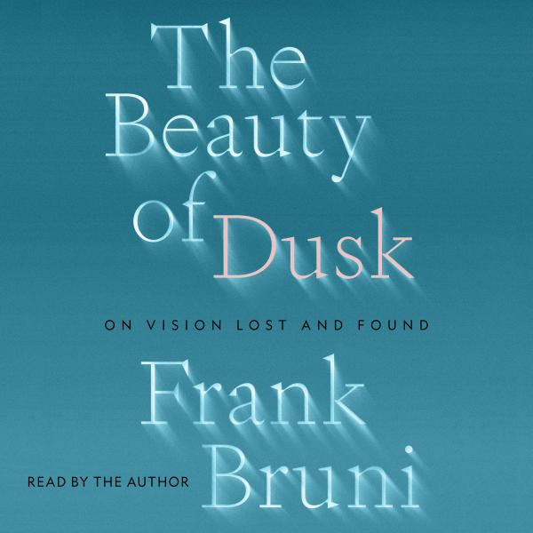

---
 

A couple of months ago I woke up  with significant vision loss in one eye. As someone in his seventies I  was probably overdue for a health crisis, and there is nothing like  losing eyesight to focus you on your mortality. I was terrified that my  writing days might be over and I was in grief at the prospect of a  shrinking world. Worse, the type of optic neuropathy I was diagnosed  with sometimes claims vision in the remaining eye. After a month, life  is returning to normal. I’ve made adjustments, learned to see without  the headaches I initially experienced, and I’m taking driving a step at a time. 

But needing to take as much control over my  situation as I can, I resolved that if I lost the other eye I would be  prepared. The [Hadley Institute](https://hadley.edu/) has many resources for blind and low-vision people, including the  Braille lessons I have started "just in case" the worst happens. Another of Hadley's many resources is a podcast where I first heard an [interview](https://hadley.edu/podcasts/hadley-presents-conversation-experts/nyt-columnist-frank-bruni-vision-loss-and-life) with New York Times columnist Frank Bruni, whose experience with  non-arteritic anterior ischemic optic neuropathy (NAION) was identical  to mine.

Bruni is also the narrator of the [Audible](https://www.audible.com/pd/The-Beauty-of-Dusk-Audiobook/1797137123) version of the book "The Beauty of Dusk" and I was of course eager to  see how he negotiated his own adjustment to vision loss. However, "The  Beauty of Dusk" is not merely about Bruni's experience of sudden partial blindness but is more a meditation on mortality, our ability to meet  challenges head-on, to transform our ways of doing things, to change our thinking and even ourselves — as well as the satisfactions of meeting  those challenges and discovering strengths and possibilities we never  imagined were within us. In confronting all his own fears and questions, Bruni managed to write a wise and generous meditation on what it means  to be human and vulnerable.

The title of Bruni's book is apt and comes from this passage: "[...] my story isn't about dawn.  It's about dusk. It's about those first real inklings that the day isn't forever, and the light inexorably fades. It's about a rising and then  peaking consciousness that you're on borrowed and finite time." Exactly. Those of us "of a certain age," for whom "old age isn't for sissies,"  may prefer more humorous characterizations of our silver years. But *dusk* is a perfect reminder that our day is almost over and there's just so  much light to be snatched before it all ends. It's a sobering but a  brutally honest and even *actionable* metaphor.

Bruni's meditation explores almost every aspect of his medical experience as  well as much in his own life. But it is far from a medical memoir. Most  of "Dusk" is devoted to stories from the many friends he has — as we all have — whose burdens are far greater than his. These are tales of  people who met unthinkable challenges that most of us imagine would have stopped us in our tracks.

But it doesn't work that way. Buried  within each of us is the capacity to adapt, to change, to look at the  world differently. Bruni draws from the work of numerous psychologists  and neuroscientists to remind us that our brains and our personalities  are far more elastic than we imagine. Bruni also pokes fun at the comic  irony of how he was forced to “see the world differently.” As he  half-jokes, "when one eye closes, another one opens."

Bruni  reminds us of the polite caution, if not disinterest, we show those with disabilities. After his own experience with disability Bruni started  asking every one he knew about how they navigated the world, what their  challenges were. Many of their answers surprised him. Their desire to  talk about their struggles initially surprised him.

"The Beauty of Dusk" is a triumphant book, a slightly sentimental book, and  occasionally a tedious book of things (like his dog) that only some  readers will find engaging. But it is also a book about the hard  realities, both good and bad, of aging and disability. As I listened to  Bruni narrate, barely a month after my own opthalmological adventure, I  at times found myself weeping. There were naturally tears of sadness for what is lost, but also tears of triumph over my initial terror,  despair, and grief. There were also tears of recognition — felt more  fully now than ever before in my life — that I am finite, that life is  finite, that what is left to us of each day is not to be wasted. That  vulnerability and disability are waystations that each of us will visit  sometime in our lives.

