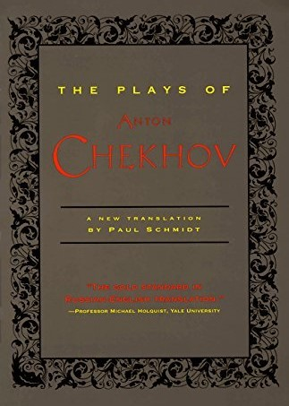

---
 

I have been filling the gaps in my theatre literacy by tackling plays of the masters. One who cannot be ignored is Anton Chekhov, whose stories I have read and loved in both English and German translation. A volume of twelve of [The Plays of Anton Chekhov](https://www.goodreads.com/book/show/551480.The_Plays_of_Anton_Chekhov) edited and given a new American English translation by Paul Schmidt is an enjoyable improvement over British English versions of plays I have read previously on Project Gutenberg. 

A [new book](https://www.goodreads.com/book/show/60320713-chekhov-becomes-chekhov) on Chekhov by Bob Blaisdell [reviewed](https://newrepublic.com/article/170133/vast-humanity-anton-chekhov-blaisdell-biography-review) in TNR peeks over the young writer's shoulders at his journals and correspondence with friends, family, contemporary writers, and theatre people. As with the plays, both [correspondence](https://www.gutenberg.org/ebooks/6408) and [journals](https://www.gutenberg.org/ebooks/12494) can be found on Project Gutenberg. "The Vast Humanity of Anton Chekhov" by TNR writer Scott Bradfield discusses the author's supposed apolitical humanism and where it originated. I'm not totally convinced he was all that apolitical, however. Chekhov was the grandson of a serf who had purchased his own freedom and the son of a failed middle class businessman. But he was also a hard-working physician and early on began writing potboilers to support his family. Although Chekhov's connections to the old aristocracy may have been superficial and of recent vintage, he certainly knew what audience he was writing for: the dying aristocracy. As I read Chekhov's plays, I kept looking for social commentary. What I found at first was sympathy and humor, then stronger moral judgment, and finally a medical diagnosis that the aristocratic patient was not long for this world.

It is not surprising that the physician/observer character found in many of his stories and plays was either saved from the corruption of the aristocracy — or fully plopped into the muck along with them. Much of the melodrama and material of Chekhov's theatre pieces played out in his own family. His older brother was a drunk and a debt-ridden gambler. His younger brother took up with a married woman. As in *Ivanov*, one of Chekhov's brothers married a Jewish woman (who had been a nanny). Chekhov's parents' home was repossessed. Chekhov wore himself down like several of the doctors in his plays to the point that he contracted tuberculosis in his twenties and died in his early forties. It seems clear enough: Chekhov wrote what he knew. But he had also joined a club that would be gone within a generation.

Though he no doubt influenced the trajectory of European theatre, I don't share the sentiment that Chekhov was a *master* of both short fiction and drama. The fact is, while Chekhov's *stories* are less cluttered and less mannered and can still be enjoyed by a modern reader, most of Chekhov's plays have not aged equally well. Despite Schmidt's intention to free Chekhov's plays from the snobbish-sounding British-isms of earlier translations, the plays themselves will never be free from Chekhov's preoccupation with the rotting Russian aristocracy and the embarrassing histrionics and conventions of European theatre circa 1900. Nor should we forget that most of these plays were written for quick cash, just like most of Chekhov's short stories.

*Swan Song* (1887) is an awful monologue by a drunken, elderly actor who can't decide if he's over-the-hill or still has that *je-ne-sais-quoi*. I guess, as long as you think you've still got it, you do. But there's not really much more to this play.

*The Bear* (1888) is a farce whose adaptation by [Brian Friel](https://www.goodreads.com/book/show/208305.Three_Plays_After) I read first. An attractive but overwrought widow has decided to wear black and mourn her husband for the rest of her life, never leaving her house. But she is intruded upon by a thuggish neighbor who demands instant repayment of a loan supposedly given to the woman's dead husband. The home invader refuses to leave until paid, both characters demonstrate they have ample backbone, and a duel of honor is about to occur but is then sidetracked by professions of love from the thug.

*The Proposal* (1888) is another farce marred by histrionics and melodramatic flourishes no longer in vogue. A young man who is either a walking catalog of real ilnesses or simply a hypochondriac visits his neighbor to propose to the man's daughter. The conversation with the (inexplicably) eager young woman goes south when they argue over a property line. Once they resolve to overlook the property line in order to marry, they are *still* arguing over dog breeds. As the couple continues to argue, the prospective father-in-law yells to the audience: "Bring on the champagne."

*Ivanov* (1889) is a full-length play in four acts. Ivanov is a profligate 35 year-old debtor who has married a Jewish woman whose family disinherited her as a result. As such she has no dowry. And then she contracts tuberculosis and is not long for this world. But Ivanov is a congenitally unhappy man for reasons that make no sense to a modern theatre-goer. Perhaps it's that his projects and his energies have spread him too thin, perhaps he's just a restless guy, or perhaps he's just an aristocrat with too much time on his hands, but Ivanov simply *stops* loving his wife and resolves to marry another woman as soon as his present one is dead. 

The play features anti-semitic aristocratic idlers that include a card player, a count, various landowners, and a smug, judgmental physician. On the day of Ivanov's second wedding the still-tormented (for whatever reason) groom argues with his bride, her father, and a friend about his decision to back out of the marriage. Despite the glaring fact that it's in *nobody's* interest for this sweet young woman to marry a financial wreck who was despicably cruel to his last wife, for *no reason at all* these friends and *her* family still want to see the marriage go ahead. Only the self-tormented Ivanov himself recognizes how bad the marriage will be, and at the last moment he hurries out of sight and shoots himself. This is far more histrionics and melodrama than any modern viewer can stomach. And it only hints at the perverse world that Chekhov would later indict.

*A Reluctant Tragic Hero* (1889) is another farce that relies on the trope of the much-abused and henpecked husband. Tolkachov breathlessly visits his friend Murashkin in a panic. The poor man needs a gun and is preparing to rough it in the wilderness — all because his wife and neighbors have tasked him with an impossibly long "Honey, do" list. The actor who plays Tolkachov recites five pages of frenetic dialog while guzzling gallons of water and enumerating all the many reasons for his panic. The punchline, of course, is that his friend Murashkin manages to calm him down — only to pile on additional errands of taking a sewing machine and a canary in a cage with him when he returns home.

*The Wedding Reception* (1889) is another stale little confection, another farce in which a *nouveau riche* father hosts a reception for his recently-married daughter. The old beau shows up, a fake general is hired to lend respectability to the event, a Greek guest stumbles over his Russian, and that's basically what passes for humor here. 

*The Festivities* (1891) is another awful farce. It takes place in a Russian Savings & Loan. The head clerk and the owner, who has arranged a recognition ceremony for *himself*, are joined by a cast of nitwits who run around sighing and carrying on.

*The Dangers of Tobacco* (1902) is a monologue by a self-described half-wit who comes before an audience as if he were an "expert" to speak about the dangers of tobacco. Of course, the man speaks about everything *except* tobacco.

*The Seagull* (1895) is a warmly-regarded play for its supposed introduction of subtext, symbolism, off-stage action, invisible characters, and other innovations — but didn't playwrights before Chekhov employ all of these? Despite multiple readings I never found *Seagull* a particularly enjoyable play. The histrionics so common in the previously-mentioned plays are all present in *Seagull*. And the conceits of the idle Russian aristocracy have not aged well or deserve any more sympathy than the Bolsheviks showed them. 

Chekhov's experiment with a Shakespearean *play-within-a-play* may have been intended to show us how crass philistines reacted to a brilliant young avante-garde playwright, but Chekhov's play within a play featuring glowing devil eyes and stinking sulphur was truly as ridiculous as the philistines in *Seagull* thought it was. What's more, the first audience to view *Seagull* had exactly the same reaction as *Seagull's* philistines. So savage was the reaction to the play that the lead actress was rendered speechless, in subsequent performances the actors sucked on anti-anxiety drops, and Chekhov almost gave up writing for the theatre altogether.

*Seagull* features much the same cast of characters as *Ivanov* — an older writer seduces a younger woman, and it includes a rich landowner, a doctor, and various specimens of the idle rich. In *Seagull* everyone loves someone they can't have. All the characters — and even the *audience* — are bored and jaded and exhausted by play's end. Treplev is a terrible but earnest young playwright who loves Nina, who in turn falls in love with the famous hack writer, Trigorin, who is in a relationship with a shallow conventional theatre actress, Arkadina, who is the mother of Treplev. 

Treplev shoots a seagull, a symbol of Nina's attraction to a world she can only admire. Trigorin tells Nina he is inspired to write a story about a girl who is destroyed by a man, just as Treplev has casually destroyed the seagull's life. Nina and Trigorin fall in love, Nina decides to make a go of acting in Moscow and — *long story short* — Trigorin cheats on Arkadina, runs off with Nina, impregnates and deserts her, the baby dies, he returns to Arkadina, and he ruins Nina's life. Nina eventually comes back and meets Treplev again, who by now is a famous writer and still carries a torch for her. But Nina (again, out of a logic found only in vaudeville) proclaims she still loves Trigorin *despite everything* and — *boom!* — Treplev shoots himself in the head. *Again*. And it is up to Chekhov's reliable narrator, Dr. Dorn, to tell us that *this time* it's probably fatal. *Curtain*. 

Chekhov seems to have been conflicted about what sort of play he was writing. On the one hand, *Seagull* had some artistic pretensions. On the other, it was still essentially a Russian *telenovela*. Judging by the many descriptions of past productions and adaptations, to this day no one is 100% sure if *Seagull* is a tragedy or a comedy. It has [defied](https://www.irishtimes.com/culture/film/saoirse-ronan-and-a-great-cast-cannot-make-the-seagull-work-as-a-film-1.3617819) successful transplantation to the silver screen. And for very good reason. It's a bit of a mess.

*Uncle Vanya* (1896) is another melodrama of unrequited love, and (again) it involves a doctor and bored and depressed aristocrats. Uncle Vanya's now-deceased mother has married Professor Serebriakov, a pompous art history professor and a bit of a fraud. Her daughter Sonya and mother Maria continue to live on her estate and Sonya (for the most part) runs it because Vanya is increasingly found drinking himself into a stupor with his friend, the doctor. Maria's son Vanya (Sonya's "uncle Vanya") as a young man was impressed by and totally dedicated to Serebriakov. Now the old and infirm professor has remarried the young and lovely Yelena, leaving Sonya (and to a lesser extent Vanya) to the day-to-day management of the estate. 

The play begins as Vanya has suddenly realized he (and this applies to Sonya as well) have wasted their whole lives serving Serebriakov. Vanya, now 47, has been enamored of Yelena for a decade but objectively he is too old for her and never once expressed his feelings to her before she married. And Sonya has admired the self-pitying Dr. Astrov (who tends Serebriakov's many illnesses) from afar for at least six years. Vanya tries but can't persuade the constant Yelena to leave Serebriakov, and Sonya finally asks Yelena to find out if Astrov has any interest in her (turns out, the shallow doctor doesn't because he has a thing for Yelena himself and expresses his interest to her in rather crude terms). 

All this self-inflicted misery and hypocrisy from people who have it far better than the peasantry is infuriating and tiring. Astrov pities himself for the trauma of seeing newly-freed serfs sicken in hovels they share with their pigs or die of farm and mining accidents and typhus. Both he and Vanya drink excessively, and the selfish Serebriakov is about to leave everyone in uncertainty by selling the 26-room estate for mutual funds and buying a condo in Finland. As Yelena puts it in Act Three: "The despair and boredom around here, these grey smudges of people: they're so petty. All they know how to do is eat, sleep, and drink —." Well, that's the essence of *Uncle Vanya* in a nutshell. 

Chekhov subversively hid uncomfortable truths about the Russian aristocracy in plain sight as he humored them with the love triangles they loved so much. Chekhov's Russian aristocrat characters watch their world turn to shit by their own hands as Russian aristocrats in the audience applaud.

In the end, Vanya has it out with Serebriakov, even taking the by-now obligatory Chekhovian gun in hand and unsuccessfully firing it. In rage, Vanya screams, almost Brando-style: "I coulda been contender!" Actually, what Vanya says is "I could have been a Schopenhauer… another Dostoevsky!" Chekhov was right to describe the play as a farce. In Act Four Vanya has stolen morphene from Astrov and intends to kill himself. Serebriakov and Yelena are leaving for Harkov and Yelena and Astrov have final words. They admit some small mutual attraction but that a relationship would have been a disaster for both of them, and then Astrov signs off with *finita la commedia* (end of the comedy). *Again* Chekhov tells us this has all been a farce.

Serebriakov departs with the admonition to everyone to "get down to work" and "do something" — which is, of course, damned ironic. The play ends with Sonya's invocation of the Kingdom to Come, a world kinder to them than the present, one where they can finally rest. This oddly unsatisfying ending seems as if Chekhov himself had tired of the whole thing and decided to wrap it in a shroud and give it a quick Christian burial. But there is much more going on here. I think Chekhov was beginning to really hate the upper class that he had recently become a part of.

*Three Sisters* (1900) features many of the same conventions and characters —drunken freeloading doctors and idle aristocrats nibbling their caviar, drinking their vodka, and lusting after all the wrong people. In this one, the three sisters live in the biggest, most luxurious and (as it turns out) the only fireproof house in the neighborhood. Their late father's house is not only a cultural island in a provincial backwater; it is also a meeting place for a tiny slice of Russia's vast pre-revolutionary bureaucracy and the military that holds it together. 

The plot is almost as convoluted as General Stanley McCrystal's Afghanistan pacification [PowerPoint](https://www.theguardian.com/news/datablog/2010/apr/29/mcchrystal-afghanistan-powerpoint-slide) — one featuring multiple love triangles, duels, gamblers, sick children, alcoholics, yogurt, cuckolds, you name it. Expanding on the dreariness of work so present in *Vanya*, *work* plays an important part in *Sisters*. Brother Andrey is nothing like his man of action father; he's a chubby shlub with academic potential but he seems happier working as a county bureaucrat. Andrey has a gambling habit, is married to a woman of dubious taste and morals, and lives with sisters Irina (who works at the telegraph office), Olga (at the board of education), and Masha (who is married to a high school teacher and gym coach).

*Sisters* is a play about the decline of the aristocracy fully underway. At one point Irina says, "You say life is so beautiful. But suppose it isn't? Look at us. Three sisters. Our life hasn't been so beautiful; it's choking us up like a lawn full of weeds. […] We have to work, we really do. The reason we're unhappy and think life is so awful is because we don't know what it means to work. We come from families who thought they never had to work…" Each is about to experience further shocks in lives outside their own control. 

But this ambitious play's mechanics are so overly complicated that Chekhov had to use extremely awkward exposition in multiple places to lay out backstories and plot complications. In many of Chekhov's plays characters use the *aside* to make clear what they are thinking, whereas a modern playwright would either *show* us or use more oblique and artful dialog. And this has not aged well.

But what makes many of Chekhov's plays, especially *Sisters*, *most dated* and unlovable is what apparently made them so lovable for British audiences at the start of the 20th century. Martin Esslin has a chapter in Harold Bloom's [book](https://www.goodreads.com/book/show/1417454.Anton_Chekhov) on Chekhov in which he mentions that George Bernard Shaw may have been the first to recognize the attraction that Chekhov's plays held for the English upper classes — for no other reason than both the Russian and British aristocracies were crumbling and they knew it. According to Esslin, Shaw — the socialist dandy — modeled his *Heartbreak House* (1919) on Chekhov's *The Cherry Orchard* (1903). By the Twenties Chekhov's plays were having great successes in London, and throughout the Forties and Fifties British plays were increasingly borrowing from Chekhov. 

In the United States Tennessee Williams tapped into the same insecurities, miseries, mental illness, alcoholism, and decline of the Southern aristocracy. Like the Russian nobility now losing their fortunes because they couldn't extract free labor from their serfs, the Southern planter class could no longer rely on free labor from slaves. In Williams' *Streetcar* Blanche DuBois has been widowed by her husband's suicide, has been *reduced* to teaching (before she is fired for having a sexual relationship with one of her students) and she wistfully and frequently recalls her family's lost estate, *Belle Reve*, the same "lovely dream" that Chekhov's nobility cling to. Like Olga, Irina, and Masha, Blanche is living with *her* sister out of necessity. You can't get much more Chekhovian than all of this. 

Esslin goes on to credit Chekhov with influencing whole generations of modern playwrights and even taking "Chekhov's technique of characters in apparently idle and trivial chatter to its extreme" in absurdist works like *Waiting for Godot*. Interestingly, the film version of *Streetcar* featured Marlon Brando, who embraced the *Stanislavsky method* — the same Stanislavsky who directed some of Chekhov's plays and most likely saved his playwriting career after the disastrous premiere of *Seagull*. And Chekhov's nephew Michael, an actor, created a variant of the Stanislavsky method which he taught in Germany and Hollywood.

*The Cherry Orchard* (1903) is probably Chekhov's best-known play and one that resonates best with modern audiences. In it Chekhov has again preserved all of the elements of then-popular farce and vaudeville, but even clearer than in *Three Sisters* is the uncluttered and indelible theme of the *Cherry Orchard*: The End for the aristocracy. In the end the family's vast estate with its orchards are literally chopped down. And not just the end of aristocracy but its unsuitability to continue to rule Russia along with the simultaneously bright and terrifying prospects of a rising middle class taking over the reins. 

*Cherry Orchard* was Chekhov's last play and he maintained until the end that it was a farce, not a tragedy. And how could it be a tragedy when he had made it so plainly about Russia embarking on a new, uncharted path? How could it be a tragedy when he painted his perpetual student as the victim of the Czar's prisons? How could it be a tragedy when both the former owners of the orchard and its almost 90 year-old former serf were clearly not going to survive in this brand new world? Only the wheeler-dealer who ultimately buys the estate seems to have his head screwed on properly — despite his obvious shortcomings in education. But it's not as if the man didn't try to warn the estate owners, who had frittered away their savings and lived in illusion.

It is interesting that Chekhov, who would be dead the following year, *again* argued with the play's director, Stanislavsky, about how *Cherry Orchard* ought to be played. Although he reputedly sat in during rehearsals Chekhov may have never seen the entire piece performed as the tragedy that Stanislavsky insisted it was. Chekhov died the next year in a German sanatorium where he had gone for treatment for his tuberculosis.

Having read Chekhov's plays several times, I still have not seen the major ones performed. As Chekhov's own experience with his work shows, direction and interpretation are everything. I would like to see them on stage some day and, short of this, do a desk read with friends and discuss them.

