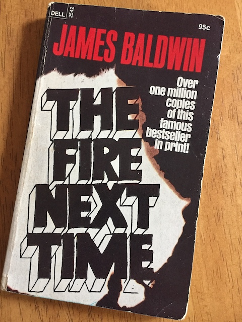

---

It has been 57 years since James Baldwin wrote [The Fire Next Time](https://www.goodreads.com/book/show/464260.The_Fire_Next_Time) — 28 years since Rodney King was beaten down by police in L.A. and 6 years since Michael Brown was murdered by one in Ferguson, Missouri. In the interim there have been hundreds of these police lynching, all but a handful ever prosecuted.

Baldwin's warning, from which his title was chosen, calls out the "racial nightmare" of this country by name, challenging America to "dare everything" to end it:

> “If we — and now I mean the relatively conscious whites and the relatively conscious blacks who must, like lovers, insist on, or create, the consciousness of the others — do not falter in our duty now, we may be able, handful that we are, to end the racial nightmare and achieve our country, and change the history of the world. If we do not now dare everything, the fulfillment of that prophet, recreated from the Bible in song by a slave, is upon us: God gave Noah the rainbow sign, no more water, the fire next time!”

But White America not only refuses to do anything about racism, it doesn't even want to hear about it.

But if even the silent, nonviolent protest of "taking a knee" while the national anthem is being played is too much for delicate white sensibilities, then it is inevitable and expected — even reasonable to assume —  that those most affected by America's racial nightmare will have no other choice but to rage and try to burn the entire system down — over and over again, until the system stops killing them.

