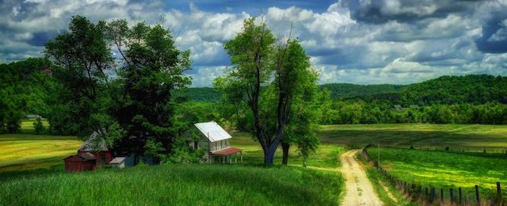

---

[The Hidden Wound](https://www.goodreads.com/book/show/227313.The_Hidden_Wound) by Wendell Berry

I have forgotten precisely how Wendell Berry's "The Hidden Wound" came to be on my reading list. At the time I ordered the book I did not know that Berry had written it in 1968 as a meditation on race relations, safe in a quiet research room in a library on the Stanford campus. I knew only that Berry was a respected "agrarian" poet from Kentucky and a thoughtful man. Maybe I was hoping for a little hope.

Despite its age and defects, Berry's book was not a disappointment. Those reading the book a half a century after it was written will be put off by dozens of uses of the N-word to describe a certain type of labor thought to be menial. And today's reader will likewise be bewildered or angered by his thesis that white supremacy has equally wounded both whites and blacks. As one unsympathetic reviewer put it, "This book looks at the cultural wound of racism from the perspective of the oppressor, implying that the abused and the abuser suffer equally." Berry never even comes close to making that case.

Likewise, Berry's depictions of his grandfather's tenant farmer Nick and Aunt Georgie are cringe-worthy tales of noble serfs who found true happiness in honest work on someone else's land. To reinforce this notion Berry recalls the tale of Eumaios, "the noble swineherd" who befriended Odysseus upon his return to Ithaka. Berry also places himself in the shoes of Dostoevsky's landowner, Levin, who desires to know more about the serfs who work his vast estate.

And Wendell Berry, in 1968, was hardly ready or willing to indict Capitalism for the separation of white men from the actual stewardship of the land they instead stole and despoiled and had others work on. His arguments are diffuse and he is almost comically incapable of drawing the obvious links between the racism, colonialism, and environmental destruction he describes throughout his meditation. Instead of understanding the sources of this alienation politically — which he explicitly rejects — Berry seizes upon Southern Agrarianism as the cure for his and America's wounds.

Yet, despite these many sins and omissions, Berry's book is nevertheless filled with insight. In the book's early pages, Berry writes of white self-delusion facilitated by conscious myth-making and propaganda:

> "As a people, we have been tolled farther and farther away from the facts of what we have done by the romanticizers, whose bait is nothing more than the wishful insinuation that we have done no harm. Speaking a public language of propaganda, uninfluenced by the real content of our history which we know only in a deep and guarded privacy, we are still in the throes of the paradox of the 'gentleman and soldier.' However conscious it may have been, there is no doubt in my mind that all this moral and verbal obfuscation is intentional. Nor do I doubt that its purpose is to shelter us from the moral anguish implicit in our racism — an anguish that began, deep and mute, in the minds of (my emphasis) *Christian democratic freedom-loving owners* of slaves."

As a Southerner familiar with slaveholder customs, Berry demolishes the lie that slavery did "no harm" to either party:

> "First, consider the moral predicament of the master who sat in church with his slaves, thus attesting his belief in the immortality of the souls of people whose bodies he owned and used. He thus placed his body, if not his mind, at the very crux of the deepest contradiction of his life. How could he presume to own the body of a man whose soul he considered as worthy of salvation as his own?"

Southern Christianity itself had to contend with this moral contradiction. It solved the problem by completely hollowing itself out. Murder, rape, slavery and exploitation were no longer to be regarded as sins and were replaced by prohibitions on trivial acts such as drinking, failing to attend church, or gambling.

> "Detached from real issues and real evils, the language of religion became abstract, intensely (desperately) pious, rhetorical, inflated with phony mysticism and joyless passion. The religious institutions became comfort stations for scribes and publicans and pharisees. Far from curing the wound of racism, the white man's Christianity has been its soothing bandage — a bandage masquerading as Sunday clothes, for the wearing of which one expects a certain moral credit."

Fifty long years before Steve Bannon's pan-European nationalism efforts, Berry indicted white American culture as a sterile, delusional imitation of Europeanism — while, on the other hand, he pointed to black culture's richness and connection to the reality of its people, history and the land.

And Berry wanted some of that:

> "And then in the spring of 1964 I turned back on the direction I had been going. I returned to Kentucky, and within a year bought and moved onto a little farm in my native part of the state. That return made me finally an exile from the ornamental Europeanism that still passes for culture with most Americans. What I had done caused my mind to be thrown back forcibly upon its source: my home countryside, my own people and history. And for the first time I felt my nakedness. I realized that the culture I needed was not to be found by visiting museums and libraries and auditoriums. It occurred to me that there was another measure for my life than the amount or even the quality of the writing I did; a man, I thought, must be judged by how willingly and meaningfully he can be present where he is, by how fully he can make himself at home in his part of the world. I began to want desperately to learn to belong to my place."

The Southern Agrarianism that Berry seized upon in 1968 may then have been a naive, nostalgic rejection of industrialization, but today it is a prominent [feature](http://southernagrarian.org/about/) of Neo-Confederacy and the Alt-Right. Berry's meticulously-drawn links to the actual stewardship of land by black farmers, sharecroppers, and tenant farmers belies the claims of the revisionist Neo-Confederates whose real or imagined ancestors simply owned the people who worked the plantations.

Most importantly, what Berry's book tells us is that white people have understood racism for centuries and have passed down their own history as a self-indictment. "The Hidden Wound" was written at just about the same time the Kerner Report came out. White America has been able to read about this wound for at least a half century.

So now the real question is — what the hell are we going to do about it?

