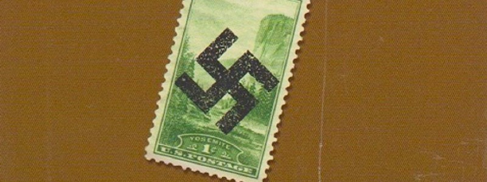
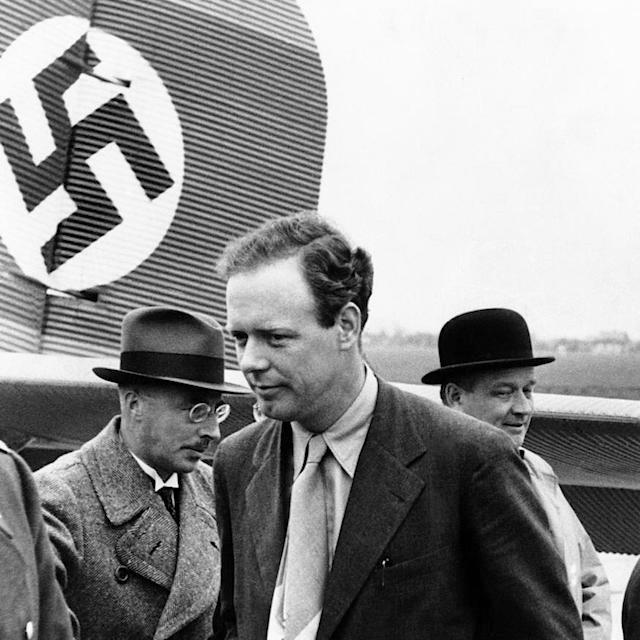
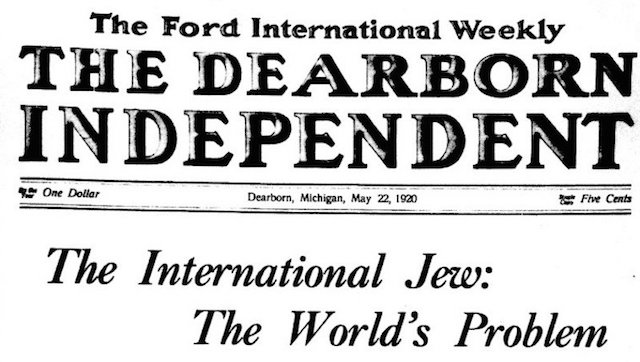
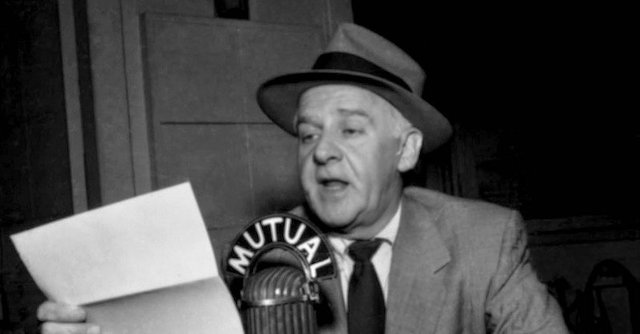

---

*Review of "The Plot Against America" by Philip Roth (ISBN 9781400079490)*

This book, written in 2004, is one of *those* -- like *The Handmaid's Tale*, *1984*, and *It Couldn't Happen Here* -- books that have had second lives following Donald Trump's inauguration.

Philip Roth imagines an America that finally gives in to its darkest xenophobic impulses. His real-life hometown near Newark, New Jersey, experiences first one shock, then another, then another, and another, as fascism creeps into the White House under a Charles Lindbergh presidency. The story Roth tells is a slow-moving nightmare -- and it really resonates because a nightmare is precisely what we are living in now.

Lindbergh, of course, really *did* have a real-life flirtation with Nazism, even accepting an award from Hermann Göring.

Roth's childhood, re-imagined in terrific detail, doesn't need to stray too far from real American history because intolerance and nativism was baked into the national cake. Rich white plantation owners gave way to automotive magnates like Henry Ford, whose Dearborn Independent featured headlines like "The International Jew: The World's Problem." But with an epidemic of Islamophobia and Brown People Phobia today, hate-peddling billionaires like the Kochs, Mercers, and Adelsons, and modern day equivalents of the Dearborn Independent, we haven't moved the needle a millimeter since 1920.

Much of Roth's story is about political conflicts within his own Jewish family, which become a lens into the Jewish community of the time -- or maybe the one of today. Roth's *fictional* brother Sandy is a self-hating Jew, as is his *fictional* aunt Evelyn and her husband, Lindbergh sycophant Rabbi Lionel Bengelsdorf -- a man who never met a Nazi he didn't like. This brings to mind the curious relationship between the right-wing Jewish community of 2017 and the Trump Administration. Our modern day *Bengelsdorfs* -- settler-ambassador David Friedman and "Rabbi to the Stars" Shmuley Boteach -- now occupy prominent positions in and around the most xenophobic presidency of all time.

For a book designed to make you think, *The Plot Against America* also has one hell of a great plot. Father Coughlin, Walter Winchell, Fiorella LaGuardia and hundreds of real historical figures make believable appearances in this tale of what coulda, mighta been -- could have *easily* been. For those who don't know their history, there's even a postscript that fills in some blanks.

I won't spoil the book by giving anything away. Needless to say, the Jews of America don't come out unscathed.

But Roth's insights into the ease with which the United States can slide into fascism can't be ignored. This is an argument, a though experiment even, and Roth makes his case.

Philip Roth understood in 2004 how easily, even wordlessly, a sitting president could unleash a pogrom on a helpless minority -- and his choice of words gave me the chills for its accuracy and prescience:

> The week after the September assault on Detroit's Jews -- which was addressed with dispatch by neither Michigan's governor nor the city's mayor -- new violence was directed at homes, shops, and synagogues in Jewish neighborhoods in Cleveland, Cincinnati, Indianapolis, and St. Louis, violence that Winchell's enemies attributed to his deliberately challenging appearances in those cities after the cataclysm that he'd instigated in Detroit, and that Winchell himself -- who, in Indianapolis, barely escaped being crushed by a paving stone hurled from a rooftop that had broken the neck of the bodyguard stationed beside him -- explained by the "climate of hate" emanating from the White House.

Five stars.

