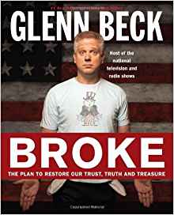
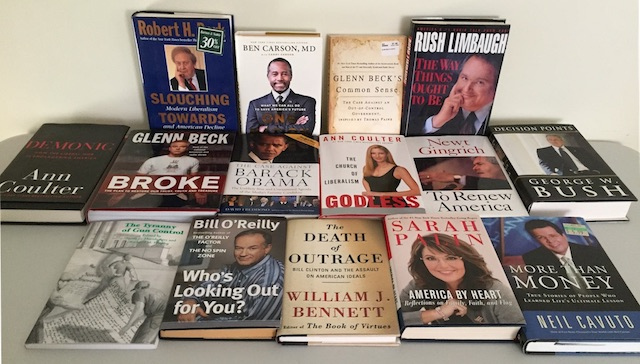

---

After Thanksgiving I was looking for something in my bookshelf when I found a book I'd never bought. It was Glenn Beck's *Broke*. When I opened the cover it contained an effusive recommendation — from me! — and a cryptic note: "15 of 16." It dawned on me that I'd been pranked.

This set me looking for the rest. Of course the principal conspirators — my brother-in-law, sister-in-law, and son — were messing with my head. There were actually only 14 more. If I didn't have the right number, they certainly had mine.

And what a collection it was! 

- *America by Heart* by [Sarah Palin](https://en.wikipedia.org/wiki/Sarah_Palin), a dunce who can now be forgiven somewhat when compared to her male counterpart running the country
- *Broke* by [Glenn Beck](https://en.wikipedia.org/wiki/Glenn_Beck), two parts conspiracy theory and one part crackpot economics exploration
- *Common Sense: The Case Against an Out-of-Control Government*, by [Glenn Beck](https://en.wikipedia.org/wiki/Glenn_Beck) (again) — a guy who thinks he's Thomas Paine but is really just a pain without any common sense
- *Decision Points* by hapless Decider-in-Chief, [George W. Bush](https://en.wikipedia.org/wiki/George_W._Bush), a dishonest, sanitized memoir of his many failures and weaknesses masquerading as success and strength
- *Demonic: How the Liberal Mob is Endangering America* by white supremacist [Ann Coulter](https://en.wikipedia.org/wiki/Ann_Coulter), who picked a book that describes her to a tee
- *Godless* by VDARE and Aryan Nation darling [Ann Coulter](https://en.wikipedia.org/wiki/Ann_Coulter), sins of liberal atheists from Willie Horton to the Walkman
- *More than Money* by [Neil Cavuto](https://en.wikipedia.org/wiki/Neil_Cavuto), uplifting stories of CEOs who triumphed despite their white privilege
- *One Nation* by narcoleptic fundamentalist surgeon [Ben Carson](https://en.wikipedia.org/wiki/Ben_Carson), a meditation on what really enslaves and plagues America — and, surprise! — it's nothing that would occur to any rational human being
- *Slouching Towards Gomorrah* by [Robert Bork](https://en.wikipedia.org/wiki/Robert_Bork), which puts a cold white finger on what's really wrong with America — pestilential strivings for democracy and equality
- *The Case Against Barak Obama* by [David Freddoso](https://en.wikipedia.org/wiki/David_Freddoso), a hatchet job on Obama (prior to his other racist book, *Gangster Government: Barak Obama and the New Washington Thugocracy*)
- *The Death of Outrage* by [William Bennett](https://en.wikipedia.org/wiki/William_Bennett), a hit piece on Bill Clinton that reminds us that there *really is* a vast right wing conspiracy
- *The Tyranny of Gun Control* by conspiracy theorist and gun nut [Jacob Hornberger](https://www.fff.org/blog/) and lover of all things Austrian [Richard Ebeling](http://www.citadel.edu/root/csb-faculty-staff/48-academics/schools/business/badm/22431-ebeling)
- *The Way Things Ought to Be* by oxycodone connoisseur [Rush Limbaugh](https://en.wikipedia.org/wiki/Rush_Limbaugh), unhinged rants on blacks, gays, women, law and order, and Hollywood liberals
- *To Renew America* by serial adulterer and well-educated "deplorable" [Newt Gingrich](https://en.wikipedia.org/wiki/Newt_Gingrich), on "reasserting the values of American civilization" — code for beefing up American hyper-capitalism and racism
- *Who's Looking Out for You?* by [Bill O'Reilly](https://en.wikipedia.org/wiki/Bill_O'Reilly_(political_commentator)) (with a dedication to Roger Ailes), which attacks people who don't take responsibility for their actions or the ill that befalls them— like, for instance, black people and women [including those he personally sexually abused]

My new collection had been repurposed from a library book sale that had no buyers for them. My sister-in-law's wicked sense of humor provided an alternative to the town dump.

I related this experience to friends who thought it was pretty funny — something they'd love to do to bleeding hearts of their own.

Well. I just happened to have a box of books they could use.

