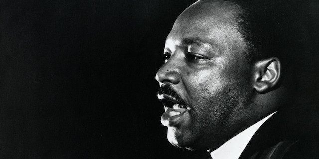

---

Yesterday was Martin Luther King Day, and I followed columnist [Esther Cepeda](https://www.mysanantonio.com/opinion/commentary/article/Cepeda-King-s-dream-still-hasn-t-come-true-14984857.php) in reading King's "I Have a Dream" speech. But I've also been reading Cornel West's "[The Radical King](https://www.goodreads.com/book/show/23995382-the-radical-king)," which reprints many of Martin Luther King's more "radical" essays and sermons. I'm not finished with it because you can't read a book of thoughtful essays in one go.

But from what I *have* read, West sees no contradiction between the nonviolent King and the man he calls the Radical King. King's nonviolence, for all the nods to Ghandi and other religious traditions, was rooted in his Christianity and specifically in the Black Church. Yet apparently there were also connections to the Jewish prophetic tradition — in which prophets rage against the evils of kings and tyrants. This may be one reason for King's friendship with Abraham Joshua [Heschel](https://www.plough.com/en/topics/community/leadership/two-friends-two-prophets).

King's most famous speech was part of a 1963 march on Washington for Jobs and Freedom, and when he was killed King was in Memphis to support striking sanitation workers. King told his staff in 1966, "There must be a better distribution of wealth and maybe America must move toward a democratic socialism." King travelled across the country with his Poor People's Campaign, a campaign that Rev. William Barber today is trying to revive. And though the Civil Rights Act was passed in 1964, four years later King still found himself fighting for civil and economic rights when he was assassinated in 1968.

America of 1968 was not only about to implode from racial injustice but also from economic injustices and wars of choice that were not only killing black, brown and poor white men but bankrupting America financially and morally. At quite a cost to his own political capital, and even putting himself at odds with other black leaders, King spoke out against American militarism and materialism.

King was regarded as the "most dangerous man in America" by J. Edgar Hoover, who also tried to brand King as a Soviet asset — not because he was a nonviolent advocate of racial equality (most certainly true), but because he represented a challenge to economic and political exploitation.

West points out in his introduction to the collection that King's thoughts were constantly evolving. We are all familiar with the "long arc" optimism of King's "I Have a Dream" speech but no one ever got to hear the more pessimistic sermon King had planned to deliver the Sunday after he was murdered, "Why America May Go To Hell."

Toward the end, the radical King had grown disillusioned with white liberals whose deeds never matched their rhetoric. In one essay King discusses Stokely Carmichael's rejection of both white allies and nonviolence. With increased physical represssion, Carmichael's SNCC, CORE, and Deacons for Defense were all beginning to sense the limits of nonviolent strategy. In West's "Black Power" excerpt from 1967, King never repudiates his nonviolence but clearly understands and even appreciates the reasons Black Power advocates gave for their willingness to use force if necessary:

> "Black Power advocates contend that the Negro must develop his own sense of strength. No longer are 'fear, awe, and obedience' to rule. This accounts for, *though it does not justify*, some Black Power advocates who encourage contempt and even civil disobedience as alternatives to the old patterns of slavery. Black Power assumes that Negroes will be slaves unless there is a new power to counter the force of the men who are still determined to be masters rather than brothers."

By coincidence, our book group's selection this month was Colson Whitehead's "Nickel Boys," set in Tallahassee, Florida in 1962. The very first page begins with Elwood Curtis's thoughts on a ten cent record of Martin Luther King's speeches. King's speeches could also serve other purposes than a moral call to action. For kids like Elwood, King's speeches were educational and also an affirmation of black pride:

> "In the third cut on side A, Dr. King spoke of how his daughter longed to visit the amusement park on Stewart Avenue in Atlanta. […] Dr. King had to tell her in his low, sad rumble about the segregation system that kept colored boys and girls on the other side of the fence. Explain the misguided thinking of some whites — not all whites, but enough whites — that gave it force and meaning. He counseled his daughter to resist the lure of hatred and bitterness and assured her that 'Even though you can't go to [Fun Town](https://www.youtube.com/watch?v=DBTSW0ulOps), I want you to know that you are as good as anybody who goes into Fun Town.' That was Elwood — as good as anyone."

Elwood is well-read, naive, and a bit of a geek. And when his bicycle chain snaps, he ends up being arrested along with the driver of the stolen Plymouth he has hitched a ride with. Elwood's grandmother Harriet, a great believer in doing things by the book, hires a white lawyer who absconds with the \$200 intended to defend Elwood. Elwood ends up in Nickel Academy, a segregated prison camp for boys, where some go missing without explanation. Whitehead's book deals with the boys' attitudes toward resistance and compliance, particularly in a [still] Jim Crow prison setting. A boy name Turner "with an eerie sense of self" who knows that only he is ultimately responsible for his own safety is the foil for the tragically well-behaved and trusting Elwood.

In one passage which seems to illustrate the divide between Black Power and Respectability Politics, Elwood is still trying to make sense of Dr. King:

> "He called upon his Negro audience to cultivate that pure love for their oppressors, that it might carry them to the other side of the struggle. Elwood tried to get his head around it, now that it was no longer the abstraction floating in his head last spring. It was real now:
>
> *Throw us in jail, and we shall still love you. Bomb our homes and  threaten our children, and we shall still love you. Send your hooded  perpetrators of violence into our community at the midnight hour and  beat us and leave us half dead, and we shall still love you. But be ye assured that we will wear you down by our capacity to suffer. One day we shall win our freedom*.
>
> The capacity to suffer. Elwood — all the Nickel boys — existed in the capacity. Breathed in it, ate in it, dreamed in it. That was their lives now. Otherwise they would have perished. The beatings, the rapes, the unrelenting winnowing of themselves. They endured. But to love those who would have destroyed them? To make that leap? *We will meet your physical force with soul force. Do to us what you will and we will still love you*.
>
> Elwood shook his head. What a thing to ask. What an impossible thing.

Indeed. What an impossible thing.

As he stated somewhat prophetically in his last speech, King *had* been to the mountain top. And King had seen the Big Picture if not been given sacred insight. King's early sermons were well-crafted moral calls to action, Christian in style and language, but he frequently tipped his hat to other traditions. King was often ecumenical and usually very accessible. For example, in [1956](https://swap.stanford.edu/20141218223302/http://mlk-kpp01.stanford.edu/kingweb/publications/papers/vol3/560517.010-The_Death_of_Evil_upon_the_Seashore%2C_Sermon_at_the_Service_of_Prayer_and_Thanksgiving_at_Cathedral_of_St._John_the_Divine.htm) King delivered a sermon to 12,000 people at an Episcopal cathedral in New York City on the second anniversary of the Brown v. Board of Education decision. The talk was about *evil*. His sermon contained the seeds of the same argument that so perplexed young Elwood:

> "Let us remember that as we struggle against Egypt, we must have love, compassion and understanding goodwill for those against whom we struggle, helping them to realize that as we seek to defeat the evils of Egypt we are not seeking to defeat them but to help them, as well as ourselves."

Some will find King's argument unconvincing (I am one), though most will admire the radical King's 'love of the oppressed. Some will admire the prophetic King for his speaking truth to power, while others will be surprised at his growing understanding of (and even sympathy for) those advocating change "by any means necessary" (King approached Malcolm X in 1966 about working together on a UN resolution).

Though King believed in ecumenism and frequently linked arms with men of different faiths, West cautions us to always remember that King's

> "radical love flows from an imitation of Christ, a response to an invitation of self-surrender in order to emerge fully equipped to fight for justice in a cold and cruel world of domination and exploitation. The scandal of the Cross is precisely the unstoppable and unsuffocatable love that keeps moving in a blood-soaked history, even in our catastrophic times. There is no radical King without his commitment to radical love."

More essays to go.