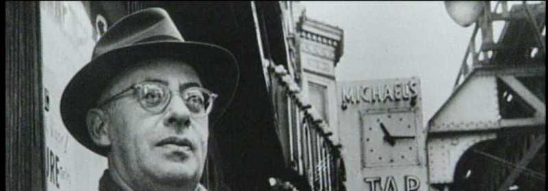

---

[Newt Gingrich](http://www.csmonitor.com/USA/Politics/The-Vote/2012/0128/Who-is-Saul-Alinsky-and-why-is-Newt-Gingrich-so-obsessed-with-him) created the meme that Saul Alinsky was the Machiavelli behind Obama. Since then, the Right-wing blogosphere has been littered with denunciations of Alinsky. This has also resulted in a cottage industry of pamphlets, articles, and spinoffs like "Rules for Conservatives" by Michael Master,  Jerome Corsi's "Saul Alinsky: the Evil Genius behind Obama," Will Clark's "Obama, Hillary, Saul Alinsky and their Useful Idiots," Richard Bledsoe's "Can Saul Alinsky be Saved? Jesus Christ in the Obama and Post-Obama Era," and, well, you get the idea. Not to mention [Ben Carson's claims](https://www.youtube.com/watch?v=6I-LQTkytR8) that Alinsky dedicated his book to Lucifer. The Right doesn't like it when the little guy fights back.

Alinsky learned his lessons in organizing generations ago and wrote the book [Rules for Radicals](https://www.goodreads.com/book/show/102748.Rules_for_Radicals) during the Reagan years. He knew what kind of stacked deck workers play against. And he knew full-well what effect he had on the Right -- "The job of the organizer is to maneuver and bait the establishment so that it will publicly attack him as a 'dangerous enemy.'" Well, Alinsky's methods worked, and his enemies respected him. Despite all their venom, the Tea Party eagerly adapted Alinsky's methods successfully. And in fact the following quotes from "Rules for Radicals" were taken from a Right-winger who studied him in depth. **Alinsky saw politics precisely as the Right does -- as all-out war**. And in times of war one does not always take the genteel high road.

In the quotes below, it's clear Donald Trump uses many of Alinsky's principles, and it's also clear how poorly most Liberals do. Alinsky's ideas may seem alien to people unaccustomed to street fighting. But we have now entered a period where politics has got to get a little rough.

\* \* \*

First, excerpts from Alinsky's [Rules for Radicals](http://www.amazon.com/Rules-Radicals-Saul-Alinsky/dp/0679721134/ref=sr_1_1):

- This failure of many of our younger activists to understand the art of communication has been disastrous. Even the most elementary grasp of the fundamental idea that **one communicates within the experience of his audience** — and gives full respect to the other’s values — would have ruled out attacks on the American flag. — P. xviii
- As an organizer I start where the world is, as it is, not as I would like it to be. That we accept the world as it is does not in any sense weaken our desire to change it into what we believe it should be — **it is necessary to begin where the world is if we are going to change it to what we think it should be**. — P. xix
- “Power comes out of the barrel of a gun!” is an absurd rallying cry when the other side has all the guns. — xxi
- **A reformation means that masses of our people have reached the point of disillusionment with past ways and values**. They don’t know what will work but they do know that the prevailing system is self-defeating, frustrating, and hopeless. They won’t act for change, but won’t strongly oppose those who do. The time is then ripe for revolution. — xxii
- But the answer I gave the young radicals seemed to me the only realistic one: “Do one of three things. One, go find a wailing wall and feel sorry for yourselves. Two, go psycho and start bombing — but this only swings : people to the right. Three, learn a lesson. Go home, organize, build power **and at the next convention, *you be the delegates*.**” — xxiii
- The preferred world can be seen any evening on television in the succession of programs where the good always wins — that is, until the late evening newscast, when suddenly we are plunged into the world as it is. **Political realists see the world as it is: an arena of power politics moved primarily by perceived immediate self-interests, where morality is rhetorical rationale for expedient action and self-interest**. Two examples would be the priest who wants to be a bishop and bootlicks and politicks his way up, justifying it with the rationale, “After I get to be bishop I’ll use my office for Christian reformation,” or the businessman who reasons, “First I’ll make my million and after that I’ll go for the real things in life,” Unfortunately one changes in many ways on the road to the bishopric or the first million, and then one says, “I’ll wait until I’m a cardinal and then I can be more effective,” or “I can do a lot more after I get two million” — and so it goes. In this world laws are written for the lofty aim of “the common good” and then acted out in life on the basis of the common greed. — P.12-13
- It is not a world of peace and beauty and dispassionate rationality, but as Henry James once wrote, “Life is, in fact, a battle. Evil is insolent and strong; beauty enchanting, but rare; goodness very apt to be weak; folly very apt to be defiant; wickedness to carry the day; imbeciles to be in great places, people of sense in small, and mankind generally unhappy. **But the world as it stands is no narrow illusion, no phantasm, no evil dream of the night; we wake up to it again forever and ever; and we can neither forget it nor deny it nor dispense with it.**” Henry James’ statement is an affirmation of that of Job: “The life of man upon earth is a warfare…” — P.14
- **The most unethical of all means is the non-use of any means**. It is this species of man who so vehemently and militantly participated in that classically idealistic debate at the old League of Nations on the ethical differences between defensive and offensive weapons. Their fears of action drive them to refuge in an ethics so divorced for the politics of life that it can apply only to angels, not men. — P.26
- One’s concern with the ethics of means and ends varies inversely with one’s personal interest in the issue. — P.26
- …The secretary inquired how Churchill, the leading British anti-communist, could reconcile himself to being on the same side as the Soviets. Would Churchill find it embarrassing and difficult to ask his government to support the communists? Churchill’s reply was clear and unequivocal: “Not at all. I have only one purpose, the destruction of Hitler, and my life is much simplified thereby. If Hitler invaded Hell I would at least make a favorable reference to the Devil in the House of Commons.” — P.29
- The fifth rules of the ethics of means and ends is that **concern with ethics increases with the number of means available and vice versa**. To the man of action the first criterion in determining which means to employ is to assess what means are available. Reviewing and selecting available means is done on a straight utilitarian basis — will it work? Moral questions may enter when one chooses among equally effective alternate means. — P.32
- The seventh rule of ethics and means and ends is that generally success or failure is a mighty determinant of ethics. The judgment of history leans heavily on the outcome of success and failure; it spells the difference between the traitor and the patriotic hero. **There can be no such thing as a successful traitor, for if one succeeds he becomes a founding father**. P.34
- The ninth rule of the ethics of means and ends is that **any effective means is automatically judged by the opposition as being unethical**. — P.35
- The tenth rule of the ethics of rules and means is that **you do what you can with what you have and clothe it in moral arguments**. …the essence of Lenin’s speeches during this period was “They have the guns and therefore we are for peace and for reformation through the ballot. When we have the guns then it will be through the bullet.” And it was. — P.36-37
- Eight months after securing independence (from the British), **the Indian National Congress outlawed passive resistance and made it a crime**. It was one thing for them to use the means of passive resistance against the previous Haves, but now in power they were going to ensure that this means would not be used against them. — P.43
- All effective actions require the passport of morality. — P.44
- But to the organizer, compromise is a key and beautiful word. It is always present in the pragmatics of operation. It is making the deal, getting that vital breather, usually the victory. If you start with nothing, demand 100 per cent, then compromise for 30 per cent, you’re 30 per cent ahead. — P.59
- The organizer becomes a carrier for the contagion of curiosity, for a people asking “why” are beginning to rebel. — P.72
- **To realistically appraise and anticipate the probably reactions of the enemy, he must be able to identify with them**, too, in his imagination and foresee their reactions to his actions. — P.74
- With very rare exceptions, the right things are done for the wrong reasons. **It is futile to demand that men do the right thing for the right reason** — this is a fight with a windmill. — P.76
- The moment one gets into the area of $25 million and above, let alone a billion, the listener is completely out of touch, no longer really interested because the figures have gone above his experience and almost are meaningless. Millions of Americans do not know how many million dollars make up a billion. — P.96
- **If the organizer begins with an affirmation of love for people, he promptly turns everyone off**. If, on the other hand, he begins with a denunciation of exploiting employers, slum landlords, police shakedowns, gouging merchants, he is inside their experience and they accept him. — P.98
- The job of the organizer is to maneuver and bait the establishment so that it will publicly attack him as a “dangerous enemy.” — P.100
- **The organizer dedicated to changing the life of a particular community must first rub raw the resentments of the people of the community**; fan the latent hostilities of many of the people to the point of overt expression. He must search out controversy and issues, rather than avoid them, for unless there is controversy people are not concerned enough to act. — P.116-117
- **THE THIRTEEN RULES** -- Always remember the first rule of power tactics: Power is not only what you have but what the enemy thinks you have. The second rule is: Never go outside the experience of your people. …The third rule is: Wherever possible go outside the experience of the enemy. Here you want to cause confusion, fear, and retreat. …the fourth rule is: Make the enemy live up to their own book of rules. …the fourth rule carries within it the fifth rule: Ridicule is man’s most potent weapon. …the sixth rule is: A good tactic is one that your people enjoy. …the seventh rule : is: A tactic that drags on too long becomes a drag. …the eighth rule: Keep the pressure on. …the ninth rule: The threat is usually more terrifying than : the thing itself. The tenth rule: The major premise for tactics is the development of operations that will maintain a constant pressure upon the opposition. …The eleventh rule is: If you push a negative hard and deep enough it will break through into its counter-side. …The twelfth rule: The price of a successful attack is a constructive alternative. …The thirteenth rule: Pick the target, freeze it, personalize it, and polarize it. — P.126-129
- **One acts decisively only in the conviction that all the angels are on one side and all the devils on the other**. A leader may struggle toward a decision and weigh the merits and demerits of a situation which is 52 per cent positive and 48 per cent negative, but once the decision is reached he must assume that his cause is 100 per cent positive and the opposition 100 per cent negative. He can’t toss forever in limbo, and avoid decision. He can’t weigh arguments or reflect endlessly — he must decide and act. — P.134
- It should be remembered that you can threaten the enemy and get away with it. You can insult and annoy him, but **the one thing that is unforgivable and that is certain to get him to react is to laugh at him. This causes irrational anger.** — P.134-135
- I have on occasion remarked that I felt confident that I could persuade a millionaire on a Friday to subsidize a revolution for Saturday out of which he would make a huge profit on Sunday even though he was certain to be executed on Monday. — P.150
- For example, since the Haves publicly pose as the custodians of responsibility, morality, law, and justice (which are frequently strangers to each other), they can be constantly pushed to live up to their own book of morality and regulations. **No organizations, including organized religion, can live up to the letter of its own book**. You can club them to death with their “book” of rules and regulations. This is what that great revolutionary, Paul of Tarsus, knew when he wrote to the Corinthians: “Who also hath made us able ministers of the New Testament; not of the letter, but of the spirit, for the letter killeth.” — P.152
- Many of the lower middle class are members of labor unions, churches, bowling clubs, fraternal, service, and nationality organizations. **They are organizations and people that must be worked with as one would work with any other part of our populations — with respect, understanding, and sympathy.** To reject them is to lose them by default. They will not shrivel and disappear. You can’t switch channels and get rid of them. **This is what you have been doing in your radicalized dream world but they are here and will be.** — P.189

\* \* \*

[David Frum](https://www.theatlantic.com/politics/archive/2017/02/how-to-beat-trump/515736/) is a prominent Neoconservative who worked for the Bush administration. Many of his foreign policy prescriptions are pretty repellent. But for Frum, as with many Neocons, Trump's proto-fascism is so frightening that he's offering advice to the Atlantic Monthly's liberal readers:

> "It’s possible I’m not the right person to offer the following analysis. Yet it’s also a good rule to seek wisdom wherever it may be found."

And Frum's counsel on strategy is pretty sound. In fact, it sounds an awful lot like Alinsky's:

- **The more conservative protests are, the more radical they are**. You want to scare Trump? Be orderly, polite, and visibly patriotic. Wave the flag, be more inclusive. Disinviting pro-Life women from the Women's March may have been an error. Invite more cops and veterans. Don't be so partisan. Be inclusive. Be dignified. Don't let Trump set the tone.
- **Strategic thinking, inclusive action**. The military formula is -- superior force at a single point. OWS fizzled because it was diffuse. Be selective with demands that can be achieved. And go after specifics related to Trump -- "Pass a law requiring the Treasury to release the President’s tax returns.” -- “An independent commission to investigate Russian meddling in the US election.” -- “Divest from the companies.” -- **Limited "asks" with broad appeal**.
- **Protests are fun but meetings are effective**. Bodies in the street represent *potential* power, not necessarily *real* power. What happens when people get on the bus and go home? In contrast, it's the mundane day-to-day organizing that gets things done. Less hair-splitting, more organizing. Relentlessly use the kind of tactics [Indivisible](https://www.indivisibleguide.com/) spells out to keep steady pressure on elected officials.

