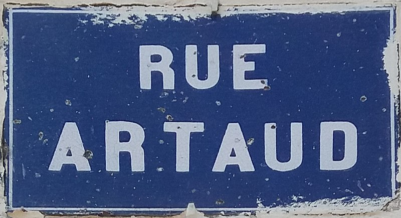

---
 

As part of educating myself about the theater, I read <a href='https://www.goodreads.com/book/show/75867.The_Theater_and_Its_Double'>The Theater and Its Double</a> by Antonin Artaud. When he wrote it, Artaud was in and out of psychiatric care. He was also waging battles in ink with detractors over concepts he had enunciated in various manifestos of the *Theatre of Cruelty*.

In launching his arguments Artaud began by asking: what is man's true nature? How would he react, say, to the end of the world or a massive plague? Artaud goes off on a pseudo-scientific detour on plagues, listing affected organs he believed accounted for human behavior. Elsewhere in this drawer-full of manifestos, text, and polemics Artaud conceives of a new manner of theater in which verbal language is replaced with code, where actions and emotions are broken down into a taxonomy of gestures.

With this said, however, the <em>Theater and Its Double</em> is an interesting read because of its dissection of theater's persistent and all-too real weaknesses. Naturalism, for one, which was just gaining strength, clearly ticked off Artaud, who expected more of theater. For Artaud, theater is a primal sphere, a holy sphere, filled with man's greatest longings, his greatest hungers, his greatest fears. Mere representation of social and psychological conflict was a trivialization of theater's potential. Artaud rails against the bourgeousification of theater, its detachment from the wants and fears of the common man, and its self-castration. And as a major voice of French Avant- garde theater, he certainly made his case, although the common man has a low threshold for lunacy and conceptual art. Still, many of Artaud's criticisms of theater are spot-on even today.

Even Chekhov, in *The Seagull*, predated Artaud's criticisms when he had Treplieff say, "When the curtain rises on that little three-walled room, when those mighty geniuses, those high-priests of art, show us people in the act of eating, drinking, loving, walking, and wearing their coats, and attempt to extract a moral from their insipid talk; when playwrights give us under a thousand different guises the same, same, same old stuff, then I must needs run from it... If we can’t [have a new theatre], let us rather not have it at all.” 

But Artaud goes off on so many incoherent tangents that it's impossible for it all to fit together. In concocting his new Occidental theater, Artaud drew from Balinese theater, Tarot, the Kabbalah, astrology, and his own eclectic pseudo-scientific theories. 

And, viewing them in a historical context, there was a dark side to Artaud's theories. Kimberly Jannarone's <a href='https://www.goodreads.com/book/show/11107321-artaud-and-his-doubles'>Artaud and His Doubles</a> looks at Artaud's place in theatre and finds "two sets of doubles: one, a body of peculiarly persistent received interpretations from the American experimental theater and French post-structuralist readings of the 1960s; and, two, a darker set of doubles brought to light through close historical examination — those of Artaud's contemporaries who, in the tumultuous, alienated, and pessimistic atmosphere enveloping much of Europe after World War I, denounced the degradation of civilization, yearned for cosmic purification, and called for an ecstatic loss of the self."

It wouldn't be too many years until Europe was "purified" of those accused of degrading civilization.