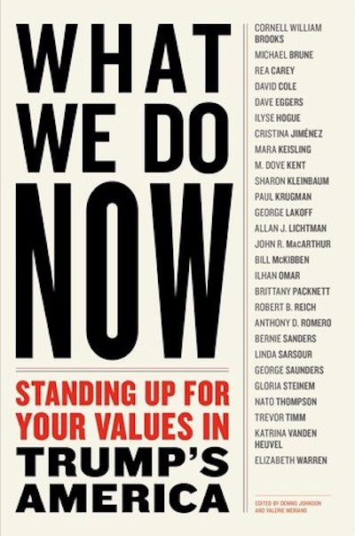

---

I received "What We Do Now" as a gift for making a contribution to [Democracy for America](http://www.democracyforamerica.com/) (DFA).

"[What We Do Now](https://www.goodreads.com/book/show/33299879-what-we-do-now)" is 200+ pages containing 27 short essays or excerpts from speeches by a number of liberal politicians, activists and writers. They include VT Senator Bernie Sanders, who wrote about the six American banks that represent 60% of the American GDP; MA Senator Elizabeth Warren, on the importance of crafting a coherent economic message; Anthony Romero of the ACLU, on the dangers our democracy faces -- all the usual suspects weighing in on all the usual issues. And I don't mean to make light of them.

But after two months into the Trump presidency, I dare say we are already doing precisely what the roster of authors suggest -- without having read them first. Most of us have already figured out the demagogue's media tricks, as George Lakoff deconstructs them. And the fact that his own supporters will suffer the most, as Paul Krugman points out. We know what to expect economically, politically, and culturally. And we're resisting.

Linda Sarsour's essay was my personal favorite, followed by Alan Lichtman's piece on rebuilding the Democratic Party. Sarsour takes just the right tone of stridency and progressive opposition. Lichtman, on the other hand, should be required reading (and re-reading) as a warning of how difficult it is going to be to convince Democratic centrists they were wrong. Lichtman betrayed the most partisan bias of any of the authors in the book and is clearly both a Clinton fan and a TPP proponent. But he mis-characterized opposition to the Trans-Pacific trade bill as the "rat-trap of protectionism" and didn't bother to mention the corporate goodies buried in the TPP that were so problematic for progressives. On this Lichtman can't see any difference between Trump and Sanders, and this is a form of blindness.

Thus, "What We Do Now" perfectly encapsulates ongoing conflicts and contradictions within the Democratic Party. For DFA to reward me with a book containing an essay by Bernie and another by a Hillary surrogate tells me the fight for the soul of the Democratic Party is far from over.

