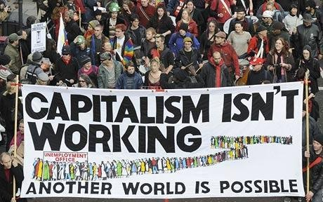

---

_Don't give me that old time religion._

American Free Market fundamentalists claim that regulation, taxes, government interference, and lack of incentives are stifling job creation and business growth. No matter that many of them are already operating off-shore, pay no taxes, or are stashing their money out of reach of the IRS.

Not enough people stop to think that the overall state of the world economy might also have something to do with it &#8212; what with Greece, Portugal, Spain, Ireland, Iceland, and now Italy in economic crisis. Wealthier Eurozone nations like Germany and France are on the hook for a lot of European debt, and this will ultimately hit them if weaker economies default. And then there's Japan, which has been battling sluggish economic growth for over a decade. That's a lot of uncertainty. More uncertainty than knowing you have to pay your taxes every year on April 15th at a predictable tax rate.

With so many capitalist nations sick or on life support, where are all the customers for American products and services going to come from? The reticence to expand businesses and hire people may actually have more to do with the dismal chances of recouping investments in an uncertain world. But it certainly is convenient to blame unions, government, regulators, and those calling for Big Business to pay its fair share of taxes instead of considering the scary proposition that Capitalism itself is on the ropes.

Surely there must be a country somewhere which provides all the incentives, tax relief and lack of regulation that Big Business craves, and that country would naturally have the most dynamic free-enterprise economy in the world &#8212; if the acolytes of Milton Friedman are right. And it is a given that all that economic success would occur in a democratic country with well-educated, free, and healthy citizens. Turns out, this is a Free Market Fundamentalist's delusion.

Where is this supposed paradise?

Qatar and Paraguay have impressive GDP growth according to 2010 figures from the International Monetary Fund. On this same list on which the US finds itself 117th with 2.84% growth, there are a handful of economies with double-digit increases (Singapore, Taiwan, India, China) and approximately 70 with growth over 5%. Mexico and Bangladesh have twice the growth of the United States and Afghanistan three times our growth. Using CIA World Factbook figures, Taiwan and China both claim to have poverty rates half that of Switzerland's 5%. India's is 25% and ours is 12%. Even Syria has a lower poverty rate than the United States. Leon Panetta said so. But many of these countries are not free. For example, Singapore abolished trial by jury and for China they're optional. Some of these economic "dynamos" are in war zones. Some are places you wouldn't even want to visit.

So it would appear that economic growth can either lift a nation's standard of living or leave millions in poverty even while profits are taken. But growth or recession can change in a heartbeat. Singapore's economic growth, for example, is expected to plummet to a third of their 2010 figures as the world economy cools. However, ask a Free Market Fundamentalist why this phenomenon happens here in the US, and they'll tell you that it's due to too much regulation and taxation, both of which have been in decline since the Reagan administration.

So the next time a Tea Party person reads his voodoo economics off his palm, or quotes Ayn Rand or Milton Friedman, they're just invoking their prophets and reciting their economic prayers. Like any religion, it has little to do with reality and everything to do with wishful thinking. Wall Street's, not ours.