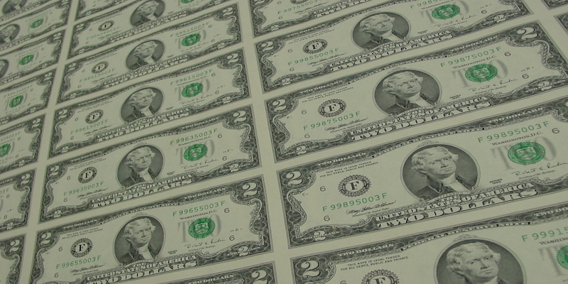
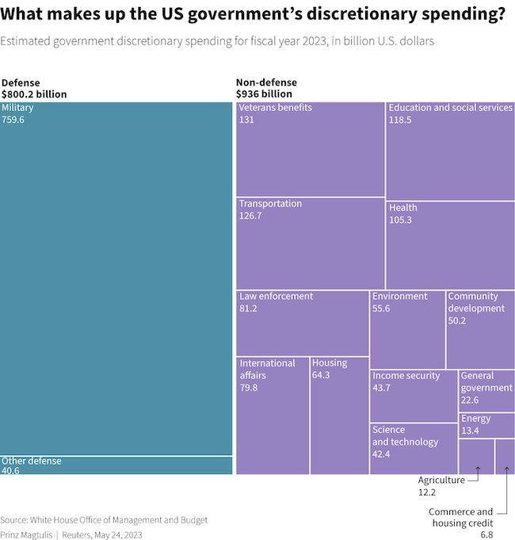

---
 
In our economic system, to make money investors rely on the stability of the dollar as well as the fiscal duty of the U.S. government to back up all debts. But profitability requires even more of government. The gears of commerce must be greased by the Fed, the Treasury, by Congress, by the President, by financial institutions, by legions of business groups and lobbyists, by laws and tax codes that privilege investors and "job creators" – all cheered on by a mainstream press almost exclusively owned by billionaires.

Our complex, fragile Capitalist economy has failed several times in recent memory, requiring extraordinary levels of governmental support and bailouts. For something so precarious, the system requires faith and superstition as much as technocratic know-how and can only survive when all the previously-named actors play their parts in theatrical rituals designed to keep the whole rickety house of cards from toppling. The debt ceiling crisis illustrates this perfectly.

CNN warned us of economic "armaggedon" while the New York Times claimed that a failure to reach an accord would unleash a "horror scenario," the total collapse of the world economy. It was widely reported that the U.S. had [never in its history](https://thehill.com/opinion/finance/575722-the-us-has-never-defaulted-on-its-debt-except-the-four-times-it-did/) defaulted – except for all the times it had. In 1933 the U.S. refused to honor the gold standard, instead opting to pay its debt off in devalued currency. And in 1971 the U.S. refused to honor the Bretton Woods Agreement, which had pegged the dollar to a value of gold, again opting to pay off debts in devalued currency. In both cases creditors got stiffed.

*Running low? Just print more.*

The U.S. [national debt](https://fiscaldata.treasury.gov/americas-finance-guide/national-debt/) is now almost $32 TRILLION. This is a number so staggering that, in practical terms, it can never be repaid. Nor does the U.S. government ever need (or intend) to. Unlike *you*, the U.S. Treasury can simply print more money. If “trust me” is all that is required for the economy to work, and skepticism is severely discouraged, then government doesn't even need to raise sufficient taxes to pay for its programs. In this way the super-rich aren’t required to pay their fair share.

Add to this the fact that the largest government programs – especially "defense" outlays – are bloated beyond imagination and can't even pass an [audit](https://www.npr.org/2021/05/19/997961646/the-pentagon-has-never-passed-an-audit-some-senators-want-to-change-that). Despite this there is little effort by either political party to slow down military spending. Of all the [expenditures](https://www.reuters.com/markets/us/whats-debt-ceiling-deal-biden-mccarthy-are-negotiating-2023-05-26/) responsible for our massive accumulating national debt, military spending is #2 and interest on that debt is #1. In short, the national debt is bipartisan in origin and the failure to deal with it equally bipartisan. And where there is "debate" without actual disagreement you find only staged theatre and spectacle.

*White House OMB 2023*

Thus, the debt ceiling "crisis" we just witnessed was another semi-annual performance completely divorced from reality. No other nation on earth has a debt ceiling – with the exception of Denmark, where the average citizen has never even heard of it. There is no intention of ever paying off the U.S. national debt. There is no intention of ever reaching a balanced budget. And staging such congressional theatre is completely unnecessary in the first place – because the U.S Constitution says that, *no matter what*, the bills must always be paid:

> "The validity of the public debt of the United States, authorized by law, including debts incurred for payment of pensions and bounties for services in suppressing insurrection or rebellion, shall not be questioned."

But assuming creditors *would* come banging on the door, demanding their money, who are they and how much leverage do they have?

Contrary to a common notion of China holding an [exaggerated](https://chinapower.csis.org/us-debt/) quantity of the national debt, it turns out that roughly [40%](https://www.pewresearch.org/short-reads/2023/02/14/facts-about-the-us-national-debt/) of the debt is held by the U.S. government itself. The Federal Reserve is the largest single creditor, followed by Social Security, the U.S. military, Civil Service retirement funds, and other intragovernmental accounts. The remaining 60% is held by millions of public investors, sometimes nations, sometimes huge bond holders, sometimes a teenager who has forgotten about the treasury bond his nana bought him at birth.

[Foreign nations](https://ticdata.treasury.gov/Publish/mfh.txt) account for less than a quarter of our creditors and include: Japan ($1.08T); China ($870B); United Kingdom ($645.8B); Belgium ($332.9B); Luxembourg ($312.9B); Cayman Islands ($283.3B); Switzerland ($266.7B); Ireland ($250B); Canada ($229B); Brazil ($225.9B). Nations like Belgium, Luxembourg, Switzerland, and the Cayman Islands do not even necessarily hold all these U.S. treasury notes themselves; instead much of those portfolios represent tax-shelters parked offshore for oligarchs, mobsters, and multinationals.

According to the [conventional](https://foreignpolicy.com/2023/01/27/us-debt-default-china-global-financial-system-treasurys/) wisdom, "In a default, interest rates on U.S. Treasurys would skyrocket (because investors would demand a higher rate in exchange for taking the risk that they might not be paid back), and Treasurys might no longer be usable as collateral (because their underlying value would not be clear). The entire world financial system could simply freeze."

That is, a world financial system *frozen* not because Treasurys became worthless overnight or debts cannot be repaid, but because momentarily the value of Treasurys cannot be quantified. It’s hard to sympathize with the financial markets. Most working Americans deal with much more urgent uncertainty than this every day.

Given the constitutional obligation to back debt, the debt crisis means only that the process of repaying bills *might* be *delayed*. Barring the dissolution of the United States of America and the abolition of the Constitution, debts *will* be paid – eventually. Thus, a "world financial crisis" would not result from an actual default but because of *uncertainties* regarding the *possibility* that the U.S. might not pay off its bills *immediately*. 

It is shockingly of lesser importance that the debt itself has become so large that no one actually expects it to ever be paid off or intends to ever tax the rich sufficiently to pay for a government whose machinery guarantees their own profits. Or that neither party insists on the primacy of spending the national treasure on actual *people* with real needs. Instead, the whole machinery of government seems designed to mainly service financial markets and gun runners.

The real object of this week’s high theater seems to have been to propitiate the gods of investment. And these old scoundrels require human sacrifice. Since the debt ceiling was invented in 1917, the main object of such "negotiations" has been to demand austerity and deregulation. Inasmuch as some government programs address poverty, starvation, healthcare, the environment, and joblessness, the destruction of these programs through so-called bipartisan "fiscal responsibility" makes the former beneficiaries of the hobbled social safety net more vulnerable than ever.

When the debt ceiling deal was first announced, the Business Roundtable (Josh Bolton), the National Association of Manufacturers (Jay Timmons), the Chamber of Commerce (Suzanne Clark), and various securities markets groups like the Financial Services Forum (Citigroup, Goldman Sachs, JPMorgan Chase, etc.) all congratulated the political performers for their "bipartisanship" — and then demanded even *more* austerity and deregulation.

The press stepped up as well to play their assigned role, sticking to the narrative that the manufactured and unique-in-all-the-world political ritual was a real "crisis." Politicians who supported the deal were lauded by the press for their [bipartisan](https://theintercept.com/2023/06/03/debt-limit-bill-bipartisanship/) pragmatism and sensibility while [those who opposed it](https://fair.org/home/for-media-giving-in-to-debt-limit-blackmail-was-a-triumph-of-bipartisanship/) were labelled "fringe" and excoriated for their recklessness. Democrats reluctant to inflict suffering on Americans relying on SNAP and TANF programs were lumped together as “extremist” with sadists from the GOP for whom no measure of suffering inflicted on the poor is sufficient.

Why, then, did more House Democrats than Republicans vote for the Financial Responsibility Act? First, there are two wings of the Democratic Party. One, relatively tiny, includes Democrats who believe in social and economic justice. The other, the overwhelming majority, numbers those eager to be recognized for their bipartisanship.

Happily, both Massachusetts Senators (Warren and Markey) and two members of the Massachusetts House delegation (Pressley and McGovern) voted against the FRA for moral and ethical reasons. But it was troubling that a majority of Democrats, including the President, were all too willing to sacrifice America's most vulnerable citizens on the altars of bipartisanship and market stability.

Centrist Democrats, who comprise the majority of their party, embrace bipartisanship while Republicans thumb their noses (or flip their fingers) at it. The debt ceiling vote reflected this. The centrists are not really enemies of austerity, militarism, or neoliberalism, and many of them give only lip service to social and racial justice. There's simply not enough distance between these creatures and Romney Republicans to make them enemies. hence, "bipartisanship" becomes an excuse for accommodation and outright agreement. A virtue.

Jon Schwartz has a [great article](https://theintercept.com/2023/06/03/debt-limit-bill-bipartisanship/) in the *Intercept* about Democrats hiding behind bipartisanship. And a lot of sins have been committed in its name:

- The Commodity Futures Modernization Act of 2000, passed during the Clinton administration overwhelmingly by Democrats, exempted a boatload of financial instruments from regulation
- The 2001 Authorization for Use of Force, which unleashed America's most costly war (which today accounts for 25% of our national debt) and which all but one Democrats voted for is still in effect and has expanded military strikes, drone attacks, and assassinations to 12 countries.
- The AUMF of 2002 was used to authorize the invasion of Iraq.
- The American Jobs Creation Act of 2004 gave tax breaks to corporations repatriating to U.S. shores. It didn't create many jobs but it sure padded corporate pay.
- The Budget Control Act of 2011 was the daddy of this week's "fiscal responsibility act." It imposed $1 TRILLION worth of cuts on social programs and made millions of Americans financially more vulnerable.

At some point Americans are going to have to confront a couple of very simple questions: Why do we live together in a society? And: What is the purpose of government?

If we live together in a society to undermine and ignore each other's needs, this is no kind of society at all. If the purpose of government is only to enable the exploitation of citizens for the benefit of the wealthy, this isn't going to work either. At some point those being duped are going to get wise to being unfairly treated.

This week the debt crisis again raised these questions. And for the most part neither Republicans nor Democrats could come up with satisfactory answers.
