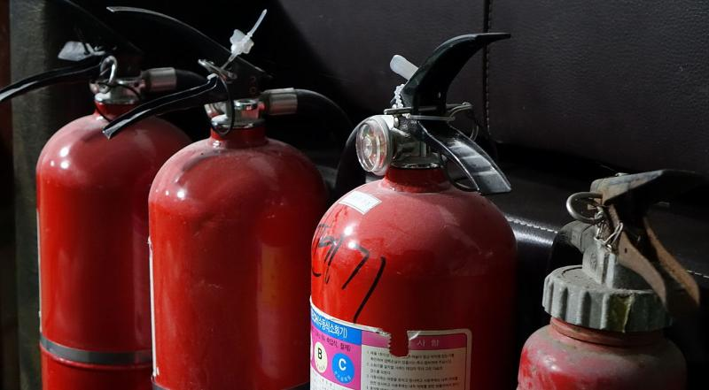

---
 

The Democratic Party is the only thing standing in the way of the Republican Party replacing America with a Christian theocracy.

And that is an absolutely terrifying thought.

The [geriatric](https://www.nytimes.com/2022/06/14/opinion/beware-the-ruinous-optimism-of-democratic-leaders.html) Democratic Party leadership — faced with an ongoing Republican coup, a Christian nationalist Supreme Court, dramatic assaults on civil liberties and separation of church and state, a war in Ukraine, energy price spikes, galloping inflation, the possibility of a recession, and more mutations of the COVID virus — well, they've certainly had their hands full.

But they're fighting a national five-alarm fire with a home extinguisher.

Rather than leveraging the tools of a government still in power, Democrats have refused to enforce party discipline on Democratic Senate free agents like Joe Manchin or Krysten Sinema, abolish the filibuster, *prosecute* January 6th insurrectionists, expand the Supreme Court, or employ the considerable powers of the Presidency to preserve what's left of American democracy. There is no presumptive Democratic candidate for President in 2024 and no apparent plan to replace the many [geezers](https://www.nytimes.com/2022/06/14/opinion/beware-the-ruinous-optimism-of-democratic-leaders.html) in Democratic House and Senate leadership roles.

There’s also no way Joe Biden can run *and* win the next presidential election. GOP hostility is a *given*, but many Democrats are worried that Biden & Co. are not up to the many challenges and disasters facing the country. Biden would be 82 if he actually began a second term as President. But who wants him? Not GOP voters, and not engaged progressive Democrats.

Merely competent, Biden has exhibited few of the leadership skills necessary to pull the country back from The Abyss. He is not a reassuring presence, as FDR or even Jimmy Carter were. His public addresses have been few and far between and he and the Democratic Party he leads have backtracked on almost every progressive promise ever made.

Right down the line — canceling student debt, expanding Medicare, enacting police reform, bolstering voting rights, shrinking the Pentagon budget — the Democratic House may have put on legislative dinner theater, but the Senate has done little to advance these bills. Is Chuck Schumer *really* less gifted than Mitch McConnell? Or is there simply a lack of will when it comes to full-throated support for Democratic policies like racial equity and abortion rights? — values once regarded as mainstream but now apparently too "far left" for some Democrats. A 2019 article in *The Atlantic* by [Peter Wehner](https://www.theatlantic.com/ideas/archive/2019/04/progressivism-making-democrats/586372/) enumerates many of the fears of these Democrats who have internalized [conservative claims](https://www.dallasnews.com/opinion/commentary/2021/07/22/are-progressives-taking-over-the-democratic-party/) that "self-styled progressives" from the "Far Left" are "taking over" the Democratic Party.

But that's nonsense, say progressive Democrats. NY Representative Alexandria [Ocasio-Cortez](https://twitter.com/AOC/status/1520108070151536641) fires back on the "Far Left" label with: "The extreme left is taking over WHERE. In Texas, Republicans passed a law allowing rapists to sue their victims for getting an abortion. Can anyone name a 'far left' policy *that* extreme implemented *anywhere*? We can’t even get our party to import cheaper RXs from Canada."

Ocasio-Cortez’s complaint raises the bigger issue that you can’t get Democrats to take strong action on even wildly popular issues. Take the worst of recent Democratic losses — abortion. Democrats lost abortion because they didn't try hard enough to keep it.

For years Democrats refused to formalize abortion rights into law. Asked if his administration would fight for the Freedom of Choice Act — which he had promised to do as a *candidate* — [President Obama](https://www.ourbodiesourselves.org/2009/04/obama-freedom-of-choice-act-not-highest-legislative-priority/) told CNN senior White House correspondent Ed Henry that it “is not the highest legislative priority.” Hillary Clinton's 2016 running mate was a long-time [foe of abortion](https://slate.com/human-interest/2016/07/hillary-clinton-picks-anti-abortion-tim-kaine-for-vice-president.html). Nancy Pelosi famously [argued](https://www.nbcnews.com/politics/congress/pelosi-course-you-can-be-democrat-against-abortion-n749856) that "of course" you can be [both] a Democrat and against abortion.

Like Obama, the [younger Biden](https://www.nytimes.com/2019/06/13/us/politics/joe-biden-abortion-2006.html) also refused to support abortion rights. “I do not view abortion as a choice and a right. I think it’s always a tragedy,” Biden was quoted in a [videotaped interview](https://www.youtube.com/watch?v=8qNRZ6WVkZI) with Texas Monthly. “I think it should be rare and safe […] I think we should be focusing on how to limit the number of abortions.”

Even after the leak of the draft overturning *Roe v Wade*, the [Democratic Party went out of its way](https://www.rollingstone.com/politics/politics-news/jim-clyburn-henry-cuellar-democrats-abortion-1348005/) to undermine pro-choice Democrat Jessica Cisneros in a primary contest with Henry Cuellar, an anti-abortion Democrat being currently investigated in an illegal scheme with Azerbaijani energy interests.

There's no denying that budgets are expressions of priorities. While there never seems to be much money for the social safety net, expanding healthcare, subsidizing education, making vaccines available to poorer nations, or providing debt relief for our own students, *somehow* Democrats managed to scrounge together [an extra $53 billion](https://www.vox.com/23125706/ukraine-aid-russia-invasion-us-40-billion) lying around the house to give to defense contractors for the Ukraine war. And the war is just getting started.

This is *in addition to* the [record](https://www.reuters.com/business/aerospace-defense/us-house-passes-bill-boosting-bidens-record-defense-budget-2022-07-14/) $800 billion Pentagon budget passed by a three-to-one majority by the Democrat-controlled House. Representative Andy Levin, a member of the Progressive Caucus, expressed his dismay: "On the whole, the National Defense Authorization Act exemplifies the basic fact that we spend far too much on military-first solutions and far too little on diplomacy and on human needs at home and around the globe."

Even our foreign policy under a Democratic President has not departed considerably from that of the Trump administration. While Trump (and Bush before him) may have glimpsed a soul in Vladimir Putin's eyes, Biden is no slouch when it comes to sucking up to autocrats and repressive regimes.

Biden's recent hat-in-hand trip to the Middle East was an embarrassment. Instead of penalizing Israel for killing American-Palestinian journalist [Shireen Abu Akleh](https://www.state.gov/on-the-killing-of-shireen-abu-akleh/), Biden gave it an extra billion dollars in military aid and agreed to restrict the rights of Americans who support [boycotts](https://www.whitehouse.gov/briefing-room/statements-releases/2022/07/14/the-jerusalem-u-s-israel-strategic-partnership-joint-declaration/) against Israel's Apartheid-style occupation of the West Bank. And by the time he got to Saudi Arabia, rather than sanctioning the Saudi regime for the gruesome murder of Washington Post reporter [Jamal Khashoggi](https://www.bbc.com/news/world-us-canada-62186332), Biden allowed himself to be lectured by Khashoggi's killer in order to extract Saudi concessions to produce more oil.

If Democrats think that they can run Biden or continue to limp along with leaders like Pelosi, Schumer, Hoyer, and Clyburn, they are mistaken. Yet we are sure to hear that "now is not the time" to let a new crew steer the ship of state. Some new iteration of an uninspiring "Better Deal" or "Build Back Better" campaign will be unloaded on voters and we will be reminded how *competently* Democratic septuagenarians and octogenarians saved the economy from calamity and kept thousands from dying of COVID.

And they’re not totally wrong. But what American voters want is not mere competence but *boldness*. And here’s why.

The fact is, no one has much faith that American democracy as it now exists can survive with perpetual gridlock, such intense political divides, endless conflicts between state and federal courts and law, and ongoing assaults on people of color and sexual minorities. To this, throw in the fact that no solution to this stalemate is possible under our deeply flawed, deeply destabilizing, and deeply anti-democratic Constitution.

We are in the midst of a Constitutional crisis not so much because one party figured out how to sabotage it but because the Constitution itself is such a mess. Until this document is shredded and re-written, we can have no political stability.

And this is precisely *why* American voters are always seeking bold change instead of unexciting competence. Like it or not, setting fire to the country *does* constitute bold change. If Democrats want to compete, then, where are *their* bold ideas? Purposely thrown overboard as "too far left."

I fear that the potential of the idealized "America" which most of us grew up with and truly love will be gone in a few years — permanently disfigured by Christian nationalists and abandoned by those who couldn't bring themselves to fight harder to hold onto it.

