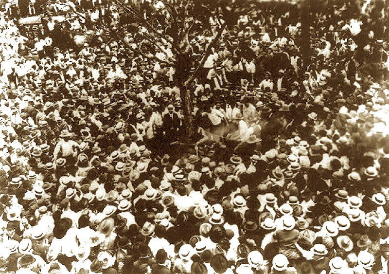

---
I just finished Anthea Butler's excellent book, [White Evangelical Racism](https://uncpress.org/book/9781469661179/white-evangelical-racism/). Butler is an associate professor of religious studies and Africana studies at the University of Pennsylvania. Her book is tour through one aspect of our malignant American history, specifically: how a perverted "slaveholders" version of Christianity has managed to corrupt virtually every aspect of American politics over hundreds of years.

As a former Black evangelical, Butler's book is both a repudiation of white evangelism and a challenge to it. In an interview she gave to [Religion and Politics](https://religionandpolitics.org/2021/04/20/white-evangelical-racism-an-interview-with-anthea-butler/), Butler not only challenges the "cultural whiteness at the heart of evangelicalism that anyone who enters the community has to receive" but the white supremacy behind the "cultural whiteness."

As white evangelicals reached consensus on the inferiority of non-whites, they internalized a white supremacist version of Christianity, which has guided even religious missions: "In the Reconstruction period," Butler says, "the 'Religion of the Lost Cause' lamented the end of slavery and asserted that Black people were inferior. The missionary movement asserted that foreigners were 'heathen' in need of civilization, which was invariably couched in white expressions of Christianity." But this is nothing new: it is at the heart of the colonialism that violently conquered the "New World."

From Reconstruction through 1952, there was not a single year in which Black Americans were *not* lynched by white mobs. [Most](https://www.redletterchristians.org/repression-national-shame-history-nooses-lament/) of these lynchings occurred on Sundays immediately following church services. Jamelle Bouie, writing in [Slate](https://slate.com/news-and-politics/2015/02/jim-crow-souths-lynching-of-blacks-and-christianity-the-terror-inflicted-by-whites-was-considered-a-religious-ritual.html), remarks that "these lynchings weren't just vigilante punishments or, as the Equal Justice Initiative notes, 'celebratory acts of racial control and domination.' They were rituals. And specifically, t*hey were rituals of Southern evangelicalism* and its then-dogma of purity, literalism, and *white supremacy*."

White evangelicals have replaced what the religious Right's Dave Daubenmire calls [sissified Christianity](https://www.rightwingwatch.org/post/dave-daubenmire-sissified-christianity-brought-us-donald-trump/) — that is, a traditional Christianity that deals in kindness and justice, one that doesn't suit their purposes — with a more violent, punitive, white dominated, and male dominated version. White Evangelicals pretend that their many [intrusions into politics](https://www.christianitytoday.com/edstetzer/2021/february/how-do-non-american-evangelicals-respond-to-us.html) are nothing more than the Word of a Living God. But there is barely a trace of Christ in white Evangelical Christianity — except for the sword-wielding slayer of the Second Coming. The truth is, the white evangelical movement, [masquerading as a religion](https://www.theatlantic.com/podcasts/archive/2021/05/evangelicals-republican-voters/618845/), is little more than cover for white supremacist politics.

If a religion can be hollowed-out to fit a political agenda, then why not also the fabric of reality? For White Evangelical America, truth is what you say it is, what you "just know," what's simply "common sense." *What we can't see can't hurt us. Everything in the Bible comes straight from God. White people are God's gift to humanity. Being gay is a chosen lifestyle. Evolution is a lie. God will protect me from COVID-19. Slavery wasn't so bad.* It's no surprise that reckonings with our white supremacist history, in efforts like the 1619 Project, must be firmly opposed.

No amount of fact, personal testimony, or science will convince white evangelicals of views that challenge white supremacy. Time after time their thought-leaders and politicians not only reject verifiable fact but traffic in manufactured lies, the more outrageous the better. Anything to "own" the Libs. Though the Space Station clearly shows the earth is round, it looks pretty flat down here on earth. *So trust your eyes! And, anyway, the whole space program was a hoax filmed on a Hollywood back lot.* For white evangelicals, if reality is too convincing, too *real*, then just call it a lie. And if *that* fails, you can always claim that God has sent you a prophetic dream or that a failed political candidate was "anointed" by God. Election results be damned.

Given white Christian America's contempt for any reality but its own manufactured version, the Conservative media — print, online and broadcast — shows little interest in producing fact-based news but instead cranks out rightwing propaganda at a rapid pace, much of it pouring down hate on non-whites, immigrants, LGBTQ people, scientists, academics, and social justice reformers. Much of today's Conservative media reads like the 21st Century equivalent of Julius Streicher's [Stürmer](https://www.thoughtco.com/der-stuermer-newspaper-1779279).

White evangelicals make up only 25.4% of the [population](https://www.pewresearch.org/fact-tank/2018/03/01/5-facts-about-u-s-evangelical-protestants/) but they are the largest single religious denomination in the United States, beating out non-religious Americans at 22.6%, Catholics at 20.8%, and traditional Protestants at 14.7%. 76% of white evangelicals are white, 49% live in the South and 22% in the Midwest. 66% see themselves [at odds](https://religionnews.com/2020/03/15/why-white-evangelicals-are-at-odds-with-america/) with mainstream American culture, lamenting positive changes in immigration, secularization and demographic diversity. For white evangelicals, these changes are all related. Immigration, civil rights, secularism and feminism all [threaten](https://www.huffpost.com/entry/white-evangelicals-race-immigration-diversity_n_5bda1fb1e4b019a7ab5a04be) Christian white male domination.

Which may explain why White America has chosen white evangelicals to be its voice. A recent [Atlantic Magazine](https://www.theatlantic.com/podcasts/archive/2021/05/evangelicals-republican-voters/618845/) article notes, "These days, everyone assumes that this is just a fact of life: Evangelicals are Republicans, and Republicans are evangelicals." The article goes on to describe how white evangelicals made themselves useful to the Republican Party and, within short order, how the Republican Party became a vessel for propagating white evangelical supremacy. This story is also recounted in Anthea Butler's book as well. It's a love story of two dying demographics.

But it's not hard to see the attraction. White America fears the demographic changes that are assuredly coming. Specifically, White America fears the loss of five centuries of racial supremacy. The Republican Party — 81% [white](https://www.pewresearch.org/politics/2020/06/02/in-changing-u-s-electorate-race-and-education-remain-stark-dividing-lines/) and 73% [Christian](https://www.pewresearch.org/politics/2020/06/02/in-changing-u-s-electorate-race-and-education-remain-stark-dividing-lines/) — and [disproportionately Southern](https://www.washingtonpost.com/politics/2020/02/07/republican-party-is-white-southern-how-did-that-happen/) — has cynically adopted or defended the "Lost Cause" teachings of Southern white evangelism — not to mention its monuments — and tolerates evangelical hostility to science and disregard for mainstream American views, and the many conspiracy theories that it circulates. It is no surprise that [QAnon is spreading](https://www.pewresearch.org/politics/2020/06/02/in-changing-u-s-electorate-race-and-education-remain-stark-dividing-lines/) most rapidly among white evangelicals.

White America has entered a new Jim Crow era. Voting rights, along with secular freedoms, are now being threatened by the GOP and its white evangelical base in dozens of states. Support for police repression has increased. Since George Floyd's killing, police killings are unabated. 255 more Black people have been murdered by police — the 21st Century agents of lynching. In several states laws permitting motorists to run down Black Lives Matter protesters have been signed. Permission to carry unlicensed or conceal-carry weapons have been written into law. That's on top of "stand your ground" and dozens of clearly racist laws that permit vigilantism to varying degrees.

Now with Jim Crow just starting up again, it seems all too clear — if parts of White America could get away with it, we'd be seeing Sunday lynchings once again.

