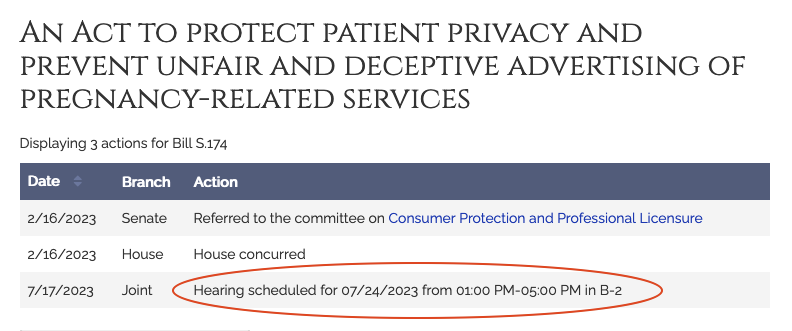

---
 

As many are aware, anti-abortion organizations have begun setting up [fake abortion clinics](https://www.theguardian.com/us-news/2019/aug/16/georgia-abortion-crisis-pregnancy-centers), such as the Crossroads Pregnancy Center in Georgia, a state with over 90 such "clinics," in an attempt to prevent women from receiving *actual* health care.

These "crisis centers" or "fake clinics," as reproductive rights advocates call them, deceptively advertise medical services but offer none, use strong-arm tactics including releasing or threatening to release personal information to third parties, and frequently engage clients in counseling and religious proselytization well into late stage pregnancy in order to make the abortion impossible. National [organizations](https://msmagazine.com/2021/08/08/feminists-fight-fake-abortion-clinics-no-one-should-be-lied-to/) like SPARK, ReproAction, and Abortion Access Front have exposed these clinics for what they are and Massachusetts bills S.174 and H.377 thankfully put legal protections for women into law.

The Massachusetts Joint Committee on [Consumer Protection and Professional Licensure](https://malegislature.gov/Committees/Detail/J17/193) will **hold hearings tomorrow** that will include testimony on [Senate Bill S.174](https://malegislature.gov/Bills/193/S174) (also filed as [House Bill H.377](https://malegislature.gov/Bills/193/H377)), *An Act to protect patient privacy and prevent unfair and deceptive advertising of pregnancy-related services*. The legislation is accompanied by an appropriations component found in [House Bill H.57](https://malegislature.gov/Bills/193/H57), *An Act making appropriations for the Fiscal Year 2023 to provide for supplementing certain existing appropriations and for certain other activities and projects*.

Besides legal protections for women, the appropriations bill specifies that "not less than $1,000,000 shall be expended for a public awareness campaign to educate providers and the public about so-called crisis pregnancy centers and pregnancy resource centers and their lack of medical services; provided further, that said campaign shall include information on the availability of providers across the commonwealth that provide legitimate medical and family planning services."

Naturally, right-wing groups are up in arms. The Massachusetts Family Institute is [rallying](https://www.mafamily.org/2023/07/19/action-alert-stop-the-pregnancy-resource-center-gag-rule/) supporters to show up at **tomorrow's hearings**. MFI takes great offense at the appropriations bill and has framed the legislation as an attack on Christian Nationalists' First Amendment rights [to deceive women], [calling it](https://www.mafamily.org/takeaction/) a "gag order."

But this is first and foremost a health and consumer protection issue. These fake abortion clinics are as much a menace to public health as the guy who does liposuctions in his garage.

**Please write** to your legislator and to the Joint Committee to [express your support](https://precaf.github.io/mailto/sb174/) for *An Act to protect patient privacy and prevent unfair and deceptive advertising of pregnancy-related services*.

