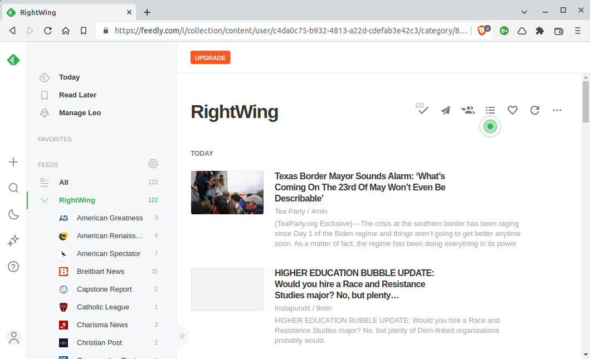

---
 

Americans have become highly segregated into ideological silos. So much so that if they venture outside their comfort zone they feel endangered, queasy and agitated — as if they had strapped on a VR headset and were gazing into an unsettling virtual reality.

People on the Left and Center don’t spend a lot of time in *right-wing* virtual reality. And the reverse is true. The far-right certainly doesn’t place a high premium on science, verifiable fact or primary sources.

For example, you would be hard-pressed to find many Republicans who have actually read any of the authors of foundational texts on things they despise — like Critical Race Theory, for instance. Instead, they rely on a network of think tanks and crackpots to interpret and propagandize. 

I mean, why read Richard Delgado and Jean Stefancic — two of the [founders](https://www.amazon.com/Critical-Race-Theory-Introduction-America/dp/0814721354) of Critical Race Theory — when you can read the Manhattan Institute's [Christopher Rufo](https://en.wikipedia.org/wiki/Christopher_Rufo), who has a long history with far-right think tanks — and in one gig with the Discovery Institute promoted Creationism for a living?

Now, I am pretty sure my version of reality contains a bit more, well, *reality* than the right-wing's virtual world. But it’s important to inform oneself. And not only do I trust primary sources over second-hand accounts, but I want to know what these people actually think, and why.

Just like liberals, the right-wing has its own news sources. FOX News may be the best-known, but any list should include Breitbart News, Epoch Times, WND, One America News, the Daily Signal, Daily Caller, Gateway Pundit, the Blaze, and a variety of Christian-*ish* news sources that offer everything from weather reports and dating advice to devotionals and End Times prophecy.

Then there are the social networks. *Parenthetically*, let me just say that it has been a huge mistake to "deplatform" right-wing crackpots by kicking them off Facebook and Twitter. These exiled “thought-leaders” have simply fled to right-wing social networks like Gab, Gettr, Parler, and Trump's new (and [still not working](https://www.theguardian.com/us-news/2022/apr/09/truth-social-trump-app-failed-products)) Truth Social — dragging all their supporters with them, where they may be out of sight but are still very much out of their minds. Only, now it’s more difficult to track what they’re up to.

Platforms like Bitchute, Rumble, and PlayerFM host videos and podcasts that might not pass muster on mainstream media streaming services. The messaging program Telegram has also become a popular app for hosting far-right chat groups.

For those determined to keep a toe in the mainstream, YouTube is still an option for delivering content — unless the content creator is spreading COVID disinformation or raises some other flag. Some will just bite their tongues and show a little restraint in order to stay on Facebook and Twitter.

I signed up for Gettr, Parler, Truth Social and Telegram. Gab has been removed from both the Apple and Google stores so I couldn’t try it, and I was never able to actually use Truth Social because two months after signing up I’m still in a waiting queue. 

Just like Facebook and Twitter, each turned out to be primarily an echo chamber for news and opinion pieces published elsewhere. The level of civility was no worse than on Facebook or Twitter. But far from being oases of free expression, right-wing social networks *do* censor liberal views. Trump Truth Social reportedly goes so far as to [ban criticisms](https://www.engadget.com/trumps-free-speech-app-truth-social-is-censoring-content-and-kicking-off-users-023153584.html) of Donald Trump. 

I ultimately gave up on the right-wing social networks (as I did long ago with their mainstream cousins), instead turning my attention to news and opinion pieces from think tanks and news sources that manufacture (not simply echo) right-wing virtual reality and right-wing talking points.

One of these talking point on which I agree wholeheartedly is that social networks *really do* pose a problem to democracy with their censorship. 

Not only have COVID disinformation spreaders and the most repellent of racists run afoul of censors, but so have socialists, commentators who may have appeared on Russian media at one time or another, foreign policy critics, supporters of the BDS movement, Israel critics, Russian artists and musicians, newspapers covering whatever there is to report on Hunter Biden’s laptop, and those now falling victim to American social media's new mission as a partisan in the West's sanctioning of Russia.

But let’s not blame any one party for this. Censorship and forced political and social exile has been a bipartisan phenomenon as long as I’ve lived — and that’s a life that includes the McCarthy era.

Putin's invasion of the Ukraine — despicable as it is — has led to the West pulling out all the stops to ban Russian *anything* and even snatching internet domains. The almost McCarthyite frenzy which Putin’s invasion has unleashed serves to remind us that internet freedom exists only at the pleasure of Western governments and their [digital gatekeepers](https://core.ac.uk/download/pdf/4187775.pdf). 

The fact that corporations have now become deputized agents of state policy should also [shock us](https://www.pewresearch.org/internet/2020/02/21/concerns-about-democracy-in-the-digital-age/). Because if there is no daylight between the media and the state, or if the media is deeply “embedded” with the state (a phenomenon that the Iraq War highlighted), then it's ultimately the *state* itself that is engaged in censorship.

*That* said, the American Right has never been more dangerous than it is today. It is truly an enemy of democracy and tolerance, and a racist and misogynistic force of repression that hasn’t given up on the idea of erasing any separation of church and state. And today, while those of us on the Left and Center bicker, all the far-right’s moving parts are firing in synch like pistons in a well-tuned V8 engine.

The final layer of right-wing opinion-shaping is a stunningly vast network of right-wing think tanks and well-funded foundations which include ALEC, Christian Coalition, Civics Alliance, Claremont Institute, Colson Center, Coolidge Foundation, Eagle Forum, Family Research Council, Federalist, Foundation Against Intolerance and Racism (!), FreedomWorks, Gingrich 360, Heritage Foundation, Hoover Institution, Manhattan Institute, National Association of Scholars, National Legal Foundation, Pioneer Institute — and hundreds (if not thousands) more.

But don’t take my word for any of this. Follow the American right-wing yourself. [Feedly](https://feedly.com/) is a great tool for following [RSS feeds](https://support.microsoft.com/en-us/office/what-are-rss-feeds-e8aaebc3-a0a7-40cd-9e10-88f9c1e74b97). Whenever a new article from any one of the 70 right-wing media outlets I follow is published, it appears in Feedly. If you want to start with my list, you can download my [OPML configuration](https://precaf.github.io/links/right-wing.opml) and import it into your own Feedly account or most any [RSS reader](https://bloggingwizard.com/free-rss-feed-readers/).

Thankfully, there are a number of organizations that also follow the American Right. Some of the best are the Southern Poverty Law Center, Right Wing Watch, Political Research Associates, the Anti-Defamation League, the Freedom from Religion Foundation, the Institute for Research and Education on Human Rights, the ACLU, and the NAACP. 

Read them, donate to them, and take their warnings seriously. And — I won’t say “enjoy” — but good luck in your own explorations of right-wing virtual reality.
