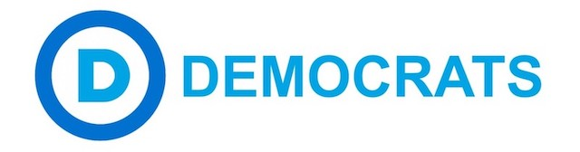

---

*Massachusetts Democrats are getting ready for the 2018 convention in Worcester. The following information might be useful if you are thinking of jumping into the Blue pool.*

**The MassDems Convention**

The 2018 Massachusetts Democratic convention is an *Endorsing Convention* — which means that state primary candidates will be vetted at the convention. To appear on the Democratic primary ballot on September 4th, candidates need 15% of the convention delegate vote, so you may have noticed that candidates are scrambling to contact party activists. This year's convention is also considering charter amendments — changing the rules by which the state party operates. *Action Together* has a good writeup on what will go on at the convention:

- [MA Civics 101: What happens at the 2018 Endorsing Convention?](https://actiontogetherma.com/blog/2018/01/10/ma-civics-101-what-happens-at-the-2018-endorsing-convention/)

*Action Together* also has a good summary of how you can jump in:

- [2018 MA Democratic Caucus & Convention Information](https://actiontogetherma.com/resources/2018-ma-democratic-caucus-convention-information/)

**First things first**

Start by attending your Democratic town caucus. You can't be a delegate if you're not attached to a local committee. Today was the first day of the caucuses. Check to see when yours is being held:

- [2018 Caucus Date List and Submission Center](https://massdems.org/convention/2018-caucus-dates)

**A little light reading**

The rules for delegates, alternates and "add-on" delegate selections will leave you with heartburn and a headache. In general, there are an equal number of male and female delegates and alternates. There are also a number of "add-on" delegates, also gender-balanced, who represent various identities: minority, gender, sexuality, disabled, etc.

You must be registered as a Democrat at the time of your town caucus to be elected as a delegate or alternate. Add-on delegates can register as Democrats at the caucuses. Delegates must be present at the caucuses unless they are serving in the military, and they must not have publicly supported non-Democrats within the last 2-4 years. There may be some exceptions for absences at the caucuses if prior notice has been given in writing to the local chair. Consult your local chair and familiarize yourself with the Convention documents and the various forms and registration deadlines. And don't show up late for your caucus!

- [2018 Preliminary Call to Convention](https://massdems.org/files/Final-Preliminary-Call-to-Convention_01.pdf)
- [2018 Delegate Allocation](https://massdems.org/files/2018_DelAllocation_Final-2.pdf)
- [2018 Convention Rules](https://massdems.org/files/2018-Convention-Rules-APPROVED.pdf)
- [2018 Method of Selecting Delegates](https://massdems.org/files/2018-Method-of-Selecting-Delegates-APPROVED.pdf)
- [2018 Convention Online Applications](https://massdems.org/convention/online-applications)
- [2018 Convention Add-On Application](https://goo.gl/forms/rLdtUL8ca0RPjKpU2)
- [Youth Add-On Selection Procedure Explainer](https://massdems.org/files/Youth-Add-On-Selection-Procedure-1.pdf)
- [2018 Convention Fee Waiver Application](https://goo.gl/forms/4RsKcsBrPsdIe2lA2)

**In case you missed the email**

You may find additional information in an email the MassDems sent to all town and city Chairpersons:

- [Email Updates to Chairs of the Mass Democratic Party](https://us16.campaign-archive.com/?u=8c481433b020af7ca5a403bdc&id=4ac0804357)

**Get on Richard's list**

Richard Drolet is a good guy to know if you’re a SouthCoast Democrat. He is the Chairperson of the New Bedford Democratic City Committee, which arranges a bus to the convention for Democrats from New Bedford and neighboring towns. Get on Richard's email list to be advised of City committee meetings (which are open to members of neighboring towns) and plans for travel to the 2018 Convention in Worcester.

- [Email Richard Drolet](mailto:branch18nalc@yahoo.com?subject=Please%20add%20me%20to%20your%20list&body=Richard,%0d%0a%0d%0aPlease%20add%20me%20to%20your%20New%20Bedford%20Dems%20list%20and%20let%20me%20know%20about%20travel%20to%20the%202018%20Convention.%0d%0a%0d%0aThanks,%0d%0a%0d%0a[your%20name]%0d%0a)

