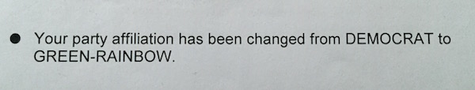

---

The last twenty-four hours have convinced me that progressives are in an abusive relationship with the Democratic Party.

First were the emails released by Wikileaks revealing that the party actively conspired against Bernie Sanders. Then Clinton's choice of running mate seemed designed to stick a finger in the eyes of progressives. Finally, preserving superdelegates seemed designed to flip the party leadership's middle finger at 43% of the base who wanted not only a progressive platform but progressive reforms.

People, if you're *really* honest with yourselves, you need to admit it -- *you're in an abusive relationship.*

All the warning signs are there. Complete control (at conventions and primaries). Betrayal (of progressive values). Breaking down self-esteem (by constantly telling you your ideas are naive and unviable). Jealousy (if you deviate from the leadership's views). Threats (that you are reckless and irresponsible). Taking advantage of you financially. Expecting absolute and undeserved loyalty. Physical abuse (by preserving violent policing, militarism, and economic injustice). Promising you anything to keep you in the relationship. Warning you how defenseless you will be if you leave the party.

But fortunately there are healthy, positive steps you can take.

Maintain outside relationships -- even though your party may try to make itself the center of your world. Talk to others. Seek "reality checks" from third parties to see if your party's behavior is healthy. Identify a "safe place" you can go if your relationship with your party becomes dangerous. Develop a support system through community organizations and other political groups who champion real change. Stop blaming yourself for your party's bad behavior -- their values are not yours. Stop putting on a show for friends and family of happiness with your party. 

Be honest with yourself. You've been unhappy a long, long time.

You don't need to keep living this way. Pack your bags and leave -- if need be in the middle of the night. Find a safe haven, a place where you are respected for yourself, for your values, a place where you will find like-minded people who will build up -- not break down -- your self-esteem. And more importantly, people who will work *with* you, not subvert your ideals.

Remember: understanding unhealthy dynamics and taking appropriate, positive steps is the key to real change.

