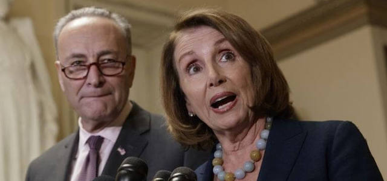
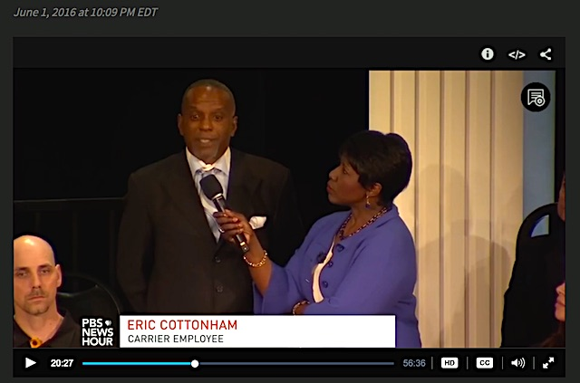
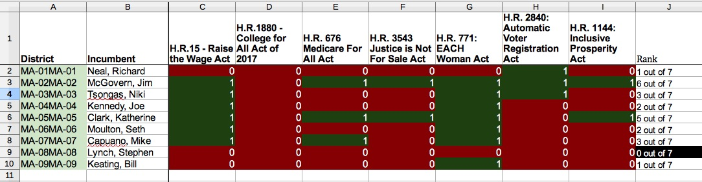

---

The newly-announced Democratic strategy for 2018 will be neither good for progressives nor for centrist Democrats. A terminally ill party has chosen to forego a direction that might save it. It has chosen a strategy that justifiably skeptical voters will reject in the midterms, one sure to alienate progressives and Republicans alike, in the earnest conviction that walking straight down the middle of the road at midnight is the safest way to move forward. The new strategy also demonstrates that a marriage between party centrists and progressives is untenable.

Yesterday Senate minority leader [Charles Schumer](https://www.nytimes.com/2017/07/24/opinion/chuck-schumer-employment-democrats.html) and House minority leader [Nancy Pelosi](http://www.democraticleader.gov/abetterdeal/) stood in the sun in rural Virginia and announced the Democratic Party's "Better Deal" for Americans. Their message was completely economic: "First, we’re going to increase people’s pay. Second, we’re going to reduce their everyday expenses. And third, we’re going to provide workers with the tools they need for the 21st-century economy."

The Democratic campaign was crafted by Madison Avenue but symbolically launched in Berryville, Virginia, population 4,185, 85% white, a Southern town where Hillary Clinton led in the 2016 election. The slogan actually reads: "A Better Deal: Better Jobs, Better Wages, Better Future" but GOP hecklers noted similarities with the Papa John's slogan "Better Ingredients, Better Pizza" and brought their own pizza boxes ridiculing the Democrats. [THEWEEK](https://theweek.com/articles/710361/congrats-getting-new-slogan-democrats-might-just-dumb-enough-work) echoed skepticism of the campaign's ham-handedness: "Congrats on getting a new slogan, Democrats. It might just be dumb enough to work."

The Democrats' new strategy seems to embrace the ideas of Clinton strategists [Mark Penn and Andrew Stein](https://mobile.nytimes.com/2017/07/06/opinion/center-democrats-identity-politics.html), whose piece in the July 6th New York Times advised "Back to the Center, Democrats." [POLITICO](http://www.politico.com/story/2017/07/24/democrats-agenda-2018-rural-virginia-240905) noted that the new strategy "sidesteps" social issues, appearing to further reject so-called "identity politics," a direction recommended to the DNC in a November 2016 op-ed in the New York Times by [Mark Lilla](https://www.nytimes.com/2016/11/20/opinion/sunday/the-end-of-identity-liberalism.html), a Libertarian. Furthermore, the DNC now seems to be chasing rural white voters, a strategy [Amanda Marcotte](http://www.salon.com/2017/07/22/democrats-are-still-chasing-rural-white-voters-and-its-a-strategy-doomed-to-fail/#.WXS6Nu-h7Ng.twitter) sees as doomed.

But the Washington Post and the [Chicago Tribune](http://www.chicagotribune.com/news/nationworld/politics/ct-democrats-better-deal-20170724-story.html) saw the launch as a smashing success, calming a "restive left" in the party's ranks. [David Atkins](http://washingtonmonthly.com/2017/07/23/lessons-learned-the-healing-within-the-democratic-party-begins/) at Washington Monthly sounded a "mission accomplished" note by declaring that the party had learned its lessons and now the "healing" could begin. [John Stoehr](http://washingtonmonthly.com/2017/07/24/the-democrats-are-re-learning-populism/) saw the party learning how to be "populists" again. [McClatchy News](http://www.mcclatchydc.com/news/politics-government/article163370518.html) claimed the announcement made progressives delirious with joy at the "left-leaning" agenda. Centrists, wrote the friendly pundits, had moved as far to the left as possible, and now love was in the air.

But when one parses the new economic strategy, it reads [exactly like the old economic strategy](https://shadowproof.com/2017/07/24/democrats-still-dont-better-deal-working-people/): economic and wage adjustments, public-private partnerships, and training for the New Economy *du jour*. But, this time, with tax credits for employers doing the training. The [New Republic](https://newrepublic.com/article/144019/central-contradiction-democrats-better-deal) argues that the DNC emphasis on worker retraining will resonate as poorly with those like the [Carrier worker in Elkhart](http://www.pbs.org/newshour/bb/questions-for-president-obama-a-town-hall-special/) whom Obama lectured during a town hall last June. CUNY Political Scientist [Corey Robin](http://coreyrobin.com/2017/07/24/the-democrats-a-party-that-wants-to-die-but-cant-pull-the-plug/) points out that public-private worker training schemes are rarely successes and observes that, if this is the best the [DNC](http://coreyrobin.com/2017/07/21/we-have-the-opportunity-for-a-realignment-we-dont-have-a-party-to-do-it-yet/) can come up with, it must have a death wish:

> "It’s true that Schumer offers other proposals, including a $15 minimum wage, but for anyone with a memory, the devotion of one sentence, much less a paragraph, of precious column space to this synecdoche of the bipartisan political economy of the last four decades—well, it’s enough to make you think this is a party that wants to die but can’t pull the plug."

Liberal WaPo columnist [Eugene Robinson](http://www.oregonlive.com/opinion/index.ssf/2017/07/democrats_can_do_better_than_a.html) sees the new Democratic strategy as timid and uninspiring. "I'm still waiting to hear the "bold solutions" that Democrats promise. I can think of one possibility: Why not propose some version of truly universal single-payer health care?"

Writing on Bill Moyers & Company, UC Berkeley law professor [Ian Haney Lopez](http://billmoyers.com/story/everything-thats-wrong-democratic-reboot-one-lousy-op-ed/) wrote that the new Democratic strategy is everything that's wrong with the party: Wall Street connections; an over-emphasis on marketing; a party turning its back on minorities by focusing now on whites; and a "boring party with limited ambitions."

A list of twenty organizations including Our Revolution, Democracy for America, and Progressive Democrats of America wants Democrats to support [seven pieces of progressive legislation](https://actionnetwork.org/petitions/s4p). It's been a remarkable litmus test for the party's willingness to actually move in a progressive direction. Not surprisingly, Democrats have rejected the progressive agenda. Forget the Blue Dogs and Red State Democrats for a moment and look at the [Massachusetts Congressional delegation](https://docs.google.com/spreadsheets/d/1jm_nHUs8xViYcAmO0ud5JAJ4VGnaRItVy3KaLVz5_es/edit).

Not one in the entire delegation supports the Massachusetts Democratic platform's call for free college education. Only two are willing to tax investment income. Only two are willing to get rid of private prisons. Only three support healthcare as a human need and not a profit center. Only three support automatic voter registration (Democratic Secretary of State William F. Galvin is even [appealing](https://www.bostonglobe.com/metro/2017/07/24/judge-overturns-state-voter-registration-deadline/B4Ah02C1GW9hMMOQNrkftL/story.html) a State Judicial Court ruling that bars the state from forbidding people from voting unless they registered 20 days prior to an election).

It seems clear where all this is headed. Does anyone really expect hundreds of midnight conversions to progressive politics from Bay State Democrats? This is a party that has learned nothing from its loss in 2016.  Democrats, both centrist and progressive, need to admit that efforts to reform the DNC have failed. There will be no new direction, no recalibration -- only a further slide to the right as Democrats try even harder to play the Republican game. 

