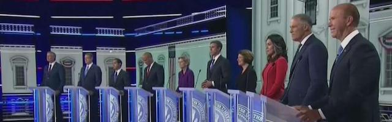

---

Last week’s debates featured a pack of twenty Democratic candidates for president. All these men and women deeply care about the United States and all would be an improvement over the incumbent. I can say with relative certainty that I will be canvassing door-to-door for whichever of these people ends up the Democratic nominee in 2020.

The debates were chaotic, with contenders interrupting and constantly talking over each other. Nevertheless, it was a valuable opportunity to see wits and bits of policy on display. To my thinking, only Julian Castro, Cory Booker, and Elizabeth Warren survived the [first night’s debate](https://www.youtube.com/watch?v=vJ6MrDO0kgY). And of the [second night’s](https://www.youtube.com/watch?v=cX7hni-zGD8) participants, only Kamala Harris and Pete Buttegieg came out relatively unscathed.

Neither of the two leaders in the polls — Joe Biden and Bernie Sanders — seemed up to the job. Biden is a gift to Republican voters with more baggage than an airport, and he deserved the thrashing he got from Kamala Harris. Twice Biden, outmatched or unprepared, saved himself by stammering — “my time is up” — a phrase that, more than any other, defines his fitness for the job. 

And it breaks my heart to say this, but Bernie is who he has always been, with a message that does not change with the wind or with polls. His policy prescriptions are wise and bold. But as the oldest presidential candidate *ever*, and without the ability to connect with an electorate that craves charisma over substance, Bernie is probably unelectable in 2020. Like Moses, Bernie has brought millions of progressives to Canaan, but he himself will never step foot in the Promised Land.

I am left with the mental image of Elizabeth Warren, Pete Buttigieg or Julian Castro running circles around Trump in a debate — that is, if voters in 2020 still care about ideas. I can also picture Kamala Harris cleaning off the ice pick she just shoved into Biden’s neck — the one she used on Barr — and plunging it into Trump. I’m not alone in believing that the defense of what’s left of our democracy may have to be accomplished with considerable ruthlessness.

Now is not the time to abandon principles. Democrats can’t give in to the delusion that so-called “never-Trump” Republicans or swing voters will be swayed by watered-down policies. If these voters are truly worried by Trump — as they should be — then they’re just going to have to suck it up and vote for the lesser evil. Universal health care won’t be as painful as concentration camps and whatever follows that. Eugene Robinson, in his [July 1st column](https://www.washingtonpost.com/opinions/never-trumpers-have-a-decision-to-make/2019/07/01/1f1e9c6a-9c2f-11e9-9ed4-c9089972ad5a_story.html) in the Washington Post, writes:

> “Anyone who watched last week’s two-night candidates’ debate should be confident that the eventual Democratic nominee is virtually certain to support universal health care, comprehensive and compassionate immigration reform, reasonable gun control, measures to address climate change and bold steps to address income inequality. No, this is not a Republican agenda. Outcasts from the GOP will have to decide whether to accept it, in the interest of ending our long national nightmare, or reject it and stick with a president who kowtows to Vladimir Putin and Kim Jong Un.”

This week a progressive Democratic Congressional delegation faced a [snarling MAGA mob](https://twitter.com/ABCPolitics/status/1145795774904537088/video/1) and aggressive Border Patrol agents in Texas when they went to visit a camp where there was no tap water and prisoners were being forced to drink out of toilets. In the midst of hostility that concerned even their security details, these mostly young progressive lawmakers stood up and denounced the abuses they had just seen.

Newly-elected Massachusetts Rep. [Ayanna Pressley](https://twitter.com/ABCPolitics/status/1145795774904537088/video/1), who many Democrats initially believed was politically indistinguishable from the man she replaced, showed voters on Monday just what the difference was when she directly addressed the haters.

> “I learned a long time ago that when change happens it’s either because people see the light or they feel the fire. We’re lifting up these stories in the hopes that you will see the light. And if you don’t, we will bring the fire.”

It’s going to take principle and courage and ruthlessness to win the next election. Everything depends on it.

Bring the fire.

