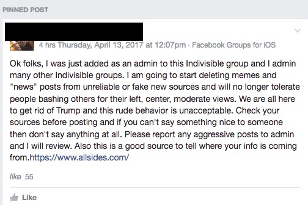

---

The two month experiment by centrist and progressive Democrats in resisting Trump while simultaneously trying to fix their troubled marriage is showing signs of strain.

The odd couple,  who have been sleeping "indivisibly" in a narrow double bed since Trump's inauguration, may be once again getting tired of each other's morning breath -- if not their mate's true nature.

From the introduction of Democratic Party platform planks, to discussions of how much support the DNC is giving progressive candidates in special elections, differences are apparent and profound. Centrist Democrats are asking for money already, and Progressives are giving instead to progressive PACs. Progressive Democrats are challenging the GOP in special elections, while the DNC hasn't figured out what its national strategy is.

Still the veneer of "indivisibility" must be preserved. And this is being done with a little sleight of hand -- or, rather, some heavy-handed censorship.

To be sure, the Right Wing enjoys the friction in this stressed Democratic marriage. If nothing else it's a nice distraction from the GOP's own relationship problems. Jared Kushner's [New York Observer ran a piece](http://observer.com/2017/04/thompson-estes-special-election-kansas-democratic-party-progressives/) recently telling progressives what they already know -- that the DNC hasn't been doing much to help progressives. The discussion over the Kansas election provoked a bit of heat on Facebook and on political discussion groups, though it was not unusually rancorous. But [Indivisible's](https://www.indivisible.us/) response was to simply censor the whole discussion:

Elsewhere we're seeing exhortations to avoid reading the right-wing press, to install content blockers in your browser, and to consult lists of "safe" vetted publications -- all at a time it's important to know what the bastards are up to.

Not only that. An old adage reminds us that even a stopped click is right twice a day. Why not, occasionally, the Right Wing? Must we ignore them, even if they occasionally make a good point? Or should heavy-handed "moderators" shape the discussion and, like the Great Chinese Firewall, protect us from opinions we shouldn't be hearing?

Libertarians and Tea-totalitarians both claim that Democrats succumbed to political correctness in the 2016 elections. One aspect of this charge was that Democrats support "identity politics" -- defending vulnerable constituencies. Well, good for Democrats! And -- centrist or progressive -- we all had better acknowledge that, right now, the Democratic Party is the *only thing* standing between GOP authoritarianism and a vulnerable public.

But another aspect of the Right's criticism points at the Democratic reticence to get out in the alley and mix it up, to habitually smooth over differences until no one really knows what Liberals stand for, to avoid conflict like delicate little "snowflakes." And they're right, pardon my saying so.

So, people, the Democratic couple this essay started out with is going to have to figure out how to move forward. They're going to have to have it out, scream out loud -- maybe even in public or at a polite dinner -- and resolve their differences once and for all.

I'm getting a bit tired of hearing that pushing for Democrats to try a new, progressive, strategy is tantamount to rehashing the Clinton-Sanders primary all over again. But we can't have a discussion about strategies and directions if "moderators" decide it's off-limits.

If you've ever seen Albee's "Who's Afraid of Virgina Woolf?" you know that denying problems in a relationship never ends well. It's time to let George and Martha have at it.

Democrats need to engage on their differences. They exist, and they are not trivial. Disputation and resolution is the only way forward. Censorship is not only counter-productive, it's something we should simply not stand for -- whatever the good but misguided intentions.

