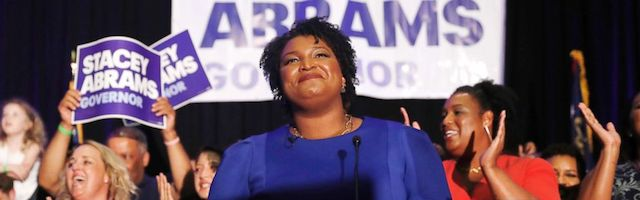

---

Hundreds of Democratic primary winners are waiting for November. Many are first-timers, younger and browner, offering the party new ideas, a different future, and inspiring forgotten constituencies and new voters. They include gubernatorial, congressional, senatorial, and state candidates. Many of them have very little national exposure.

Meanwhile, Donald Trump keeps staging campaign rallies throughout the country. The other day he made a stop in Duluth, Minnesota — a state where he only [narrowly lost](https://www.nytimes.com/elections/results/minnesota) in 2016, and a city where he received an old fashioned ass-whupping, where the [StarTribune](http://www.startribune.com/trump-s-unsettling-presidential-visit/486181021/) summarized Trump's visit as a "potent mix of hubris, divisiveness and victimhood that has come to mark his rallies, energizing his supporters and appalling his opponents." Trump had come to improve his odds in 2020 — and to troll Democrats.

Sometimes being appalled is enough to generate an idea. So here's one that occurred to me:

From this second until November Democrats must dog Trump's rallies. Every city he visits. Every cheeseburger stand. While Trump goes about selling his personal brand at the expense of his own party, Democrats should start selling the Democratic Party at rallies visually similar to Trump's. A changing roster of Democratic primary winners would appear at rallies delivering a simple, consistent message to the American public — "America, you have a choice!" Or "This is the real face of America!" 

To be sure, Democratic midterm winners represent different political views. The point of a campaign like this would be to slam Trump's policies and to celebrate a party that actually cares about people. It could combine candidate appearances with voter registration, fundraising, and local interviews. It would be simple, celebratory, and unabashedly confrontational. A campaign like this could potentially bring progressive and centrist Democrats together without papering over our very real differences. And it would signal that the Democratic Party has finally gotten up off its behind to take their messsage directly to the people.

Midterm elections are in 128 days. Democrats can't send their own autocrat on tour, but they sure could start reminding voters of the stark choices before us right now — and the diverse roster of Democratic candidates who stand ready to make all the difference in November.

