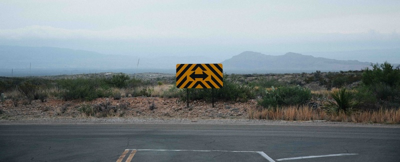

---
 

Although Joseph Robinette Biden, like Donald John Trump, has already been crowned by his party as "the only Presidential candidate who can win," there *are* other choices. Not great choices, admittedly, but choices nevertheless.

On March 5th Massachusetts voters will be presented with a [ballot](https://www.sec.state.ma.us/divisions/elections/research-and-statistics/candidates2024.htm) with three Democratic Presidential candidates to choose from. If we apply the "lesser evil" principle to these choices — as the Democratic Party insists we must in the general election — then it becomes a choice between Marianne Williamson and Dean Phillips, Biden having disqualified himself by supporting the world's best-documented genocide.

Let's consider the candidates in order of their appearance on the 2024 Primary ballot.

**Dean Phillips**

2024 will be the first Presidential try for Dean Phillips, 54, a Minnesota congressman who made his fortune by inheriting his family's liquor business and buying Talenti Gelato and Penny's Coffee.

Phillips has called for Joe Biden to step down. "I would like to see Joe Biden, a wonderful and remarkable man, pass the torch, cement this extraordinary legacy,” Phillips told NBC's Meet the Press. Phillips [worries](https://www.washingtonpost.com/politics/2023/10/27/who-is-dean-phillips/) about Biden's age: "God forbid the president has a health episode or something happens in the middle of a primary," he told the Washington Post.

Phillips is a right-of-centrist Democrat who has been [endorsed](https://www.cnn.com/2024/01/18/politics/andrew-yang-endorses-dean-phillips-president/index.html) by Andrew Yang, who left the Democratic Party to start his own "Forward" party with former [GOP](https://www.cnn.com/2022/07/28/politics/andrew-yang-forward-party-whitman-jolly/index.html) officials. Phillips is a leading member of the [Problem Solver's Caucus](https://www.timesofisrael.com/what-to-know-about-dean-phillips-the-jewish-congressman-running-for-us-president/), which spun off the No Labels party.

Phillips, like our own MA-CD9 representative Bill Keating, serves on the House Foreign Affairs Committee and has voted with Joe Biden 100% of the time. Voters can reasonably expect only minor deviations from Biden's ruinous environmental, foreign policy, militaristic, and immigration policies. Interestingly, as an undergraduate Phillips [interned](https://rollcall.com/2022/07/28/dean-phillips-intern-leahy/) with Senator Patrick Leahy, for whom the Leahy laws are named (these prohibit the transfer of weapons to countries like Israel that commit human rights abuses).

Shamelessly pandering to the Far Right, Phillips [expunged](https://www.msn.com/en-us/news/politics/biden-challenger-dean-phillips-wipes-reference-to-dei-from-campaign-website/ar-AA1n7iYc) all references to DEI ("diversity, equity, and inclusivity") from his campaign website. Phillips, who is Jewish, has accused progressive Democrats of "antisemitism" in regard to Israel. But Phillips laudably also [defended](https://www.youtube.com/watch?v=0nVdLVRWQ9g) Ilhan Omar after Republicans removed her from the Foreign Affairs Committee and has denounced Israel's carnage in Gaza, [calling for](https://www.timesofisrael.com/what-to-know-about-dean-phillips-the-jewish-congressman-running-for-us-president/) an “immediate and mutual ceasefire of large-scale military operations and indiscriminate terror” to be upheld by both sides.

**Joe Biden**

Biden is a complete non-starter in my view. It's not merely that Biden is too old; it's that his policies, like the man himself, are from an era that celebrated America as a global hegemon. Biden's militarism and foreign policy are dangerous, expensive, and immoral. His policies on immigration, the environment, and his inaction and lack of support of numerous human rights and democratic reforms are inexcusable. Most importantly, Biden is complicit in and actively supporting a [genocide](https://ehrens.substack.com/p/take-a-hike-joe), and this is a red line that no one can ignore.

**Marianne Williamson**

2024 will be Marianne Williamson's second shot at the Presidency. Williamson, 72, is a motivational speaker who got her start as spiritual leader of the Church of Today. She bristles at being called a "New Age guru" but if the shoe fits…. Williamson has written a slew of self-help books, including a best-seller promoted by Oprah Winfrey, who claimed that she had received 157 miracles after reading Williamson's book. Williamson has also been a cabaret singer, bookstore owner, and coffee shop owner. She lived in a geodesic dome for a year.

Williamson was raised in the Jewish Conservative tradition but has long identified as a Christian, lecturing at Episcopal, Methodist and Unitarian churches. She explained her dual religious identity, telling Vanity Fair, "A conversion to Christ is not a conversion to Christianity. It is a conversion to a conviction of the heart."

Williamson's platform calls for an end to the War on Drugs, a federal minimum wage, reparations for racial injustice, the establishment of a U.S. Department of Peace, and serious efforts to address poverty.

