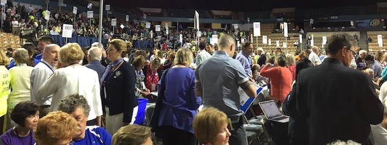
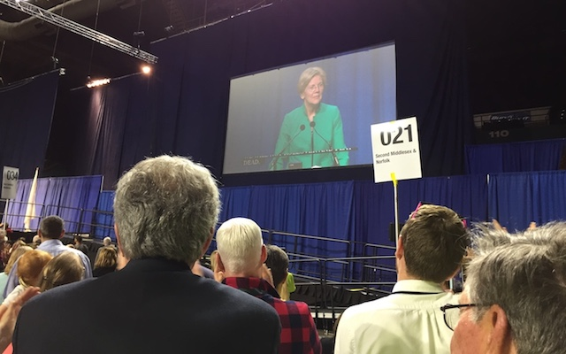

---

Yesterday I attended the Massachusetts Democratic Convention in Worcester with a busload of delegates from the SouthCoast. In Worcester there were over 4,500 of us, many alternates and guests, and it was quite likely the largest in the state party's history. This was a platform convention, and the job was to vote on a new direction for the party.

My personal interest was to see if the #DemEnter strategy (joining the party to try to change it) was sensible. In all honesty it's too early to tell, but the advantages of getting out on the field outweigh those of sitting on the sidelines and not having to make painful trade-offs. And -- disappointments aside -- this *was* democracy in action. You don't always get what you want.

In Worcester there were 1,500 new delegates, of which I was one. And there were 800 [Our Revolution](https://ourrevolution.com/) delegates, of which I was one as well. There were many fresh young faces, including my niece's. Many of the speakers were introduced by young people, including a ten year-old who had reverentially saved the candy bar he had collected one Halloween from Elizabeth Warren. Fast forward a few years -- the same kid, now a teenager, was introducing the incredibly beloved Senator at the podium.

SouthCoast delegates piled onto our school bus at 6:30 in the morning. We arrived in Worcester early enough to join the breakfasts that various organizations had organized. I had a breakfast ticket from the Mass Teacher's Association (to which I belonged about 10 years ago) but the room was mobbed. By luck I wandered into the ORMA (Our Revolution MA) breakfast next door and got a bagel. I signed amendment petitions from ORMA (Our Revolution MA), then it was time to return to the convention floor.

For almost six hours delegates sat listening to speaker after speaker. One U.S. Congressman, both U.S. Senators, the state Attorney General, each of the three gubernatorial wannabes -- and at least one speaker to introduce each of them. By almost three o'clock the light at the end of the tunnel was getting dimmer and delegates began chanting "Vote! Vote!" Several more speakers tried to keep it short -- but finally delegates had had enough of all the words, no matter how uplifting or strident.

Much has been made of the 2017 platform being the most progressive -- ever. And this is not an exaggeration. But words are cheap so no expense was spared in adding progressive planks that -- one hopes -- a few Democratic legislators may *actually* create legislation to turn into reality.

[Our Revolution Massachusetts](http://ourrevolutionma.com/massachusetts-democrats-back-measures/), which had an incredibly well-organized contingent from Somerville and Cambridge, was able to successfully advance a number of amendments to an already much-improved platform:

> "The party declared its support for a ranked choice voting system; making Election Day a state holiday; ensuring incarceration does not impact an individual’s right to vote; the abolition of Massachusetts super delegates; and a nonpartisan commission to draw voting district boundaries. On criminal justice, the party called for accountability and clear consequences for the use of excessive force and brutality by law enforcement officers; an end to for-profit prisons; and for shifting funds from policing and incarceration to long-term safety strategies such as education, restorative justice, and employment programs. Democrats declared that Democratic candidates and the party will no longer accept contributions from fossil fuel industry and infrastructure companies, for putting a price on carbon, and for more renewable energy and faster phaseout of carbon emissions. They also called for forgiveness of student loan debt."

Nevertheless, the Democratic leadership firmly rejected several human rights amendments and efforts to democratize the party:

> "Its push for new housing policies to end displacement was defeated by delegates who favor building more market-rate housing. ORMA’s proposals to make the party structure more democratic, by adding more state committee members who are elected by grassroots members and by reducing the number of signatures required to propose amendments to the charter, were also rejected. The convention chair ruled that ORMA-backed proposals on military and foreign policy, and on peace in the Middle East, were ruled out of order although they clearly had substantial support. The chair likewise ruled out of order a proposal that Democratic candidates must support the majority of the party platform or face loss of support by the party organization."

This last rejected charter amendment should tell us something -- that all the flowery language in a platform is meaningless unless there are consequences for candidates who fail to uphold platform principles.

And the arbitrary elimination of foreign policy planks -- even as the state party weighed in on Trump, climate change, veterans, and immigration -- seemed designed to avoid drying up the money tree which many state Democrats enjoy shaking. The Democratic Party is [deathly afraid of tackling the Israel-Palestine issue](http://www.huffingtonpost.com/2012/09/05/dnc-god-jerusalem-platform_n_1859200.html) -- and this convention was no exception. 

In reality there is no clear division between many Massachusetts state government and federal functions. As [Safe Communities](https://www.afsc.org/action/support-safe-communities-act-ma) illustrates, states often need to take a keen interest in "federal" issues. Besides, the Massachusetts legislature [Committee Book](https://malegislature.gov/Content/Documents/Committees/2015%20Committee%20Book.pdf) has standing committees on Climate Change, Intergovernmental Affairs, Redistricting, Election Laws, Healthcare Financing (which includes Medicare and Medicaid), Public Safety and Homeland Security, Telecommunications, and Veterans and FEDERAL AFFAIRS. Massachusetts officials regularly participate in trade delegations to nations where human rights abuses occur. Especially to Israel. The ban on certain topics is inconsistent, arbitrary, and manifestly hypocritical.

Censoring debate on foreign policy and Middle East issues is as arbitrary as if the party chose immigration issues to censor. One delegate challenged the party chair to cite the rule which specifically bans certain topics from being debated. Neither Gus Bickford nor the parliamentarian could cite any rule, only their "prerogative" to shut down the debate. But in a truly democratic organization no topic can be off-limits.

And I would still like to see the MassDems answer that delegate's question? Where in the rules is such censorship permitted?

The [press](http://www.telegram.com/news/20170603/dems-tout-resistance-in-state-convention-at-dcu-center) correctly [observed](https://www.bostonglobe.com/metro/2017/06/03/state-democrats-convene-worcester-saturday/0na4Vt133WlzT4C2yoBRtI/story.html) that the focus of the convention was for the state party to portray themselves as the *Resistance* to Trump's national (and nationalist) policies. But, again, this highlights the insanity of having a state convention with a national focus -- and then shutting down debate of *arbitrary* national issues.

I was disappointed that a few passengers of our very own yellow schoolbus agreed with the Democratic leadership that both the party's charter and platform should be almost impossible to change. If the party did not already have acute democracy problems this might be a different story. But only 80 out of 413 state committee members are democratically elected. The national party has credibility problems arising from the DNC leadership, including Debbie Wasserman-Schultz, Donna Brazile, and John Podesta, and superdelegates are a sore point with at least half the party membership.

I was also disappointed that, even within ORMA, apparently two faction leaders voted against their own amendments. Mel Poindexter and Lesley Phillips opposed the ORMA-supported charter amendment, *Toward a More Democratic State Committee*.

\* \* \*

Ultimately the platform added many great-sounding goodies. But the party is still littered with disappointments like my local state representative, Chris Markey, who didn't even bother to attend, and my U.S. 9th Congressional District Congressman, Bill Keating, who also was a no-show. This is a party that just gave a thumbs-up to single-payer healthcare (which Keating doesn't support), debt-free college education, defending immigrants (which Markey won't), a $15/hour minimum wage, family leave (again, Markey won't), and abandoning superdelegates.

But the exhausting pile of words we were subjected to yesterday means *nothing* if Democrats won't clean house and replace the Markeys and Keatings with people who are truly on board with these newly-affirmed values. And these words will mean nothing if we don't see progressive legislation and changes to party fund-raising practices.

Democratic midterms occur late next year. The Massachusetts Democratic Party will have a charter convention in 2019, during which the gears and levers of the party can be changed. Only after all this happens will any of us really know what kind of party it is, or if it can be reformed.

In the meantime, I would like to encourage progressive SouthCoast Democrats (and others) to join me in starting an ORMA local in the New Bedford area.

Change only happens if we make it happen.

