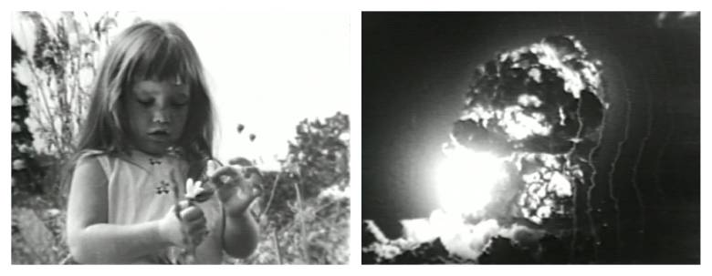

---

If you were around for the 1964 Presidential election you probably remember Lyndon Johnson's "Daisy" ad, warning voters of the dangers of voting for Barry Goldwater.

In the [iconic attack ad](http://www.youtube.com/watch?v=FuJOm0SOIRU) a three year-old girl stands in a field counting daisy petals. "One, two, three, four, five, seven, six, six, eight, nine, nine..." Then, as the camera zooms in on her eye, the voice of a launch commander is heard completing a countdown: "Nine, eight, seven, six, five, four, three, two, one, zero."

The screen lights up with an atomic blast.

At the commercial's forty second mark we hear the voice of Lyndon Johnson: "These are the stakes. To make a world in which all of God's children can live, or to go into the dark. We must either love each other, or we must die."

But ads are one thing, reality another. 

It was not Goldwater who sent tens of thousands of American servicemen to their deaths in Viet Nam. It was not Goldwater who bombed and napalmed hundreds of thousands of people half a world away -- people who had never raised a fist against the United States.

All this carnage was the work of the Democratic Party's "peace" candidate, Lyndon Baines Johnson.

The Lesser Evil.

Fast-forward fify years and the hysteria around Donald Trump is strangely similar.

Who knows what Trump would do if he were Commander-in-Chief?

No one really *does* know, but we've already seen Hillary Clinton's handiwork throughout the Middle East as Secretary of State.

Let voters heed their own consciences and not be swayed by "Daisy" ads. If the values of third party candidates align better with your own, vote for them.
