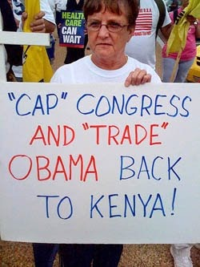
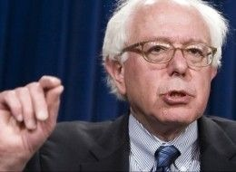
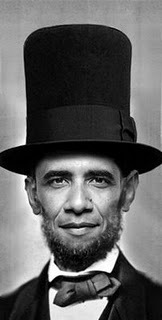

---

While the details of the debt agreement are yet to be hammered out, the big picture is emerging and there's little question that President Obama needlessly capitulated to the Tea Party, which impressively projects its extremist minority views on the entire nation. Yet despite the president's weakness and failure to keep campaign promises, conventional wisdom is that Liberals and Progressives will still rally around him in the next election solely out of fear of the Tea Party.

Don't count on it.

Liberal Democrats are not very happy with the President at the moment. The Congressional Black Caucus, for example, has promised to oppose the debt agreement. "Seeing a Democratic President take taxing the rich off the table and instead push a deal that will lead to [massive] cuts is like entering a bizarre parallel universe - one with horrific consequences for middle-class families," Progressive Change co-founder Stephanie Taylor wrote. "MoveOn's 5 million members, along with the vast majority of Americans, will not stand for Social Security, Medicare and Medicaid benefit cuts-not now, and not six months from now," moveon.org's Justin Ruben darkly hinted. Even House Minority leader Nancy Pelosi hasn't been fully sold on the agreement, saying only "I look forward to reviewing the legislation with my caucus to see what level of support we can provide." Liberals rightly regard Obama's multiple capitulations as paying ransom to hostage takers — in a nation that officially never negotiates with terrorists.

About my only point of agreement with the Tea Party is that Mr. Obama will be a one-term president. This will not be due to the Tea Party's savage racist attacks on the President. It's been largely self-inflicted. Young people are not going to turn out to vote in such numbers as they did last time for a president who has now shown that the "audacity of hope" was merely a cynical slogan. Besides the youth, Mr. Obama has lost the support of many independents, Libertarians, and reflexive Democrats who supported him last time. His numbers are way down with minorities. Mainly, however, Mr. Obama has lost the support of the left wing of his own party.

Three years ago I hoisted a glass with friends after Mr. Obama was elected. But after watching the Democrats feebly continue (and expand) not only the Bush wars, bailouts for the rich, tax cuts for the wealthiest, and embracing Republican "trickle-down" economics and neoconservative foreign policy, it is impossible to continue supporting this bankrupt party. In the next election I'll probably vote Green. If I'm going to throw my vote away, I'd rather do it myself than have the Democrats do it for me.

If there is concern about third party "spoilers," the Democrats now have an opportunity to reevaluate the viability of the President and should follow Independent Vermont Senator Bernie Sander's advice to primary someone other than Mr. Obama. Otherwise, they're going to lose the next election.

There is more than a kernel of truth in the joke that the Democrats are the Party of No Ideas and the Republicans are the Party of Very Bad Ideas. This country either needs some new ideas or some very good old ones because the Tea Party's loony prescriptions are going to harm this country for decades. Yet the Democratic Party's failure to present better policies is taking us nowhere. They seem to be forever peeking out the door, checking to see if it's safe to support workers, consumers, minorities, or the environment &#8212; then darting indoors when they conclude it's not.

I don't hold out any hope for the Republicans, who have spinelessly let their party be hijacked by Dick Armey, Grover Norquist, nativists, fundamentalists, "ex-gay" therapists, Birthers, the Christian Identity movement, Larouchites, Secessionists, and every species of ding-dong. But the Democratic flirtation with centrism has also failed. Their own Blue Dog Democrats are nothing but Republicans in disguise. 

Mr. Obama, meanwhile, has completely botched his Lincoln-esque "Team of Rivals" approach. Concession after concession hasn't worked. Golf with Boehner hasn't worked. Worse, far from building a "team of rivals," Mr. Obama has actually resigned his job as team captain only to become the Gatorade carrier for the opposing team.

Democrats should not blame what used to be the Progressive wing of their own party for the coming defeat in November. Democrats could have remained true to their own values, but they abandoned those along with a constituency that elected them. Tragically, this could have been avoided.
