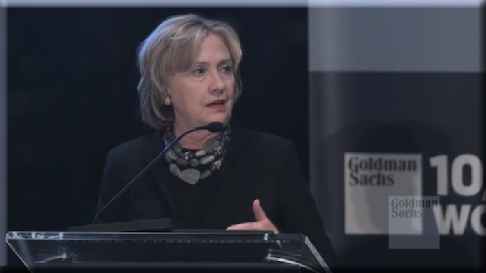

---

The [Democratic Party’s 2016 Platform](http://www.demconvention.com/wp-content/uploads/2016/07/Democratic-Party-Platform-7.21.16-no-lines.pdf) is now available. Juxtaposed with recent RNC convention speeches, the 2016 election now appears to be quite the trip back in time.

Neither party has any fresh ideas.

While Trump's closing speech at the Republican National Convention recalls [Nixon's "Law and Order" speech](http://www.newyorker.com/news/news-desk/trump-inspired-by-nixon) in 1968, the Democratic Party's 2016 platform recycles 1980's Clinton (I) neoliberalism and Henry Kissinger's containment policy.

The Democratic Party's domestic policies all sound cheery and benign -- although I"m not sure I believe most of them. For instance, as a sop to the Sanders people, the platform calls for appointing financial regulators outside the industry. But this has *never* been Clinton's practice. Similarly, the language on global trade agreements sounds great, but does anyone *really* expect the NAFTA power couple to follow through on any of it? DNC donors and policy makers are so firmly enmeshed in for-profit education that reform will never happen under Clinton. For all the lofty language about Native American sovereignty, we'll see if her administration will turn a new leaf after 400 years. For all the verbiage about Puerto Rico, we'll have to wait and see if Clinton's financial industry friends will permit the colony to write off or restructure its debts. Similarly, we'll have to wait to find out what Clinton means by "within reasonable limits" when pursuing immigration reform. And is Clinton going to go toe-to-toe with the healthcare industry on drug costs? Experience tells us otherwise.

Many won't happen because of GOP obstructionism, while the rest will never happen because -- at root -- [the Democratic Party leadership and its major donors](http://inthesetimes.com/article/19295/are-core-progressive-values-being-compromised-with-2016-democratic-platform) don't really believe in them.

Highlights of the domestic planks:

> $15/hour federal minimum wage; protecting collective bargaining; ensuring equal pay for equal work; promoting affordable housing; expanding social security; protecting US Postal Service; investing in infrastructure; revitalizing manufacturing; promoting clean energy jobs; enlarging access to high-speed internet; supporting STEM education; protecting intellectual property and trade secrets; promoting small business; creating jobs for young people; reigning in Wall Street; updating Glass-Steagall; appointing regulators outside the financial industry's revolving door; making super-rich pay their fair share of taxes; evaluating trade agreements (including TPP); reforming criminal justice system; training police in de-escalation; ending racial profiling; asking DOJ to investigate ALL questionable police shootings; rolling back "war on drugs; de-criminalizing marijuana; abolishing the death penalty; fixing the immigration system "within reasonable limits”; ending contracts with for-profit prisons; stopping racial and religious profiling; strengthening rights for LGBT and disabled; strengthening cities and rural areas; promoting arts and education; improving Tribal housing, education and sovereignty; recognizing the self-determination of Hawaiians and Puerto Ricans; protecting voting rights; restoring the Voters Rights Act; fixing Campaign Finance laws; appointing judges sympathetic to civil liberties; securing statehood for Washington DC; tackling climate change; supporting a clean energy economy; protecting the environment; promoting debt-free college education; cracking down on for-profit educational institutions; guaranteeing universal pre-school; securing universal health care by expanding Medicare; supporting community health centers; reducing prescription drug costs; investing in medical research; fighting drug abuse; supporting families with autism; securing reproductive rights; promoting public health; ending violence against women; preventing gun violence;

On the other hand, foreign policy is something that Clinton has a lot of experience with -- unlike her opponent who seems to make things up as he goes along. Unfortunately, Clinton's playbook comes in large part from war criminals like Henry Kissinger and former role model Madeline Albright (who as Secretary of State defended the deaths of half a million Iraqi children by US sanctions). For all her experience, the former Secretary of State has made hash of the Middle East.

Clinton is every bit the American Exceptionalist Trump claims to be and she promises to expand and project American military power. She finds nothing wrong with provoking Russia by pushing NATO right up to its borders. Putting boots on the ground doesn't trouble her either. She embraces "regime change" like every good neocon (Honduras, Libya, Syria), and is not troubled by arming Iran's Wahabbist enemies -- even if they *are* the major supporters of global terror. Clinton supports AUMFs instead of Congressional declarations of war, and she's a hardliner on cyber warfare. The list of foreign theaters she wants to become involved in is much more extensive than at any other time of history. Not only does she want to keep tinkering with the Middle East, but she's *pivoting* to Asia and Africa as well. This is far more reckless than Donald Trump's muscular pseduo-isolationism.

Here are the highlights of Clinton's foreign policy planks, straight from the DNC Platform:

> strengthening US global and military “leadership”; making the US military the “strongest in the world”; ending waste in the military budget; fixing problems in the Veterans Administration; supporting military families; ending the epidemic of rape in the military; beefing up intelligence efforts to defeat ISIS; spending more money on homeland security; updating the AUFM (authorization for use of military force) – instead of having Congress declare wars; promoting regime change in Syria; supporting “moderate” rebel forces in Syria; taking the lead in Afghanistan with NATO; promoting social programs in Afghanistan without demanding democracy; maintaining a US military presence in Afghanistan; reserving the use of military force against Iran; bolstering the [Wahabbi] militaries of Iran’s enemies; beefing up defenses in Japan and South Korea against North Korea; expanding NATO to counter “Russian aggression”; establishing “global norms” in cybersecurity through spy agencies; supporting non-proliferation treaties; “looking for ways” to help refugees; promoting global health; ending HIV and AIDS; ending child labor; ending trafficking of girls and women; promoting human rights; ending US use of torture; closing Guantanamo Bay; standing up to China; promoting a Two-State Solution; strengthening Europe as a bulwark against “Russian aggression”; beefing up NATO; promoting human rights in Cuba and Venezuela; becoming more involved in Africa;

