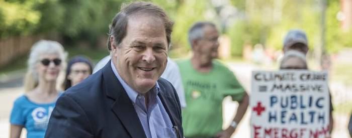

---

On November 12th, state committee members of the [Massachusetts Democratic Party](https://massdems.org/) will vote for a new Chairman. At present the party is led by Gus Bickford, who for years has held the post in conflict of interest with his day job as a political consultant. Bickford recently took his ethics challenges to a whole new level by [poking his nose](https://www.gazettenet.com/Democrat-investigation-finds-party-chair-interfered-in-1st-Congressional-race-37177026) into the Morse-Neal race for the 1st Congressional District and launching a homophobic attack on Morse. This misstep, not so distant from Thursday's vote, will probably end his tenure. Thankfully.

Under Bickford's tenure the MassDems have fallen into greater and greater disrepair. Membership is down, town committees aren't operating, and democracy has been a casualty. The party hasn't been able to successfully challenge Republican governors and Bickford has failed to provide help in critical county and legislative races. Voters who have left the MassDems to become unenrolled say the party's platform, revised every other year, doesn't bear any similarity to to how Democratic lawmakers actually vote.

Bickford is being challenged by Mike Lake and Bob Massie.

Lake is deputy treasurer of the MassDems and [CEO of Leading Cities](https://leadingcities.org/about/3cb7971f-8bf3-4299-b363-77ea2b24d477), which promotes "business development and government cooperation opportunities and implementing public policy that effectively addresses the shared challenges facing 21st century cities." Massie is known for his advocacy of environmental, climate, human rights, economic issues, and corporate responsibility. Both are affluent white guys who established nonprofits and helped themselves in the process.

Massie authored a roadmap called "[BUILDING OUR FUTURE TOGETHER](https://mcusercontent.com/b75ea8e2943b1bf5a1f397b67/files/4da51613-a40f-4a21-b2da-deee4b12239b/Bob_Massie_Building_Our_Future_Together_November_2020.01.pdf): A 10-Point Plan to Strengthen the Massachusetts Democratic Party and Win the Governorship in 2022." And at least [according to Lake](https://www.tauntongazette.com/news/20201019/massachusetts-democrats-already-planning-for-well-beyond-2020), he and Massie are on the same page about many of the changes necessary to fix the party: “I think Bob Massie and I frankly have a much more aligned vision of  what the party can be. […] We have already pledged to support each other.”

So, Massie or Lake — either would be a vast improvement over the ethically-challenged do-nothing currently presiding over the demise of the Massachusetts Democratic Party.

