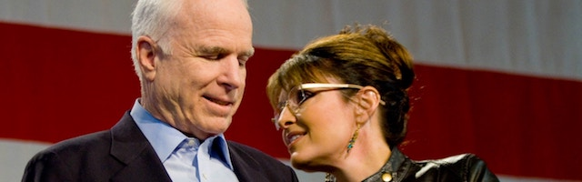

---

While it is generally frowned upon to speak ill of the dead, this rule of etiquette cannot be observed for someone who exerted as much power in Washington for over three decades as John McCain. As I.F. Stone once observed, “funerals are always occasions for pious lying, A deep vein of superstition and a sudden touch of kindness always leads people to give the departed credit for more virtues than he possessed.” Conversely, sentimentality at funerals sometimes reveals deeper truths about those expressing condolences.

When John McCain died last week, his Senate desk was draped in black crepe and it was announced that his body would lie in state in the Rotunda and be interred at Arlington Cemetery. Writers from both Right and Left seized upon McCain to idolize both the man he was and [the man he was not](http://prospect.org/article/what-john-mccain-wasnt-and-what-he-was), pointing at his work across the aisle, his self-deprecatory humor, and his status as an honest-to-god American hero. Even Democratic Socialist [Alejandra Ocasio-Cortez](https://ijr.com/2018/08/1119016-ocasio-cortez-john-mccain/) was smitten by McCain’s “decency.” McCain was Audie Murphy, Jack Armstrong, and Mr. Smith Goes to Washington all rolled into a single myth. And he got a lot of mileage from it over a long career.

There is no question the nation has been traumatized by Donald Trump. Some of the effusive praise of McCain seems at first glance to be [nostalgia](http://thehill.com/homenews/senate/403683-tapper-there-is-so-much-reverence-for-mccain-because-of-whos-in-the-white) for the days when not all Republicans were white supremacists or proto-fascists. There are plenty of journalists who remember McCain as he was — warmonger, friend of the super-rich, the man who made the Tea Party “respectable” with his Vice Presidential pick — and not as some want him to be (see [this](https://theintercept.com/2018/08/27/hold-the-plaudits-john-mccains-2008-campaign-paved-the-way-for-donald-trump/) and [this](http://newrepublic.com/article/150895/mccain-dead-obituary-nationalist-vision-eclipsed-trumps) and [this](https://slate.com/news-and-politics/2018/08/one-moment-that-sums-up-what-was-admirable-and-dangerous-about-mccains-worldview.html) and [this](https://theintercept.com/2017/12/02/john-mccain-claimed-he-cares-about-honor-in-the-senate-his-tax-vote-shows-he-lied/) and [this](https://www.aljazeera.com/indepth/opinion/john-mccain-impossible-man-180827092849835.html) and [this](https://www.gq.com/story/john-mccain-is-the-perfect-american-lie) for examples). But much of the praise we’re hearing reveals a bipartisan appetite for McCain’s militarism and love of American Exceptionalism. Numerous Democratic pundits removed their veils this week, revealing that McCain’s values were really their own.

In John McCain’s [farewell statement](https://www.mccain.senate.gov/public/), read by a former campaign manager, he wrote that Americans “never hide from history. We make history.” McCain was wrong. We may know our history but it is precisely the American penchant for hiding from history which allows us to repeat our mistakes over and over again. McCain certainly hadn’t forgotten the history of Viet Nam when he voted to invade Iraq. But he hid from it. Democrats know their history too, but hiding from it permits the strange posthumous embrace of a man who represented everything they claim to oppose.

The Far Right — that is, today’s Republican Party — has little to lose by [valorizing McCain](https://www.breitbart.com/big-government/2018/08/25/john-mccain-1936-2018-conservative-frenemy-american-hero/) even if they *did* bash him for the occasional clash with *Dear Leader* Trump. But the effusive praise by Centrist Democrats (examples [here](http://thehill.com/homenews/sunday-talk-shows/403674-durbin-praises-mccain-for-uncommon-decency-as-a-senator) and [here](http://thehill.com/homenews/news/403631-clintons-pay-tribute-to-john-mccain) and [here](http://thehill.com/homenews/sunday-talk-shows/403672-hillary-clinton-mccain-knew-what-it-meant-to-be-an-american-in-the) and [here](http://www.washingtonpost.com/opinions/john-mccain-and-the-last-of-human-freedoms/2018/08/26/9f7d421e-a96c-11e8-b1da-ff7faa680710_story.html)) is egregious and focuses on McCain’s better personal qualities, and not on an honest reckoning with his — or *their* — politics.

When it comes to immigration, defense spending, and economic policy, Centrist Democrats aren’t really as distant or distinct from Republicans as they claim to be. Despite McCain’s swipe at Trump “hiding behind walls” in his farewell statement, in 2008 McCain went to Mexico to argue that America needed *more* [border walls](https://abcnews.go.com/Politics/story?id=5307694) — a view [both Clintons](https://www.motherjones.com/politics/2016/08/tomdispatch-operation-streamline-immigration-enforcement-donald-trump-wall/) and Barak Obama shared. In 2013 McCain went to Syria to drum up support for American intervention and regime change, but it was the Obama administration which actually initiated the war. In 2018 the massive “John S. McCain National Defense Authorization Act” was [passed overwhelmingly](https://www.govtrack.us/congress/votes/115-2018/h379) by both Republicans and Democrats, stealing much from the poor and giving it instead to defense contractors.

Another recent preoccupation of Centrist Democrats has been the defense of the American security establishment. FBI head James Comey and CIA head John Brennan have become national heroes for many liberal Democrats. Conveniently forgetting history has led to liberals like [Stephen Colbert](https://slate.com/culture/2018/04/watch-stephen-colberts-uncut-interview-with-james-comey-video.html) forgetting James [Comey’s spying](https://theintercept.com/2018/04/24/james-comey-mlk-martin-luther-king-surveillance-muslims/) on Black Lives Matter and American Muslims, or [Bill Maher](https://www.newsweek.com/bill-maher-calls-trump-traitor-conversation-former-cia-director-john-brennan-1090821) forgetting John Brennan’s long history of [war crimes](https://www.nytimes.com/roomfordebate/2013/01/07/the-right-or-wrong-experience-for-the-job/by-nominating-john-brennan-obama-is-ignoring-war-crimes), including torture and rendition, dating back to the Bush administration (Obama kept Brennan on at the CIA). As an institution, [Comey’s FBI](https://www.alternet.org/dear-liberal-america-fbi-not-your-friend-and-it-never-has-been) has a long history of repression of [Afro-Americans](http://theintercept.com/2018/04/21/terry-albury-fbi-race-whistleblowing/) and Leftists.

Since Hillary Clinton’s accusations at the 2016 [DNC Convention](https://www.nytimes.com/2016/07/25/us/politics/donald-trump-russia-emails.html) of political meddling by Vladimir Putin, there has been a [Russian lurking](https://www.thenation.com/article/do-liberal-democrats-want-war-with-russia/) under every bush. Suspicion, calls for additional sanctions, and even red-baiting have led to a new [Cold War mentality](https://theweek.com/articles/785530/why-democrats-want-another-cold-war), with some Democrats even demanding Internet censorship of news outlets not hard enough on Russia. [NATO](https://www.washingtonexaminer.com/policy/defense-national-security/house-democrats-warn-trump-against-suspending-military-exercises-in-europe), a relic of the Cold War, now has more flag-waving Democratic boosters than ever.

If Russia is the foreign nation Centrist Democrats obsess over the most, Israel is the one they won’t even talk about. Since the 2016 election, Donald Trump has cozied up to the Israeli settler movement. The American ambassador to Israel is, in fact, a settler himself. The US has cut UN contributions for Palestinian refugees and given Benjamin Netanyahu the green light to annex East Jerusalem and roll out more settlements in the West Bank. Israeli snipers recently murdered dozens of “Land Day” protesters in Gaza, and there was scarcely a peep from Centrist Democrats. And when it comes to all-too real “foreign interference,” Israel’s domestic lobbying partners have successfully passed legislation in dozens of states [making it illegal to criticize or boycott Israel](http://nymag.com/daily/intelligencer/2017/07/senate-bill-would-make-it-a-federal-crime-to-boycott-israel.html). And all with Democratic Party help.

I.F. Stone was right about lies at funerals, but sentimentality sometimes reveals its own truths. No one for a second believes history can be conveniently forgotten, but we can and do hide from it — and who we really are. This week’s outpouring of love for America’s most recognizable nationalist and American Exceptionalist tells a disturbing truth about both our country and the Democratic Party.

