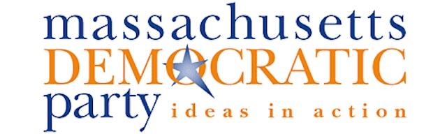
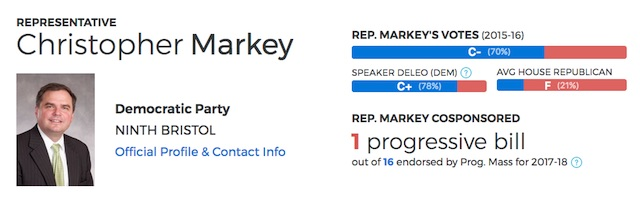

---

The motto of the Massachusetts Democratic Party is, was -- or *should* be -- *Ideas in Action*. And if it is we should really mean it.

Replying to my first-timer's [impressions](/Democratic Party/convention-impressions/) of the party's convention in Worcester last Saturday, I heard from **Jonathan Cohn**, co-chair of the Issues Committee at [Progressive Massachusetts](http://www.progressivemass.com/), who asked the cheeky question:

*If a platform is adopted and no legislators are there to enact it, did it make a sound?*

-- which was precisely my concern about a convention that put so many progressive ideas down *on paper*. But while Massachusetts Democrats have plenty of good ideas, and no doubt many have good intentions and good hearts, the follow-through is always lacking, and has been for some time.

Cohn recently devoted an entire piece in [Commonwealth](https://commonwealthmagazine.org/politics/democratic-supermajority-not-so-super/) to the discussion of the 80% Democratic majority in the Massachusetts Legislature that is, somehow, and chronically, unable to enact progressive legislation. Thomas Frank made many of the same points in his book, [Listen Liberal](http://www.listenliberal.com/), and in a [Nation](https://www.thenation.com/article/why-have-democrats-failed-in-the-state-where-theyre-most-likely-to-succeed/) article entitled "Why Have Democrats Failed in the State Where They’re Most Likely to Succeed?"

Cohn's piece is worth your time and he has graciously given me permission to reprint it with attribution.

And while you're online, check out Progressive Massachusetts' [Legislator Scorecard](https://scorecard.progressivemass.com/). 

\# \# \#

#### Democratic supermajority not so super

*Jonathan Cohn, reprinted from [Commonwealth Magazine](https://commonwealthmagazine.org/politics/democratic-supermajority-not-so-super/), May 27th, 2017*

**IN THE YEAR FOLLOWING** a presidential election, the Massachusetts Democratic Party updates its platform. A party platform can stand as a defiant statement of goals and ideals, and a roadmap for a legislative agenda and priorities. In today’s national political climate, such aspirational declarations are especially important as they offer voters something to fight for and something to vote for.

The platform released just last week contains new planks on paid family and medical leave, a $15 minimum wage, automatic voter registration, and the elimination of mandatory minimum sentences, bolstering what was already, by and large, a progressive document.

**On Saturday, June 3, delegates from across the state will convene in Worcester to approve the platform, perhaps with a few amendments to make it stronger.**

**On Monday, June 5, if the past is any guide, our overwhelmingly Democratic Legislature will proceed to completely ignore it.**

But a supermajority has value only to the extent that it stands for something, and to the extent that it is put to work. When one looks back at the party’s 2013 platform, the contrast between the aspirational document and actual policymaking can be quite stark, perhaps most so in the realm of health care.

For years, the Massachusetts Democratic Party platform has called for a **single-payer health care** system, one that would truly enshrine health care as a right. The momentum that exists behind single payer in other parts of the country does not seem to have yet reached Beacon Hill. Single-payer legislation recently advanced out of committee in the California Senate and was passed by the New York Assembly. On the national level, the [majority](https://www.congress.gov/bill/115th-congress/house-bill/676/cosponsors) of the House Democratic Caucus in Congress now supports single-payer, an all-time high. But only about a [third](http://www.progressivemass.com/singlepayer) of Democrats in either branch of the Massachusetts Legislature have taken heed of their own party’s platform.

Or take another hot topic: **immigration**. The 2017 platform, like the 2013 one, calls for “the elimination of policies that make state and local police responsible for the enforcement of national immigration laws.” The Trust Act, which would have done just that, died in the Legislature without ever getting a vote in the past two sessions, and [ House Speaker Robert DeLeo](http://www.politico.com/states/massachusetts/story/2017/02/mass-house-speaker-spurns-sanctuary-state-title-as-dems-mull-anti-trump-efforts-109656) seems inclined to let the Safe Communities Act, its new, expanded incarnation, see the same fate.

Or take a look at **public transit**. The MBTA has a $7.3 billion – and growing – repair backlog and is the victim of years of disinvestment. The 2013 platform recognized the importance of increased investment in public transportation to economic prosperity, to equity, and to climate mitigation. But the Democrats in the Legislature have preferred to side with Gov. Charlie Baker’s misguided mantra of “reform, not revenue,” authorizing the creation of a [control board](http://www.bizjournals.com/boston/blog/mass_roundup/2015/07/massachusetts-legislature-passes-38-14-billion.html) that has mainly sought to cut and privatize basic services. The Fair Share amendment, broadly supported by Democrats, will help bring in some more money for public transit, but it’s only a start, and a late one at that.

Sometimes it isn’t just inaction; **at times, the Legislature has done the exact opposite of what the platform calls for**. The Massachusetts Democratic Party platform advocates for allowing undocumented immigrants to obtain driver’s licenses, a move backed by sound public safety logic. However, the Legislature voted to [ban them from doing so](http://www.masslive.com/politics/index.ssf/2016/07/new_drivers_license_law_requir.html) at the end of last session.

It would be unfair to blame both branches equally when it comes to the inertia characteristic of Beacon Hill. Several of the new planks of the 2017 platform, such as paid family and medical leave and more aggressive enforcement of wage theft laws, did make it through the Senate last session, only to languish in the House. **Platform mainstays like Election Day registration have passed the Senate in the past as well**.

The divide between the two branches is reflected in the [scorecard](https://scorecard.progressivemass.com/) that Progressive Massachusetts releases each session, in which one can see a Senate where members are more willing to vote – on record – for progressive policies and a House where voting in lockstep with the Speaker is the norm.

With full Republican control in Washington, we are already seeing attacks on workers’ rights, voting rights, immigrant rights, reproductive rights, and vital social and environmental protections. It is up to states to serve as laboratories of democracy, to use Louis Brandeis’s apt phrase.

Massachusetts Democrats could make our Commonwealth a beacon of progressive policymaking. **If they aren’t interested, it’s up to activists and voters to make them**.

\# \# \#

*Jonathan Cohn is an editor and activist in Boston and the co-chair of the issues committee at Progressive Massachusetts.*

