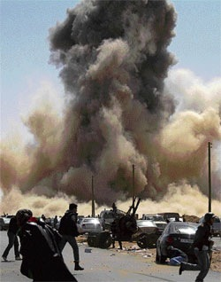

---

John Kerry was one of the first to push for another war in the Middle East, this time the war on Libya. Even before U.S.-initiated hostilities began, I sent Senator Kerry a critique of [his dumb idea](http://online.wsj.com/article/SB10001424052748704425804576220860878120884.html), with the title _Are you out of your mind?_ &#8212; thereby omitting an adjective I really wanted to use. Months later, the [yacht club Senator](http://www.huffingtonpost.com/2010/07/23/john-kerry-saves-500000-b_n_656985.html) finally deigned to reply to me. Below is his justification for another one of the wars Democrats have championed. I have not changed Kerry's text, only highlighted portions of interest.

What strikes me about Kerry's response is that he repeats the lie that the intervention was to "avoid a massacre," yet everywhere else the motivation for the intervention is more honestly described as regime change or seizing the opportunities of the Arab Spring. Kerry's assumption that seeing the U.S. involved in (and currently failing at) another Middle East war would send a warning to other dictators does not seem to have impressed the Syrian dictatorship &#8212; the same one that helped the U.S. with [extraordinary renditions](http://en.wikipedia.org/wiki/Extraordinary_rendition_by_the_United_States).

Kerry cynically writes that failing to help Muslims would send the wrong message. There are many more opportunities to send the right message in Iraq, Afghanistan, and Palestine. We've squandered them all.

As to why we invaded Libya and not, say, Syria? Kerry's answer is so slippery it's hard to believe he actually wrote, "we must weigh our ideals." One weighs polls, not ideals.

Finally, Kerry says that bombing Libya in a "supporting" role is not war. Little matter that in the first days of the invasion it was hardly "supportive" and essentially [a U.S. show](http://www.pbs.org/newshour/rundown/2011/03/us-forces-lead-attack-against-libya-in-operation-audacity-dawn.html). The senator seems to have succumbed to the same mental gymnastics as global warming deniers. Just deny it and it won't exist. 

But read his letter yourself. I'll never vote for this weasel again.

> Dear Mr. ___:
> 
> Thank you for your letter regarding U.S. actions in the NATO coalition preventing crimes against humanity in Libya. 
> 
> Everything I believe about the proper use of American force and the ability of the community of nations to speak with one voice was reaffirmed when the world refused to stand by and accept a bloody final chapter of the uprisings sweeping across North Africa and the Middle East. With a mandate from the Arab League and the Gulf states, the United Nations Security Council approved a limited military intervention to avoid a massacre. 
> 
> Neither the U.N. nor any nation should be drawn into military intervention lightly. But there were legitimate reasons for establishing a no-fly zone over Libya and forcing Gadhafi to keep his most potent weapons out of the fight. 
> 
> First, what is happening in the Middle East could be the most important geostrategic shift since the fall of the Berlin Wall. Absent U.N./NATO resolve, the promise that the pro-democracy movement holds for transforming the Arab world could have been crushed. Other dictators would have seen the world's failure to challenge Gadhafi as a license to act with impunity against their own people. The vast majority of the protesters in these countries are crying out for the opportunity to live a decent life, get a real job, and provide for a family. Abandoning them would have betrayed not only the people seeking democratic freedoms but the core values of the U.S. and other democratic nations. It would have reinforced the all-too-common misperception on the Arab street that America says one thing and does another. We are already spending billions of dollars to fight increasing extremism in many parts of the world. We didn't choose this fight; it was forced on us, starting with 9/11. To fail to see the opportunity of affirming the courageous demand of millions of disenfranchised young people for jobs, respect and democracy would be ignorant, irresponsible and short-sighted. It would ignore our real national security interests and help extend the narrative of resentment toward the U.S. and much of the West that is rooted in colonialism and furthered by our own invasions of Iraq and Afghanistan.
> 
> Second, the pleas for help came not just from the Libyan rebels, but from the Arab League and the Gulf states. Silently accepting the deaths of Muslims, even at the hand of their own leader, could have set back relations for decades. Instead, by responding and giving the popular uprising a chance to take power, the U.S. and our allies sent a message of solidarity with the aspirations of people everywhere that will be remembered for generations. Rather than be forced to debate "who lost Libya?" the free world is poised to say "remember Tripoli" every time demagogues question our motives.
> 
> Third, the particular nature of the mad man who was vowing to "show no mercy" to the "dogs" who dared challenge his rule demanded that his threats be taken seriously. Gadhafi is after all the man behind the bombing of Pan Am 103, which claimed the lives of 189 Americans. The military intervention in Libya sends a critical signal to other leaders in the region: They cannot automatically assume they can resort to large-scale violence to put down legitimate demands for reform without consequences. U.N. resolve in Libya can have an impact on future calculations. Indeed, the leaders of Iran should pay close attention to the resolve exhibited by the international community.
> 
> It is fair to ask, why Libya and not other humanitarian situations? The truth is that we must weigh our ideals, our interests and our capabilities in each case when deciding where to become involved. We must not get involved in another lengthy conflict in a Muslim country. With French and British willingness to lead on Libya, we do not need to take on the primary ownership of this conflict-and the Obama administration has made clear we will not. So the risks are manageable and, in my view, the rewards are potentially enormous.
> 
> The question of presidential authority is an important question. Some argue that our involvement in Libya is unconstitutional because it violates the provisions of the War Powers Act enacted in 1973. I am very familiar with the debate surrounding this act because it was created in response to the Vietnam War. Presidents have taken the view that the WPA does not include every single military operation and since it was enacted, only three of the numerous military actions we have participated in were authorized prior to engagement. Additionally, the WPA is very specific in its wording, requiring Congressional authorization only when our "Armed Forces are introduced into hostilities." In Libya, we have no ground troops nor are we considering ground troops - in other words, our troops have not been introduced to these hostilities. Our troops are engaged in the conflict solely in a supporting role. President Obama and I both support the War Powers Act and neither of us believes that our intervention in Libya violates it. How  
> 
> ever, I believe we are strongest when we speak with one voice - which is why on June 21, 2011, Senator McCain and I introduced a bipartisan resolution to provide limited authorization for our engagement in a supporting role in Libya. I cannot emphasize enough that this authorization only provides for the limited use of American forces for a limited time. This resolution is no blank check for the President, but is consistent with the vision of action outlined in his May 20th letter to congressional leaders. It makes clear the goals of U.S. policy in Libya: the departure of Qadhafi and his family and a peaceful transition to an inclusive government that ensures freedom and opportunity. It also plainly states that our participation in Libya will continue to consist of non-kinetic support of the NATO-lead operation in the form of intelligence, logistical support, and search and rescue missions; Congress does not support deploying, establishing, or maintaining the presence of units and members of the U.S. Armed Forces on the ground in Libya. On June 28, the Senate Foreign Relations Committee approved the resolution and I look forward to the full Senate's consideration of the legislation.
> 
> I plan to maintain a close watch on our involvement in Libya. The President will be required to consult with Congress frequently regarding our efforts by providing regular briefings and reports. These must include an updated description of U.S. national security interests and policy objectives, a list of U.S. Armed Forces activities in Libya, an assessment of opposition groups and potential successor governments, and the legal and constitutional rationale for conducting military operations consistent with the WPA. 
> 
> I believe that the passage of the Kerry-McCain resolution would demonstrate to the country and the rest of the world that the Congress of the United States and the President of the United States are committed to this endeavor. The Arab Awakening could be the single most important geostrategic shift since the fall of the Berlin Wall. If we support the legitimate aspirations of the Libyan people and assist them in their transition to democracy, I believe the positive implications for our own security will be immeasurable. 
> 
> Thank you again for your interest in this critical issue and please do not hesitate to contact me in the future.

Oh, I won't.