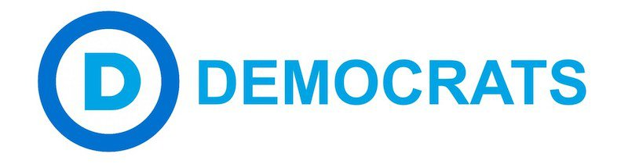

---

Dear Dartmouth Dems,

The convention is barely over and we'll be [meeting again](https://www.meetup.com/resist-new-bedford/events/239965869/) on Monday, June 12th.

In February there were 7,609 registered [Democrats in Dartmouth](http://www.sec.state.ma.us/ele/elepdf/enrollment_count_20170201.pdf). The percentage of town Democrats (like the rest of the state) is roughly 33%, while for Republicans it is about 11%. Raw numbers of both Republicans and Democrats *have been constant* (and therefore stagnant) since about 2000, while the share of unenrolled voters has risen sharply to the 55% it is today. People are not happy with either party in this state.

And we Massachusetts Democrats need to do something about it. 

It's not just Trump. Here in Massachusetts [democracy has been in trouble](http://www.wbur.org/politicker/2016/10/13/competitive-state-elections) for some time. Our state ranks [last in competitiveness](https://ballotpedia.org/2016_state_legislative_elections_analyzed_using_a_Competitiveness_Index) in political races. In the 2016 Democratic Primary there was [not one](http://electionstats.state.ma.us/elections/search/year_from:2016/year_to:2016/office_id:5/stage:Democratic/show_details:1) challenger in all nine U.S. Congressional districts. At the state level half the candidates for the [Governor's Council](http://electionstats.state.ma.us/elections/search/year_from:2016/year_to:2016/office_id:529/stage:Democratic/show_details:1) ran unchallenged. In [County Sheriff](http://electionstats.state.ma.us/elections/search/year_from:2016/year_to:2016/office_id:386/stage:Democratic/show_details:1) Democratic primary elections, six out of fourteen ran unopposed and two slots were never filled, including Bristol County where Republican Tom Hodgson won by default because of Democratic complacency. In almost [half the state legislature primaries](http://electionstats.state.ma.us/elections/search/year_from:2016/year_to:2016/office_id:8/stage:Democratic/n_candidates_operand:%3C=/n_candidates:1/show_details:1) and in 29 out of 42 [state senate](http://electionstats.state.ma.us/elections/search/year_from:2016/year_to:2016/office_id:9/stage:Democratic/show_details:1) races there was no challenger.

We need to do something about this, and soon.

There are a number of [elections coming up](http://www.sec.state.ma.us/ele/elesched/schedidx.htm) in 2018: U.S. Senator (Warren); U.S. Representative (Keating); Governor (Gonzalez, Massie, Warren); Secretary of the Commonwealth (Galvin); Attorney General (Healey); Treasurer (Goldberg); Auditor (Bump); Governor's Council (Ferreira); State Senator (Montigny); State Representative (Markey); County Commissioners (Kitchen, Mitchell); District Attorney (Quinn); Register of Deeds (Treadup); and Clerk of Courts (Santos).

We're going to have to have to debate the merits of some of these candidates. At least a couple of them need to find new jobs.

For campaigning and voter outreach, Dartmouth Democrats should look into using the [VoteBuilder](http://democratsva5.org/2016/05/15/what-is-votebuilder/) system that MassDems makes available to towns and wards. The DTC Chair will need to sign a [VoteBuilder contract](https://massdems.org/images/pdf/Town-Committee-Votebuilder-Contract-1.pdf) and several people must sign up for one of the [weekly training classes](http://jobs.massterlist.com/posts/massachusetts-democratic-party-operations-coordinator) that the party's Operations Center offers or will be offering shortly.

According to the Massachusetts Democratic Party's [Field Manual](https://massdems.org/images/pdf/chairsmanual2011.pdf) for City, Ward, and Town Committee Chairs, a Local Committee:

> "shall conduct, according to duly established and recorded local by-laws, such activities as are suitable for a political organization; among which (without limitation) are:
>
> "Endorsement of enrolled Democratic candidates; Financial Support of the State Committee; Adoption of resolutions and platforms; Raising and disbursing of funds for political purposes; Voter registration campaigns, and Calling of caucuses for the purpose of endorsing candidates, adopting resolutions, or Conducting other Party business as provided for in the Call to Convention."

Other ideas might include scholarships or essay contests to involve students and their families, voter registration, phone banking, a speakers series, or candidate nights.

According to the [MassDems Town Committee Bylaws](https://massdems.org/images/pdf/sample-bylaws.pdf), there is a formal Affirmative Action and Outreach Advisor position. Dartmouth may be demographically [89](http://www.clrsearch.com/Dartmouth-Demographics/MA/02747/Population-by-Race-and-Ethnicity) to [95](http://www.clrsearch.com/Dartmouth-Demographics/MA/02748/Population-by-Race-and-Ethnicity) percent white but we still need to make sure the committee is more diverse.

According to Article V of the bylaws, the Town Chair presides over all meetings and supervises all subcomittees. In addition, the Chair sets meeting dates and frequency "subject only to the vote of the Committee in fixing the number of regular meetings to be held during the course of the year."

With all we have to accomplish, I will make a formal motion at our first meeting on the 12th that we hold 12 monthly meetings thereafter. And I hope some of these ideas find their way onto the agenda for this meeting.

We have a lot to do.

David

