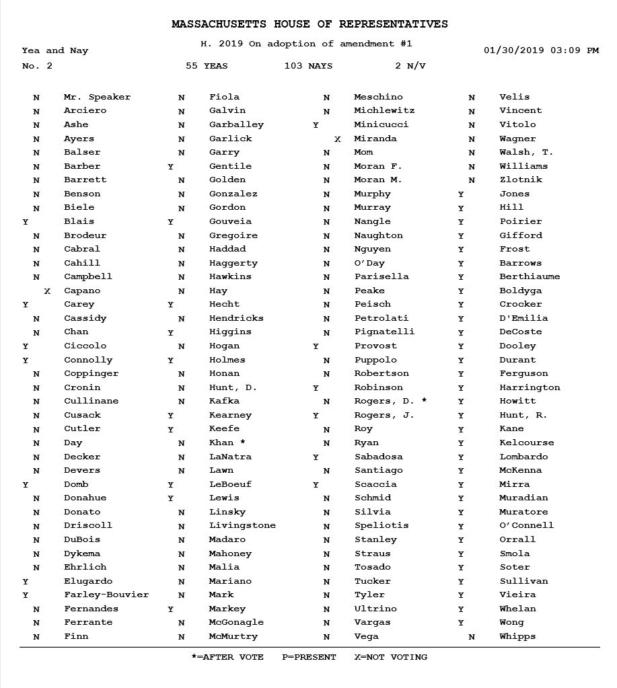
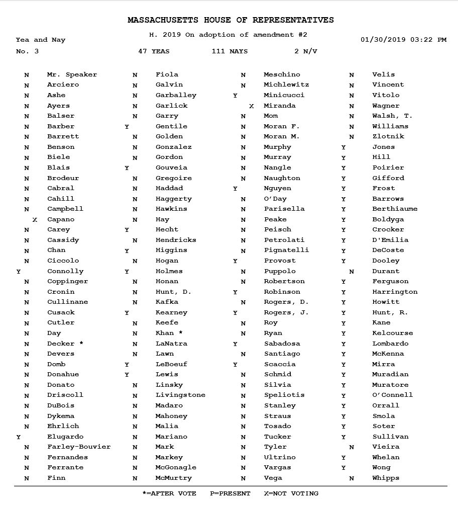
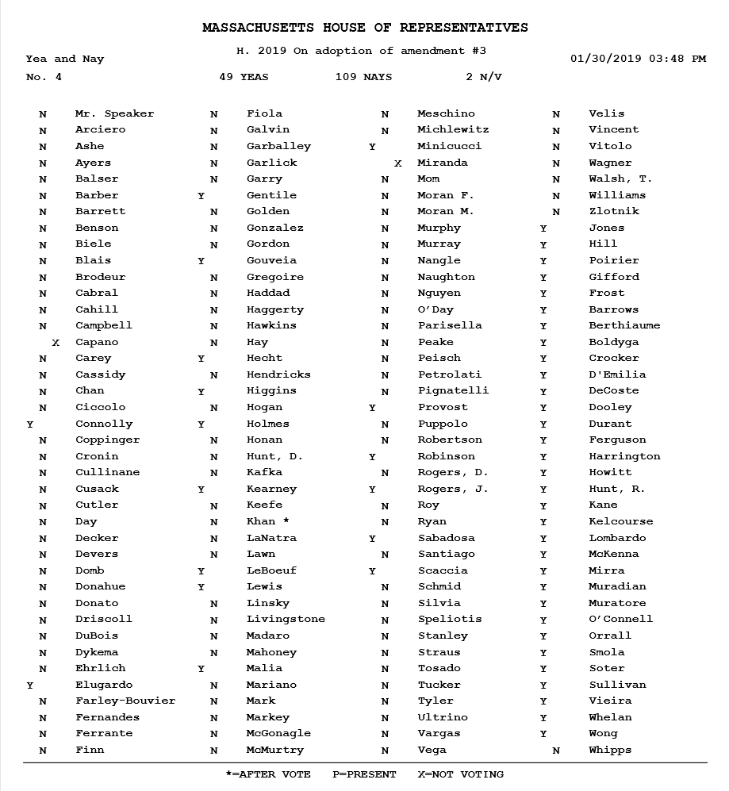

---

Yesterday the Massachusetts House voted overwhelmingly against three House rules amendments which would have required legislators to actually read bills before voting on them, and which would have published roll call votes and testimony so the public knows how representatives vote. While it all sounded sensible and democratic, the votes were a bitter reminder of one lobbyist's remark: “Don’t mistake what happens in [the Massachusetts State  House] for democracy.” 

The lobbyist quoted was Phil Sego, who [penned a piece](https://commonwealthmagazine.org/opinion/ex-lobbyist-reveals-how-the-house-really-works/) in Commonwealth Magazine last month deeply critical of a loyalty-based spoils system in Blue State Massachusetts that could just as easily be run by Mitch McConnell as Robert DeLeo. The amendment votes were strikes against transparency, to be sure, but they were mainly strikes against threats to Robert DeLeo's grip on the House.

Another Commonwealth [article that appeared on the 30th](https://commonwealthmagazine.org/politics/rules-debate-spirited-but-almost-nothing-changes/) pointed out that Democrats with cherished committee assignments voted to keep things as-is, while freshman legislators were put in the awkward position of having to vote with Republicans for a change in The Way Things Work.

In addition to the transparency votes, the House voted 43-113 against a proposal to impose term limits on Speaker Robert Deleo.

Today Progressive Massachusetts (PM) published the [results of the votes](https://www.progressivemass.com/house-transparency-2019) on three of the amendments:

1. 72 hours to read the final language of any bill the House is voting on;
2. 30 minutes for the House to read any amendment submitted on the floor to be voted on;
3. publication of hearing testimony and roll call votes

Check the votes below to see how your representative voted — and feel free to give him or her an earful:

https://malegislature.gov/Search/FindMyLegislator

#### Amendment #1 - 72 hours to read text of a new bill

#### Amendment #2 - 30 minutes to read floor amendments

#### Amendment #3 - publication of testimony and roll-calls

