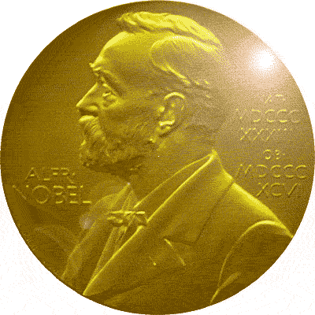

---

While I was working this morning, a friend sent me an email with an article from the Associated Press on President Obama's Nobel Peace Prize. At first I thought it was a hoax, and then re-read it carefully:

> "President Barack Obama won the 2009 Nobel Peace Prize on Friday in a stunning decision designed to encourage his initiatives to reduce nuclear arms, ease tensions with the Muslim world and stress diplomacy and cooperation rather than unilateralism."  

The announcement from Oslo was neither a hoax nor a prize. It turned out to be either wishful thinking or a misguided incentive.

Right-wing commentators are going to have a field day with the prize, and maybe they should. President Obama doesn't deserve it. At a time when the United States has yet to shut down Guantanamo Bay, will still be in Iraq well beyond 2010, is contemplating the expansion of war in Afghanistan, is accelerating the delivery of Boeing's bunker busters for use in Iran, and has been no more an honest broker for peace in Israel-Palestine than his predecessors - the president's peace accomplishments are few and dismal.

So while Conservative pundits froth over his prize, Liberals too may wish to hold off on congratulating the president - until he has actually earned this award.

-----

*This was published in the Standard Times on October 14, 2009* 
*<http://www.southcoasttoday.com/article/20091014/opinion/910140318>*

