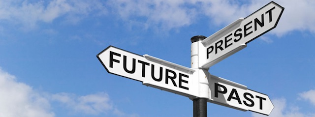

---

On August 30th Bill Keating came to the UMASS Law School for a meet and greet he didn't want to call a Town Hall. In a previous post I suggested that Democrats like Keating are either the future of the Democratic Party or relics of its past. So on the 30th I was especially interested in how the audience responded to him.

The Democratic Representative from the Massachusetts 9th Congressional district answered a few questions, choosing instead to run out the clock on potentially tough ones and he ended by telling the crowd that he had to run: he had a dinner reservation with his mother-in law. Several people remarked that the entire performance was a waste of time and Keating was condescending and disrespectful -- an opinion I shared.

But others were more generous to the congressman, a war hawk who has sided with extreme GOP positions on immigration, voted to neuter provisions in the Consumer Finance Protection Bureau, and who supports almost *none* of the [progressive legislation now before Congress](https://summerforprogress.com/scorecard) -- legislation aligned with the new [Massachusetts Democratic Party platform](https://massdems.org/platform/) but legislation Democrats nevertheless seem conflicted about actually passing.

After the meet and greet I contacted several people chosen to put questions to the congressman and asked them how well he had done. I received four replies:

1. "Although I wasn't impressed with all Rep. Keating's answers the other night, I was satisfied with what he said to mine. He even thanked me for it as I passed him by."

1. "My question was whether the congressman supported legislation to counter religious profiling, religious litmus tests and religious profiling of immigrants. I appreciate Representative Keating's empathy and his referral to his own family's encounter with discrimination as immigrant Irish Catholics. He noted that an attack on the civil rights of any minority is an attack on the civil rights of all of us."

1. "I asked Bill Keating whether he thought, given the partisan politics in Washington today, the Republicans would join Democrats in seeking articles of impeachment if the evidence was strong enough. I think he ran with the question and spoke at length about his thoughts. I was happy with his answer. I think he answered my question, and expanded on it quite a bit. What I came away with was that, at the moment, he doesn't think that we are quite there for a bipartisan effort."

1. "As a general comment, I felt he didn’t directly address the question. He talked for 6 or 7 minutes about how he supports bills pushing for transparency in political donations, i.e. from whom donations are received. This, I feel, is a tepid and timid position which does not address the real problem…unregulated and unlimited amounts of money being funneled into the election process. Transparency will help, but will not do the job. I was quite disappointed in his response and it explains why he isn’t a co-sponsor."

It's still a bit early to definitively answer the question of what kind of Democrat represents the future of the party, but we should know by the time the Democratic primaries come around. If Reagan Democrats like Keating remain unchallenged, and a slew of Baby Keatings appear on ballots, then we'll know the party's true character -- regardless of whatever lofty language is written into the platform.

Ultimately, though, it is voters who must push candidates to better positions, expect more, demand more, probe more. Keating's meet and greet left me feeling discouraged that, for many Democrats, the bar is all too low. And that the party's past is likely to be its future.

