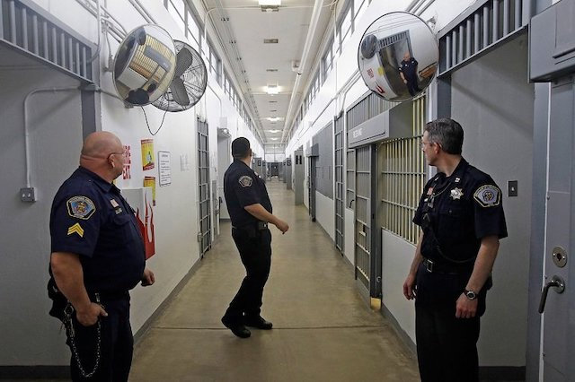
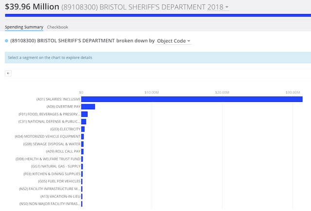
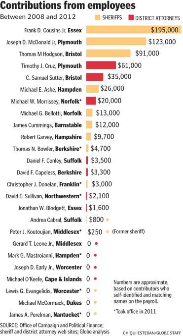

---

It's debatable if county jails do much to turn peoples' lives around. But they certainly excel as institutions of patronage. In [communities](https://www.themarshallproject.org/2016/06/14/so-you-think-a-new-prison-will-save-your-town) where jobs are scarce, where else can a high school graduate with basic skills make [$46K a year](https://www1.salary.com/MA/Correctional-Officer-salary.html) with benefits? The sheriff as *patrón* is in a position to hire a lot of employees and make a lot of friends. The Bristol County Sheriff, for example, is the [top employer in New Bedford](http://lmi2.detma.org/lmi/Top_employer_list.asp?gstfips=25&areatype=05&gCountyCode=000301) and the [third largest employer](http://lmi2.detma.org/lmi/Top_employer_list.asp?gstfips=25&areatype=05&gCountyCode=000304) in Dartmouth, Massachusetts.

Consider the [staffing](/Tom Hodgson/jailers-jailed/) in Massachusetts jails. The statewide staff-to-prisoner ratio in county jails is 1:73 and Bristol County's ratio is slightly less than that. In personnel costs alone, it takes 6,629 employees at a cost of nearly half a billion dollars to lock away 11,480 prisoners in the state's 14 county jails. Most of the incarcerated — the majority who are simply [awaiting trial](https://www.prisonpolicy.org/reports/pie2018.html) — would be better-served by drug rehabilitation and vocational programs, which jails don't even pretend to offer. And society would be better-served by actually doing "corrections" rather than simply warehousing human beings.

But jails are not in the business of rehabilitation. They seem to function mainly as job and pension factories.

#### Padding the Payroll

In 2015 [Public Consulting Group](https://www.mass.gov/files/documents/2017/10/16/attachment-c-ma-af-sheriffs-office-funding-formula-final-report-3-25-16-4.pdf) (PCG) visited six Massachusetts jails and found "wide variance in key costs metrics amongst sheriffs, even when comparing counties of similar sizes and prisoner counts." The study, "Sheriffs’ Funding Formula," was issued in 2016 and notes:

> "A review of 2013-2016 inmate counts found a decline in inmate populations over the last three years. Despite a population decrease of just over 14% during that period, state funding for sheriffs has increased by nearly 10% over those same three fiscal years."

*Yes, you read that correctly.* Jail staffing and construction is actually *increasing* — even though fewer people are being incarcerated. Yet at this moment there is at least [one bill in the state Legislature](https://malegislature.gov/Bills/191/SD1489) trying to expand the Middlesex County jail. The bill's sponsor prefers to call her jail expansion project a "justice complex."

PCG's study noted that the Massachusetts sheriffs' officer-to-prisoner ratio (1:2.48) is higher than that in New York state (1:2.53), New Hampshire (1:3.02), New Jersey (1:3.75), or Pennsylvania (1:4.49). According to PCG, the problem is bloat among the higher ranks at county jails:

> "In reviewing the ratio of staff to supervisors in each of the facilities, we found that many sheriffs have a higher number of high ranking supervisors. While our research did not identify a consistent recommendation for correctional facilities, studies in the public safety, probation, and corrections field typically recommend a “span of control” for supervisors of between 5-7 subordinates. While the sheriffs fall very close to this range for the ratio of Correctional Officers to Sergeants, the top end of the chain of command shows ratios as low as 1.58 (Lieutenants to Sergeants) and 1.87 (Captains to Lieutenants)."

But without make-work jobs for corrections supervisors, how else is a *patrón* supposed to help his friends?

The 2018 Bristol County Sheriff's Department [salary data](salary.xlsx) from the Office of the Comptroller includes 739 records representing 675 individuals and 64 promotions in rank. In the entire sample there are 34 Deputy Sheriff records, 46 Lieutenants, 27 Sergeants, 316 full-time Corrections Officers, 90 part-time Corrections Officers, and a variety of other professional roles. 54 were full or part-time contractors, many with the position of "Deputy" or "Instructor." The sheriff's top employees walk off with $3.9 million a year — 10% of the entire payroll. And they're smart enough to thank their benefactor. Many of these same names are found in Office of Campaign and Political Finance ([OCPF](ocpf.xlsx)) reports as contributors to the Hodgson campaign.

The damage that patronage does in a payroll-intensive system like a county jail cannot be over-estimated. According to Massachusetts Comptroller data, [payroll, overtime, roll call, holiday, vacation, and sick-leave buy-back pay](http://cthruspending.mass.gov/#!/year/2018/explore/0-/appropriation_name/(89108300)+BRISTOL+SHERIFF%27S+DEPARTMENT/0-/object_code) account for 86 percent of the operation of the Bristol County jail:

#### Patronage is a Massachusetts tradition

But patronage is a hallowed Massachusetts tradition. As [Shira Schoenberg](https://www.masslive.com/politics/index.ssf/2014/07/from_john_adams_to_john_obrien_massachusetts_political_patronage_history.html) wrote in *MassLive*, the "Massachusetts governor for a time had an 'Office of Patronage' dedicated to helping people apply for state jobs." The office existed at least until 2002. Boston Mayor Curley's administration *ran on* patronage, More recently, Paul Celluci's patronage appointee to MassPort, Virginia Buckingham, was forced to resign after 9/11 hijackers commandeered two planes from her airport.

In Bristol County, Massachusetts, accusations of political patronage have long dogged Sheriff Tom Hodgson. When Hodgson ran for Sheriff the first time in 1998 after an interim appointment by William Weld, the Standard-Times [endorsed](https://www.southcoasttoday.com/article/19981030/Opinion/310309938) his opponent, Rep. Joseph McIntyre. McIntyre accused Hodgson of running a “patronage bazaar” in the sheriff’s office, and the newspaper's endorsement slammed Hodgson for practices ranging from "hiring of publicity agents to his fattening of the payroll with patronage employees, who repay him with campaign contributions that he encourages."

Both of [Hodgson's challengers](http://www.thesunchronicle.com/news/hodgson-taking-his-lumps-in-sheriff-race/article_f12132f8-a243-5e09-aa6d-7d56ed6e1609.html) in 2010, John Quinn and Alan Garcia, charged Hodgson with trading jobs and pensions for political support. During one campaign debate, [Quinn said](http://www.heraldnews.com/x835153187/CANDIDATE-Q-A-Bristol-County-Sheriff-Week-2-Question-1), "the Sheriff has spent millions of dollars on unnecessary legal fees to three lawyers who are his personal friends and political contributors. He has hired dozens of high paid administrators in unnecessary patronage jobs. These people will retire on a hidden budget that will cost our communities millions of dollars in unseen pension payments for decades to come." When announcing his candidacy, [Alan Garcia](http://www.heraldnews.com/x206835953/Retired-trooper-seeks-sheriffs-seat) took a similar swipe at Hodgson: "We will be promoting people inside the prisons based on performance and merit, not political maneuvering or political patronage.”

In 2008 the state's Commission on Judicial Conduct forced Judge Michael Livingstone off the bench for ethics violations. Almost immediately, Tom Hodgson snapped up Livingstone to run his jail's medical program. Why? It was a simple case of political back-scratching. According to the [Standard Times](https://www.southcoasttoday.com/article/20111006/News/110060359):

> "The politically connected Livingstone was previously the legal counsel to the New Bedford City Council and a city solicitor. Hodgson has acknowledged that former state Sen. William Q. “Biff” MacLean Jr., New Bedford City Councilor John T. Saunders and former mayor Judge John Markey approached him seeking a job for Livingstone."

In 2011 Livingstone, who had stopped coming to work, resigned amid accusations that his job had been nothing more than a scheme permitting him to extend his state pension benefits. When asked about the scheme on October 6, 2011, Hodgson claimed to have "no idea." Of course he didn't. On [that particular](https://video.foxbusiness.com/v/1202710322001/#sp=show-clips) day the sheriff was more focused on slamming Gov. Deval Patrick's immigration policies on Lou Dobbs' FOX News show.

Several of Hodgson's lawyers are donors. [$1.3 million](https://www.southcoasttoday.com/article/20100620/News/6200338) of state money went to donor lawyer and "Special Deputy" Bruce Assad, [who is now](https://www.bostonglobe.com/metro/2017/09/13/late-for-court-controversial-sheriff-has-answer-judge/Ufd3dEUZBDWafc49oI5hvN/story.html) "Special Sheriff" Bruce Assad. According to Comptroller records, Craig Assad is Hodgson's Assistant Supervisor of Training, and Steven Assad is a corrections officer. Another million dollars in legal fees went to attorney Ronald Lowenstein, whose family's contributions in 2004 violated state campaign finance laws. Lowenstein's former partner, Robert Novack — also a donor — was made a $70K a year part-time employee, qualifying him for a state pension and health benefits, and he now serves as one of Hodgson's lawyers.

In [2013 Boston Globe](https://www.bostonglobe.com/metro/2013/03/04/fund-raising-from-employees-reveals-divide-raises-ethical-questions/HY49JVP7aOZELFET2qrgPL/story.html) reporters Peter Schworm and Matt Carroll looked at patronage among county sheriffs and District Attorneys. Offender #2 was Plymouth County Sheriff Joseph McDonald: "Over the past five years, McDonald has raised about \$123,000 in contributions from his 525 employees, almost \$50,000 over the past two years alone. That two-year total ranked as the highest among the state’s sheriffs and district attorneys, a Globe survey of campaign records from 2008 through 2012 found."

But Tom Hodgson followed on McDonald's heels in total contributions, with Bristol and Plymouth County District Attorneys right at the top of the pack as well.

Patronage damages morale, inhibits whistleblowing, and creates dysfunction. With the highest prisoner [suicide](https://bccjustice.org/suicides/) rate in the state, the second-highest [recidivism](https://bccjustice.org/recidivism/) rate, the highest rate of complaints of [excessive](https://www.telegram.com/news/20181113/looking-to-bring-order-to-unruly-encounters) force, and multiple wrongful death and human rights [lawsuits](https://www.wgbh.org/news/2018/03/18/local-news/bristol-county-report-inmate-suicides-leaves-out-key-details), one could argue that the Bristol County jail is the very *definition* of dysfunction.

A [special commission](https://www.clearinghouse.net/chDocs/public/JC-MA-0012-0001.pdf) investigating corruption at the Suffolk County Sheriff's Department in 2002 explains why:

> "Further compounding the lack of leadership is patronage. Many of the staff at all levels owe their jobs to well-connected politicians. Because the Sheriff made promotions without clearly-defined criteria (or even an employee evaluation process), many staff members concluded that their own advancement depended on politics, rather than merit. In this environment, staff became cynical of policies introduced by top management without their input. Supervisors, a group of employees critical to the proper functioning of the facilities, abdicated their responsibilities and well-formulated policies were not uniformly or consistently implemented."

In 2014, Republican candidate Jeff Perry lost his bid for the 10th Congressional District on the Cape. But patronage provided a soft landing. [Perry was appointed](https://www.necn.com/news/politics/_NECN__Exclusive__Jeff_Perry_Defends_Appointment_to_Sheriff_s_Department_NECN-247490161.html) "Special Sheriff," a job that pays $100K a year, by political buddy, Barnstable Sheriff Jim Cummings — despite allegations Perry knew about improper strip searches of teenage girls when he was a Wareham police sergeant in the 90's.

#### The Ware Inquiry

In 2010 the [Boston Globe Spotlight Team](http://archive.boston.com/news/local/massachusetts/articles/2010/10/24/hard_questions_loom_for_patronage_king/) investigated Rep. Tom "Tommy" Petrolati and Parole Commissioner John O'Brien. Petrolati apparently leaned on Hampden County Sheriff Michael Ashe to hire some of Petrolati's friends and associates and, when Ashe balked, Petrolati retaliated. But the sheriff had his own turf to defend. In 2009 Ashe, known for his [extravagant](https://www.masslive.com/politics/index.ssf/2016/08/hampden_county_sheriff_mike_as_2.html) community clambakes and whose [motto](http://hcsdma.org/sheriff-ashe-bio/) was "strength reinforced with decency; firmness dignified with fairness," [awarded his own brother](https://www.masslive.com/news/index.ssf/2010/04/hampden_sheriff_michael_ashe_h.html) a consulting contract, making him the highest paid public safety official in Massachusetts.

The Globe's reporting eventually led to a Supreme Judicial Court inquiry headed up by Special Investigator [Paul Ware](https://www.telegram.com/article/20101128/NEWS/11280480). In 2010 the [Ware Inquiry](https://www.universalhub.com/2010/report-finds-endemic-corruption-state-probation-de) released its [337 page report](https://archives.lib.state.ma.us/bitstream/handle/2452/54291/ocn682159342.pdf), naming state Senators and Representatives, members of the Parole Commission, and county sheriffs' employees who to this day offer patronage and violate campaign finance laws. When asked about the Parole Department, Governor [Deval Patrick](https://www.berkshireeagle.com/stories/theres-no-question-that-massachusetts-sheriffs-have-power-but-is-it-too-much,117399) described it as an "unaccountable and to some extent rogue agency." Many of the state's law enforcement agencies have a [culture of corruption](https://www.masslive.com/politics/index.ssf/2018/09/the_massachusetts_state_police.html), as Troopergate just demonstrated.

Page 197 of the Ware Inquiry identified Senator Mark Montigny as the top practitioner of patronage. Sal DeMasi, who went to jail for other types of corruption, appears third on Ware's list. Montigny, in fact, accounted for 54 out of all 319 "sponsorships" investigated, one of which was a [girlfriend poorly ranked by the hiring panel](https://www.wbur.org/news/2014/05/30/prosecution-builds-obrien-probation-case) because of her lack of experience. Other than the girlfriend, Montigny’s friends had extraordinary success finding jobs. Page 38 of Ware's report notes: "Of the 54 candidates sponsored by Senator Montigny, for example, at least 23, or 42.6%, were contributors to the Senator. Of the 23 contributors, 11 were successful in being hired or promoted within a year following the sponsorship (47.8%). By contrast, of the 31 non-contributors, only 1 (3%) was hired or promoted.”

In 2014 the Standard Times' [Jack Spillane](https://www.southcoasttoday.com/article/20140622/News/406220315) asked, "... what are we to make of the fact federal prosecutors have painted a portrait of Montigny, now 21 years in office, as exactly like the man who is his unwanted political godfather?" 

Spillane was referring to Montigny's mentor, former state Senator William Q. "Biff" MacLean. The same MacLean who in 1993 [pleaded guilty](https://en.wikipedia.org/wiki/William_Q._MacLean_Jr.) to conflict of interest violations involving state contracts, paid a half-million dollar fine and who ironically served a year of probation and was stripped of his pension. The same MacLean whose son Douglas was [hired in 1999](https://www.masslive.com/politics/index.ssf/2014/06/probation_department_hire_had.html) by Bristol County District Attorney Paul Wash [despite a history](https://www.masslive.com/politics/index.ssf/2014/06/probation_department_hire_had.html) of heroin and cocaine abuse, and multiple criminal convictions. The same MacLean whose son again In 2004 — [with help from Mark Montigny](http://www.patriotledger.com/article/20140619/News/140615399) — was given a job in the probation system, which he lost five years later after being [arrested for possession of crack cocaine](https://www.southcoasttoday.com/article/20090117/NEWS/901170340).

The same "Biff" MacLean who leaned on Hodgson to hire disgraced judge Livingstone. 

#### What can be done?

Tom Hodgson is one of the worst and doesn't deserve a break. But neither do all the other state ethics violators out there. Hodgson's corruption is part of a culture that spans political parties. His abuses persist because neither party has the political will to end patronage. Instead, each year criminal reforms include studies, oversight groups, and tweaks to Department of Corrections rules that shut out the public and make offending agencies accountable only to themselves.

Here are some other approaches we might try:

- **Ban employee political contributions**. Worcester County Sheriff [Lewis Evangelidis](https://www.telegram.com/article/20110120/NEWS/101200788) promised during his 2010 campaign to not accept campaign donations from employees. "The perception has been that this place was extremely political, and it seemed the morale of employees was low because of the perceived or real sense of politics being a part of the hiring process," he said shortly after his campaign ended. Half the state's sheriffs follow this example and do not accept contributions from their employees.
- **Professionalize corrections staff**. Sheriff Evangelidis raised the bar to require correctional officers to hold either an Associate Degree or have military service. This was a start, but insufficient. Corrections officers should all have completed coursework in psychology and the social sciences supervisors should have master's degrees in these areas.
- **Abolish make-work jobs**. Remember Jeff Perry — the "Special Sheriff" hired by Barnstable County Sheriff Jim Cummings? This position had been vacant and was dusted-off just for him. [Perry himself](https://www.necn.com/news/politics/_NECN__Exclusive__Jeff_Perry_Defends_Appointment_to_Sheriff_s_Department_NECN-247490161.html) signalled that he would just be warming the seat until another political opportunity presented itself. Jails should not be a jobs program for politicians between gigs.

- **Professionalize the hiring**. Perry's hiring — his department under a cloud of sexual abuse — would not have been possible if an independent civil service were responsible for hiring.

- **Limit command structure**. As the PCG study shows, left to their own devices sheriffs pad supervisory ranks. Supervisory jobs must be justified and reviewed by a public (non-DOC) oversight group and should never be directly filled by a sheriff.

- **Pay for treatment not jails**. Treatment for substance abuse and psychological problems — the majority of people in county jail — should be delivered in a clinical setting by healthcare and treatment professionals. We must not spend a penny more for jails. Spend it on treatment; otherwise, it's wasted tax money.

- **Abolish the position of sheriff**. This is one way to deal with [patronage havens](https://patch.com/massachusetts/norton/county-government-should-be-abolished). All county jails have been owned by the state since 2010. Bristol County has only an agricultural vocational high school and a county print shop. Place all jails under the Department of Corrections and have the state police handle process serving. Connecticut and Rhode Island do this already.
- **Prosecute**. Corruption breeds impunity. As chief law-enforcer, the Attorney General is in the unenviable position of having to defend sheriffs. But who defends citizens' interests? Change laws or set up a new non-partisan prosecutorial agency to deal with state corruption.
- **Vote wisely**. Sheriffs are constrained by the Department of Corrections (DOC), the Executive Office of Public Safety and Security (EOPSS), and the Executive Office for Administration and Finance (EOAF). All are appointed by the [present] Republican governor. The current Democratic state auditor conducted only a cursory “performance” audit which only makes friendly recommendations to a sheriff, not holds him accountable. As Tom Hodgson repeatedly tells voters: if you don’t like him, vote him out.
