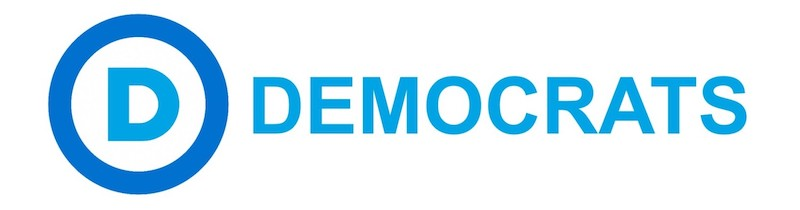
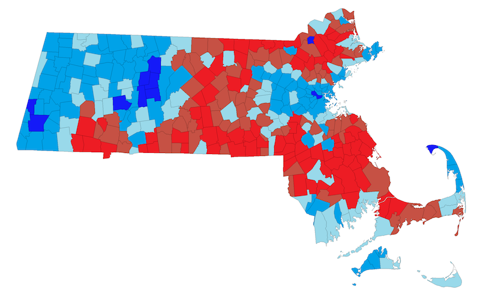

---

The Massachusetts Democratic [convention](https://massdems.org/state-caucuses-convention) is two weeks away, and there is now a working version that will be discussed in Worcester on June 3rd. Some have applauded the new draft -- including three progressive groups that contributed amendments -- for being the "most progressive" Massachusetts Democratic platform in history.

### Good Stuff

To its credit, the 2013 draft includes calls for

- single-payer healthcare -- although it's not clear why it also propose a hodgepodge of other healthcare programs
- making the Commonwealth a sanctuary state
- public funding of elections -- but will the state's Democrats *really* give up their PACs?
- paid family leave
- free college education -- well, *maybe*, because it also calls for "exploring" debt-free models of higher education
- a "decent living wage" -- though a *specific* amount is not given
- infrastructure development, including broadband -- though no mention of regulating monopolies like Comcast or ensuring net neutrality within the state
- a "millionaire's tax" -- along with tax breaks for "job creators"
- universal background checks for guns  --"balanced" by more money for law-enforcement
- more money for veterans -- which irks me for the same reason as the Commonwealth subsidizing ICE

And, to be fair, there are many good things in the platform. But some caution.

### Their hearts weren't in it

Massachusetts Democrats have been pushed to embrace many progressive positions they would normally have rejected -- and they have been translated into ambiguities and *weasel-words*. Some positions are just a road too far for Democrats in a state that thinks it's much more liberal than it actually is. The hearts of those who had to draft this "progressive" platform just weren't in it.

In a [previous post](/Democratic Party/massdem-platform/) I looked at what was missing in the [2013 MassDems platform](http://massdems.org/files/2013_MDP_Platform_FINAL.pdf) -- and some things have indeed been fixed in a 2017 draft. At the time I observed that "the 2013 platform isn't bad as a statement of liberal values -- and the 2017 Progressives' changes aren't so radical as to give Democrats much heartburn."

I was wrong. Apparently there was heartburn.

For example, the platform committee deleted the following plank from the 2013 final version:

> "We want strong diplomacy and support nonviolent conflict resolution as a first resort in our domestic and foreign relations and call for a reduced military budget that allows for investment in human needs"

Attempts by progressive delegates to insert anti-militarism and foreign policy language into the platform were flatly rejected. The word "military" only appears in the *Veterans* section. *Thank you for your service. Here, have some state money.*

### What's still missing

- **Foreign Policy and Militarism** -- stop supporting autocratic and undemocratic regimes -- no more weaponry for Saudi Arabia -- slash the military budget -- **end undeclared wars** -- insist on **Congress' right to declare wars** -- no more aid to Israel until they end settlements -- no more aid for Egypt's dictatorship
- **Democratization of the Democratic Party** -- will we ever be rid of superdelegates?
- **End the Surveillance State** -- enhance citizen **privacy** (a word that doesn't appear even *once* in the document) -- get rid of the Patriot Act -- eliminate FISA courts -- get rid of or make No Fly lists transparent -- breathe life back into the 4th Amendment
- **End useless tax breaks** -- remove vague language guaranteeing favorable tax rates for "businesses that generate community growth and participation" -- Wal*Mart? really?
- **Environment** -- now that EPA and Superfund money has been slashed, Massachusetts should sue for remediation (for example, Aerovox dumped PCBs in New Bedford's harbor and then moved to Mexico) -- strengthen our own MA Dept of Environmental Protection
- **Healthcare backup plan** -- create with other Blue States a Single-Payer Healthcare system
- **Restore Net Neutrality** to the FCC
- **Create a Citizen's Data Bill of Rights** guaranteeing that *your* personal and online data belongs to *you* and not to Comcast (Europeans have had this for years)

### The platform is really the side-show

While the platform appears to be the main attraction, anything ironed out like this amounts to so much word salad. Modifying the party's [charter](https://massdems.org/your-party/party-documents/16-about-your-party/party-documents/151-massachusetts-democratic-party-charter) may appear to be a side-show, but it is arguably the more important objective. It turns out the *platform* is really the side-show.

Though there will be thousands of delegates and guests at the convention, the Massachusetts Democratic State Committee is the body that actually makes the decisions -- think of it as your friendly [Politburo](https://en.wikipedia.org/wiki/Politburo). It's also a [fund-raising](http://us-campaign-committees.insidegov.com/l/48638/Massachusetts-Democratic-State-Committee) machine, so whatever values the platform holds are completely separate from those of the candidates the Committee funds. 

The MassDems [State Committee](https://www.massdems.org/your-party/state-committee) is the nation's largest, weighing in at 418 members. Of this number only 80 members are actually voted upon by town delegates. Over 120 have *permanent* status and cannot be unseated as long as their bodies continue to twitch. Every year the number of these functionaries grows larger.

So let there be no confusion: the platform we are voting upon in two weeks is theirs, not ours. And in the long term, it's changing the party charter that will actually make the difference.

