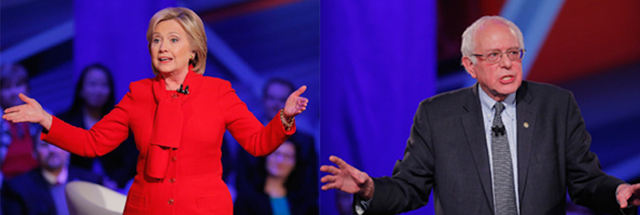

---

The fragmented state of the Left has become a bitter joke in American politics. Right off the top of my head -- we have the True-Blue Democrats, the Blue-Dog Democrats, Progressive Democrats of America, Democracy for America, the Green Party, Democratic Socialists of America, Socialist Alternatives, Working Family, and even the Pirate Party. There are likewise a ton of PACs and think tanks devoted to the disparate threads of liberalism, centrism, neoliberalism, progressivism, and socialism. To Republicans, of course, we are all simply "The Left."

Especially in light of recent events, we might be much more effective if we *were* a more cohesive "Left." But we have one donkey-shaped hole into which everyone is supposed to jam all the odd shaped pegs. And we don't have a parliamentary democracy to make coalitions like this work.

But progressives, at least, can forge cross-party alliances themselves.

In Richmond, California, a refinery town north of San Francisco, [two progressive candidates for City Council](http://labornotes.org/2015/01/unbought-slate-wins-against-democrats-chevron) went up against the Democratic Party establishment as well as a $3 million slush fund set up for Democrats by the Chevron Corporation. [And the progressives won](http://www.eastbaytimes.com/2016/11/10/richmond-progressive-alliance-sweeps-up-at-the-polls-rent-control-measure-passes/).

Both [Melvin Willis](https://ourrevolution.com/candidates/melvin-willis/) and [Ben Choi](https://ourrevolution.com/candidates/ben-choi/) were fielded by an independent progressive political organization called the [Richmond Progressive Alliance](http://richmondprogressivealliance.net/), originally founded by [Greens](http://newpol.org/content/should-greens-go-local). In addition, both received support from [Our Revolution](https://ourrevolution.com/), a party-agnostic progressive organization Bernie Sanders created after the election.

In *[Refinery Town: Big Oil, Big Money, and the Remaking of an American City](https://www.goodreads.com/book/show/30090883-refinery-town)*, former labor organizer and author [Steve Early](http://billmoyers.com/story/california-refinery-town-can-teach-america/) writes about Richmond, its Green Party mayor, Gayle McLaughlin (still active today as a [councilwoman](http://richmondpulse.org/2016/11/26/councilmember-gayle-mclaughlin-richmond-is-not-going-to-cooperate-with-ice/)), and the Richmond Progressive Alliance (RPA), which unites progressive Democrats, Greens, and independents. Given RPA's support from Our Revolution, it is not a surprise to find a forward by Bernie Sanders in Early's book.

Next door, in Rhode Island, Democrat [Marcia Ranglin-Vassell](http://www.marciaforri.com/) ran against RI House Majority Leader John DeSimone for State Representative in her party's primaries -- and she [won by seventeen votes](http://www.huffingtonpost.com/entry/marcia-ranglin-vassell-ousts-majority-leader-squeaker_us_57d98678e4b0fbd4b7bcd122). Ranglin-Vassell snagged endorsements from both [Rhode Island Progressive Democrats](http://www.riprogressivedems.com/) and [Working Families](http://workingfamilies.org/), which also endorsed Bernie Sanders. Our Revolution [supported Ranglin-Vassell](https://ourrevolution.com/candidates/marcia-ranglin-vassell/) against Roland Lavallee in the general election, which she won.

Although the Democratic Party often describes itself as a big tent, loyalty rules preclude endorsing progressive candidates outside the Big Blue tent. And it's not yet clear the DNC will ever be a home for progressives. But in alliances -- like Our Revolution, the Richmond Progressive Alliance and Working Families -- progressives can join together to field candidates whose job #1 is to help everyday people.

It's an idea progressives should be exploring right here in our little corner of Massachusetts.

