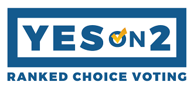
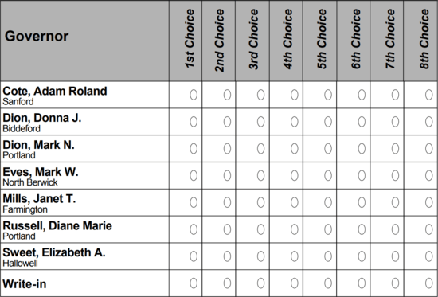

---

Elections and widespread voter suppression disenfranchise voters throughout the United States. In this most recent presidential election we have seen almost every trick used to make voting difficult or impossible. But there are many paths to disenfranchisement. Who we see on the ballot, who we see on the debate stage, and how we select the winners all determine whether we get the politicians we need.

The hegemony of the so-called Two Party System isn't doing democracy any favors. Like the convention of having 9 Supreme Court justices, there is nothing in the U.S. Constitution that requires a two-party system. The reality is that we have dozens of political parties. Yet this magic number is taken by many as an article of political faith.

This year more than a dozen presidential candidates qualified to appear on state ballots, but you wouldn't know it since only two parties were invited to appear at debates hosted by the Commission on Presidential Debates (CPD). Despite its *government-y* name, the CPD is a 501(c)(3) non-profit whose board members are a *Who's Who* of [establishment](https://www.debates.org/about-cpd/former-board-members/ ) politics. It was founded by the then-chair of the Democratic Party, Paul Kirk, Jr., and by his Republican equivalent, Frank Fahrenkopf, Jr. Since 1996 CPD's sponsors have included Anheuser-Busch, Dun & Bradstreet, Philip Morris, Sara Lee, Sprint, AT&T, Ford Motor Company, Hallmark, IBM, J.P. Morgan, U.S. Airways, the Howard G. Buffett Foundation, and — well, you get the idea.

The entire election process — including the voting procedure itself — is designed to disadvantage third parties. The American preoccupation with "viability" always trumps presenting new ideas to voters. When, as Green Party presidential candidate Jill Stein did in 2016, a third party candidate *does* overcome all odds and manages to get on the ballot, s/he is usually vilified, as Stein was, for stealing votes from "viable" candidates who are only viable thanks to free coverage from media giants and non-profits like CPD. Stein was arrested when she tried to "crash" CPB's 2016 debates.

I recently viewed a [2016 video](https://www.youtube.com/watch?v=hYBdSQqCGCM) of Stein being interviewed by "Headliner" anchor Mehdi Hasan. When asked what she could uniquely offer voters, she pointed to: student debt relief; an emergency jobs program based on a green energy economy; and and end to police violence. While today's Democrats are still struggling to address police violence, income inequality, and climate change, Stein nailed it four years ago.

Fast forward to 2020. It wasn't just Bernie Sanders and the *Squad* who brought progressive platform planks to voters. Planks from Stein's platform were eventually embraced by at least several Democrats in the 2020 election cycle. 

I was one of those who voted "Green" in 2016. Admittedly, my vote was lost in a sea of Massachusetts votes for Hillary Clinton. But I felt it was important to support a fundamentally decent candidate with a more humane and rational platform than Democrats were offering. And — *no* — my vote *didn't* bring Donald Trump to power any more than Russian troll farms or Jim Comey did. Democrats anointed the wrong candidate, and she lost because not enough people wanted her.

Which brings me to Ranked Choice Voting (RCV). [RCV is used](https://www.fairvote.org/where_is_ranked_choice_voting_used) in a number of American cities, Maine, Australia, New Zealand, Malta, Ireland, and elsewhere. It gives voters more than one choice on a ballot, so that if their first candidate is not viable — in the *real* sense of the word — then their 2nd, 3rd, or 10th choice will at least influence the final vote. Ranked Choice Voting also avoids costly runoff elections by calculating instant runoffs.

On November 3rd Massachusetts voters will have a chance to choose Ranked Choice Voting by [checking "Yes" on Question #2](https://www.boston.com/news/politics/2020/09/21/massachusetts-ballot-question-2-ranked-choice-voting). The 10-way Democratic primary in the 4th Congressional District offered a perfect example of why RCV is needed. As a [Boston.com article](https://www.boston.com/news/politics/2020/09/21/massachusetts-ballot-question-2-ranked-choice-voting) pointed out, "winning without the support of the vast majority of voters has become a feature of most recent open House primaries. In 2018, Rep. Lori Trahan won her 3rd District primary with less than 22 percent of the vote. In 2013, Rep. Katherine Clark won with less  than 32 percent. In 1998, former Rep. Mike Capuano clinched the  nomination with 23 percent."

And we call this democracy?

Had Ranked Choice voting been available in 2016, I imagine that Green voters like myself would have held our noses and chosen Hillary Clinton as our second pick. But that wasn't even an option.

So if Massachusetts voters, who are overwhelmingly Democratic, still end up rejecting Ranked Choice Voting in the face of increasing problems with conventional voting, then I will be quick to offer this piece of advice: Shut up about third parties spoiling "your" wins. You had your chance and you blew it.

Vote Yes on Question #2.

