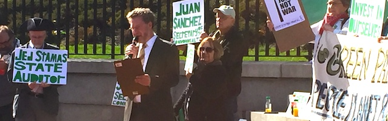

---

Massachusetts is not happy with incumbent State Auditor Suzanne Bump. 

Three candidates are challenging her this year, and all for the same reason — Bump is just not doing her job. Even many Democrats would agree that the Auditor loves to scrutinize the state's social service agencies but has done little to investigate corruption in the state police and at least one Massachusetts county jail.

At the Bristol County Sheriff's Office (BCSO), for example, illegal detentions and human rights abuses inside the facilities have been widely reported. The BCSO receives state and federal money for opioid treatment programs, yet inmates report little or no actual treatment — in fact having all medications, including blood pressure meds, HIV treatments, insulin, and methadone, withheld upon incarceration. Suzanne Bump was first informed of this last February but has not completed an audit of the BCSO.

The Bristol County Sheriff circumvents the State Judicial Court's prohibition of daily inmate fees by forcing inmates to purchase goods at a canteen from which the BCSO collects a percentage. The Auditor did a cursory review of sheriff's departments in 2010 when the state assumed responsibility for county jails, and it enumerated a number of discretionary funds the Bristol County Sheriff is permitted to manage apart from the state. But attempts to discover how these funds are actually managed, and for what purposes and to whom payments are made, have been stymied by the sheriff's omissions and obfuscatory reporting.

In 2016 Suzanne Bump faulted the [Massachusetts Sheriff's Association](https://www.mass.gov/doc/massachusetts-sheriffs-association/download) for failure to deliver state-mandated reports to her, but these reports *still* have never been published. After the Auditor's failure to look into *Troopergate*, it's fair to say that Suzanne Bump has been far too deferential to law enforcement agencies.

In the Bristol County Sheriff's office there have been persistent charges of: pension abuses related to cronyism; money laundering related to the federal "Codfather" case; profiteering related to the sheriff's use of the canteen, phone and video visitation; and pocketing of food, healthcare and drug treatment funds. A lawsuit was recently filed against the sheriff for receiving millions in kickbacks from Securus, a phone vendor. But with an Auditor asleep on the job, there's no accountability for the sheriff.

Of the approximately [1300 published audits](https://www.mass.gov/lists/all-audit-reports) done by the Auditor's office since 2000, only 22 involve sheriff's departments, and of these a third were "checkpoints" of the departments during transition to state control in 2010. Only 8 of 14 sheriff's departments have *ever* been separately audited in the last 19 years.

- The Berkshire County Sheriff's Department was audited in [2011](https://www.mass.gov/doc/middlesex-sheriffs-office/download)
- The Essex County Sheriff's Department was audited in [2010](https://www.mass.gov/doc/essex-sheriffs-department/download) [2018](https://www.mass.gov/audit/audit-of-the-essex-sheriffs-department)
- The Franklin County Sheriff's Department was audited in [2010](https://www.mass.gov/doc/franklin-sheriffs-office/download)
- The Hampden County Sheriff's Department was audited in [2010](https://www.mass.gov/doc/hampden-sheriffs-office/download) [2015](https://www.mass.gov/doc/hampden-sheriffs-department-administration-of-inmate-transportation/download) [2016](https://www.mass.gov/doc/hampden-sheriffs-department/download)
- The Hampshire County Sheriff's Department was audited in [2010](https://www.mass.gov/doc/hampshire-sheriffs-office/download) [2014](https://www.mass.gov/doc/hampshire-county-sheriffs-office/download) [2018](https://www.mass.gov/audit/audit-of-the-hampshire-sheriffs-department)
- The Middlesex County Sheriff's Department was audited in [2011](https://www.mass.gov/doc/middlesex-sheriffs-office/download)
- The Plymouth County Sheriff's Department was audited in [2005](https://www.mass.gov/doc/plymouth-county-sheriffs-department/download)
- The Worcester County Sheriff's Department was audited in [2005](https://www.mass.gov/doc/worcester-sheriffs-office-0/download) [2010](https://www.mass.gov/doc/worcester-sheriffs-office-0/download) [2012](https://www.mass.gov/doc/worcester-sheriffs-office/download)

The Bristol County Sheriff's office just keeps racking up the questionable practices. Any *one* of them ought to be enough to trigger an investigation of what's going on in Bristol County.

And it gets worse.

After filing a [public information request](http://bccjustice.org/tiny/sheriff-travel), I learned that the Bristol County Sheriff has been using state funds for registration, accommodation, and travel to far-right political events that have nothing to do with his job of running a jail and ought to be billed to the sheriff's political campaign. The documents I've seen are ripe with the stink of corruption. There is plenty of information in the collection to determine whether the sheriff has finally crossed the line from impropriety to lawbreaking. But so far — *nothing* from Suzanne Bump.

So it's time for a change.

Bump's challengers are: Libertarian Daniel Fishman, a software entrepreneur who ran twice for federal office and once for municipal election in the span of 10 months; Helen Brady, a Concord socialite who ran for state office in 2016 as a moderate Republican but who recently has begun a love affair with the Tea Party; and Green Party candidate [Jed Stamas](http://www.green-rainbow.org/blog_i_m_jed_stamas), a progressive public school teacher who actually seems to care how citizens are treated and is prepared to hold public officials accountable.

So I'm casting my vote for The Green Party guy, [Jed Stamas](http://www.green-rainbow.org/blog_i_m_jed_stamas). Brady has campaigned with Keiko Orrall, Bristol County's version of Michelle Bachmann. And a corporate-friendly, regulation-averse Libertarian would never be my first choice for a watchdog. The Green Party's [Jed Stamas](http://www.green-rainbow.org/blog_i_m_jed_stamas) has promised to hold public officials accountable, [regardless of party affiliation](http://www.green-rainbow.org/blog_i_m_jed_stamas). And Stamas certainly can't do any worse than the snoozing incumbent.

Vote for [Jed Stamas](http://www.green-rainbow.org/blog_i_m_jed_stamas) for Massachusetts State Auditor on November 6th. 

