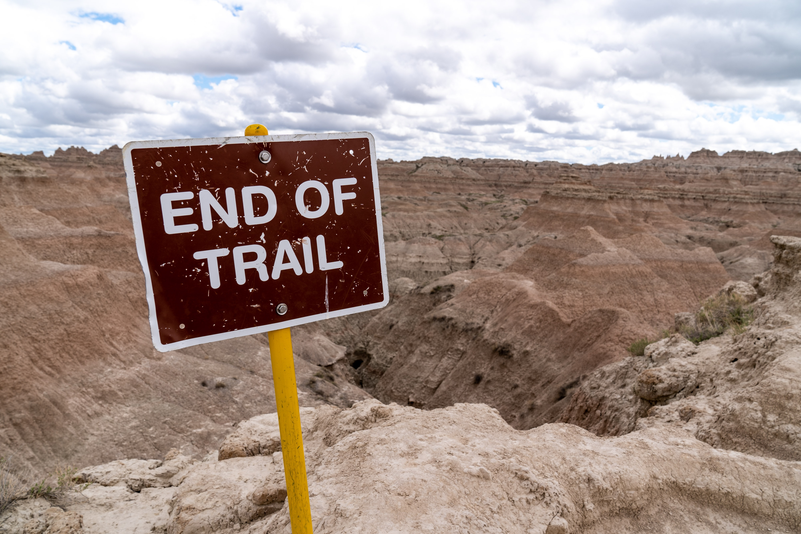
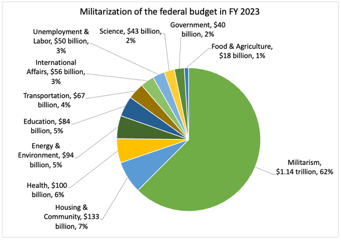

---
 

I am one of those voters who cares more about foreign policy than making Wall Street great again. Don't try to sell me *Bidenomics* when the president hired a [war criminal](https://www.motherjones.com/politics/2023/07/elliott-abrams-war-biden-white-house-bipartisanship/), sent [cluster munitions](https://www.cnn.com/2023/07/07/politics/cluster-munitions/index.html) to the Ukraine, [fist-bumped](https://www.cnn.com/2022/07/17/politics/joe-biden-fist-bump-mbs-mohammed-bin-salman-white-house/index.html) a Saudi prince who had an American journalist hacked into pieces, gave Indian fascist Narendra Modi a [bear hug](https://foreignpolicy.com/2023/06/22/biden-india-relationship-quad/), gave [the same](https://www.thenation.com/article/world/biden-netanyahu-bear-hug-disaster/) to Israel's fascist Prime Minister, and [twice bypassed Congress](https://www.cnn.com/2023/12/29/politics/biden-congress-israel-military-aid/index.html) to provide military aid for Israel's genocidal campaign in Gaza. 

In case you hadn’t noticed: Donald Trump does not have a monopoly on presidential depravity.

This week Biden thumbed his nose at that pesky Constitutional requirement to consult with Congress on US military operations in [Yemen](https://theintercept.com/2024/01/11/biden-yemen-strikes-congress-constitution/), and he has expanded the [military budget](https://www.bloomberg.com/news/features/2024-01-09/if-china-invades-taiwan-it-would-cost-world-economy-10-trillion) to obscene levels in order to prepare for a war with China that his own disastrous [foreign policy](https://www.nytimes.com/2021/03/29/world/asia/china-us-russia.html) is making much more likely.

[The Biden Budget](https://www.nationalpriorities.org/analysis/2023/warfare-state-how-funding-militarism-compromises-our-welfare/)

Meanwhile, the Democratic Party has decided that in a nation of 330 million people there is only one old white guy capable of winning the Presidency. They can’t sell Biden on either charisma or policy, so all they do is shriek about Trump while furiously waving their *Bidenomics* PowerPoints.

Democrats tell us the danger to America is a war-mongering fascist when *their* guy is waging wars at an unprecedented pace and defending fascism abroad. Democrats tell us we need Biden to fight creeping American religious nationalism even though Biden himself defends a similar variant and even [identifies](https://www.reuters.com/world/us/i-am-zionist-how-joe-bidens-lifelong-bond-with-israel-shapes-war-policy-2023-10-21/) with it.

With approval ratings in the toilet, Biden is barely acceptable to mainstream white Democrats. But if you ask 83% of [Arab-Americans](https://www.reuters.com/world/us/arab-american-support-biden-democrats-plummets-over-israel-poll-2023-10-31/) who they're going to vote for, it's anyone *other* than Joe Biden. Similarly, if you ask [young voters](https://www.nbcnews.com/politics/2024-election/young-voters-explain-re-bailing-biden-whether-d-come-back-rcna130186), 70% disapprove of his support for Israel's genocidal war. Biden began his presidency with a generous 86% approval rating from [Black voters](https://abcnews.go.com/538/biden-losing-support-people-color/story?id=105272263) but today that number has declined by 23%. Likewise Biden's numbers among [Hispanic voters](https://abcnews.go.com/538/biden-losing-support-people-color/story?id=105272263) have shrunk almost 30% from an initial 72% approval rating to about 42% today.

A [Gallup poll](https://news.gallup.com/poll/548459/independent-party-tied-high-democratic-new-low.aspx) this week showed that the damage Biden has done to his approval ratings are not confined to himself. Biden's losses have translated into losses for the Democratic Party as a whole:

> "Democratic identification has now declined by one point in each of the past three years. These declines, and the new low registered in 2023, are likely tied to President Joe Biden’s unpopularity."

It's not just Biden's war-mongering that rankles some of us. Leaving aside Biden's disgraceful history of racist legislation, fighting desegregation, and demeaning Anita Hill while greasing Clarence Thomas’s confirmation to the Supreme Court, Biden's lukewarm support for reproductive rights, his refusal to enlarge the Supreme Court, his lack of concern for the environment (including actual expansion of oil drilling), the ease with which Biden threw the poor under the bus during debt ceiling negotiations, and his shameful capitulations to the Far Right over immigration – all point to a man who, as his age might suggest, is living in an alternate reality of the 1980's when Corvettes ruled the roads and White Men ruled the world.

You can go online and sign a petition to [Step Aside, Joe](https://rootsaction.salsalabs.org/step-aside-joe) – not that the DNC is ever going to listen to you. The Democratic Party is a private entity run by partially- or non-elected leadership. Biden's name will be the only one on Democratic primary ballots in Florida, Tennessee, North Carolina, and possibly [Massachusetts](https://www.politico.com/news/2023/12/20/williamson-ballot-access-massachusetts-00132727). According to an article in POLITICO, Massachusetts Secretary of State Bill Galvin can simply add a candidate to the ballot as a figure "recognized by the national media" or may choose not to place them on the ballot "if their party doesn’t put their name forward." *Democracy*, you say!

Regardless of how much liberal peer pressure and guilt-tripping is employed to make you assent to the coronation of a candidate complicit in genocide, you don't owe Joe Biden or the DNC a thing. If the Democratic Party wants to win the Presidency in 2024, it needs another candidate. Plain and simple. But if the DNC sticks with Biden, his entirely predictable loss will have been completely self-inflicted.
