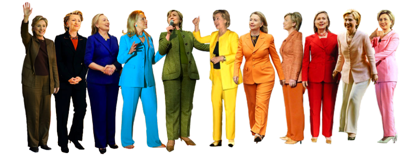

---

Depending on which flavor of Kool-Aid you've been drinking, Hillary Clinton is either the greatest threat to Western Civilization [ever spawned by Lucifer](http://www.thedailybeast.com/articles/2016/07/20/ben-carson-ties-hillary-clinton-to-lucifer-as-gop-swaps-campaign-for-witch-trial.html) -- or is Joan of Arc on a noble steed (meaning the DNC, of course), wielding a large sword and charging in to save us from the [Prince of Darkness](http://theweek.com/speedreads/607545/watch-donald-trump-become-prince-darkness) himself.

Clinton's defects have distracted progressives from one unique aspect of this election -- [replacing up to four Supreme Court justices in the coming year](http://www.alternet.org/election-2016/next-president-likely-appoint-4-supreme-court-justices). She has also become a distraction to mainstream Democrats who recently got a sobering look at [how undemocratic their party is](http://www.nytimes.com/2016/04/04/opinion/the-un-democratic-party.html) -- and who until now hadn't given much thought to how far off the rails their party has rolled. 

There are at at least three Hillary Clintons. The first is the Lucrezia Borgia of the Far Right, the star of [Dinesh D'Souza's new attack movie](http://www.nytimes.com/2016/07/22/movies/hillarys-america-dinesh-dsouza-review.html), "Hillary's America." This first one is a caricature engineered by people who have been hammering away at the Clintons for thirty years. The second Hillary is a political opportunist with an uneven record on everything from crime to helping poor families, with a [horrific record as Secretary of State](http://usuncut.com/politics/hillary-clinton-foreign-policy-record/). This second Hillary's record must be seen for nothing more than it is -- shameful and destructive. Finally, there is a third Hillary -- another caricature, this time from the Democratic Party's and Clinton's own PR machine. This third Hillary's story is a lot like Forrest Gump's: [the former Goldwater girl has been everywhere](http://www.hillaryclinton.com/bio/) and seemingly at the forefront of every important battle for the downtrodden since the Civil Rights movement began.

When lefty Democrats and Progressives talk about the second Hillary, DNC party loyalists think they're hearing Dinesh D'Souza's voice and they trot out the third Hillary. No one can agree about what she is, much less the right and left halves of the Democratic Party.

But Clinton's own record speaks most convincingly for itself. For forty years she has been (at best) an unreliable friend of working people, yet has always managed to [cash a paycheck from Wal-Mart](http://www.progressivepress.net/hillary-clinton-was-a-wal-mart-director-for-6-years/) or [Wall Street](http://www.huffingtonpost.com/miles-mogulescu/clintonss-200000-an-hour_b_9069720.html). Like Trump, many of her positions on issues as diverse as [gay rights](http://www.huffingtonpost.com/2014/06/12/hillary-clinton-gay-marriage_n_5489258.html), [civil liberties](http://www.huffingtonpost.com/mike-shammas/on-foreign-policy-and-civ_b_8314580.html), [unions](http://abcnews.go.com/Blotter/clinton-remained-silent-wal-mart-fought-unions/story?id=4218509), [welfare](http://www.nytimes.com/politics/first-draft/2016/02/24/bernie-sanders-ties-hillary-clinton-to-poverty-caused-by-welfare-reform/), the [environment](http://www.nytimes.com/politics/first-draft/2015/07/28/hillary-clinton-is-stumped-on-question-of-keystone-pipeline/) and [crime](http://www.bbc.com/news/world-us-canada-36020717) have been either inconsistent or just plain harmful. 

Not so different from the Republicans, Clinton represents [globalism](http://qz.com/741533/the-tpp-could-be-hillary-clintons-downfall-in-november-and-for-good-reason/), [militarism](http://www.nytimes.com/2016/04/24/magazine/how-hillary-clinton-became-a-hawk.html), [cronyism](http://www.salon.com/2016/03/08/hillarys_cronyism_is_showing_a_closer_look_at_her_economic_proposals_reveals_her_neoliberal_agenda_partner/), the [revolving door](http://theintercept.com/2015/07/30/two-big-reasons-hillary-clinton-isnt-taking-elizabeth-warrens-revolving-door-dare/), and a twisted foreign policy much [like Henry Kissinger's](http://www.slate.com/blogs/the_slatest/2014/09/05/hillary_clinton_henry_kissinger_pals.html). She is now [supported by the very neocons who pushed us into the war in Iraq](http://talkingpointsmemo.com/livewire/robert-kagan-clinton-fundraiser) she voted for. She [supports a cruel occupation in Israel](http://forward.com/news/breaking-news/346186/hillary-clinton-instructed-advisers-to-ensure-pro-israel-democratic-platfor/), signed off on a [coup in Honduras](http://www.huffingtonpost.com/marjorie-cohn/hillary-clintons-link-to_b_9470362.html), worked to [destabilize several Middle Eastern countries](http://www.juancole.com/2015/04/president-clintons-interventions.html), has expressed hostility to [whistleblowers](http://www.theatlantic.com/politics/archive/2014/04/hillary-clintons-dubious-views-on-whistleblowers/361354/) and [civil libertarians](http://observer.com/2016/06/the-classified-double-standard/), and is a [friend (and Clinton Foundation partner) of autocrats and dictators](http://abcnews.go.com/Politics/clinton-foundation-taking-accused-rights-violator/story?id=30840212). 

Clinton can only inflame, not fix, ISIS because [she has only Cold War containment strategies](http://www.salon.com/2016/05/15/no_hillary_clinton_isnt_a_republican_but_the_resemblance_is_striking/) up her sleeve. Because of [her "responsiveness" to Israel](http://www.politico.com/story/2015/07/hillary-clinton-jewish-donors-israel-119705), voters can [expect her to dismantle most of the work John Kerry did in creating a nuclear agreement with Iran](http://www.juancole.com/2016/03/hillary-clinton-goes-full-neocon-at-aipac-demonizes-iran-palestinians.html). Again, with her Cold War mentality, Clinton will continue to [gratuitously antagonize Russia](http://www.nydailynews.com/news/world/ukraine-prime-minister-crimea-remain-part-country-article-1.1711216). Even though the U.S. is now the only superpower remaining, the expansion of NATO and Cold War rhetoric will ensure that defense and intelligence-based industries get their handouts as we move toward a trillion-dollar defense budget. And [Clinton and Kaine both want to expand military spending](http://www.huffingtonpost.com/lawrence-wittner/are-we-in-for-another-increase_b_10952864.html). It's hard to imagine the Republicans doing much worse.

Yet Clinton is only one manifestation of the corruption of the Democratic Party. There are lots more Hillaries where this one came from. 

This week progressives got a peek into [leaked emails of the DNC leadership that show how undemocratic the party really is](http://www.washingtonpost.com/news/the-fix/wp/2016/07/24/here-are-the-latest-most-damaging-things-in-the-dncs-leaked-emails/). Last month we got a glimpse of the Democratic Party's commitment to free speech as [Andrew Cuomo beta tested an anti-BDS](http://www.huffingtonpost.com/simon-mccormack/gov-cuomos-bds-blacklist-free-expression_b_10383198.html) program [for the party](http://www.jpost.com/US-Elections/Exclusive-For-first-time-Democrats-to-condemn-BDS-and-recognize-Palestinian-right-to-self-govern-457834) -- actually, for Israel -- one intended to shut down boycotts of the Israeli occupation of Palestinians. Those with political memory will recall that, as soon as he resigned from Obama's administration and became Chicago's Mayor, [Rahm Emanuel came out of the Democratic closet as a union-buster](http://www.chicagoreader.com/chicago/romneys-plan-for-schools-sounds-like-rahms/Content?oid=6860548). And then there is VP candidate Tim Kaine's record. As recently as 2009 [Kaine was funnelling money to anti-choice programs](http://www.prochoiceamerica.org/media/press-releases/2009/pr03302009_kaine.html?referrer=http://www.prochoiceamerica.org/media/press-releases/2009/pr03302009_kaine.html) in Virgina. Kaine has supported fracking and the TPP, and is opposed to re-regulating Wall Street.

Mainstream Democrats assume that Capitalism is benign and that the rules are generally fair, that [public support of entrepreneurship is reasonable](http://www.salon.com/2014/07/10/corporate_welfares_quiet_enablers_how_democrats_pander_to_big_business_partner/), and that tax incentives for "job creators" is only fair as well. Mainstream democrats saw nothing wrong with NAFTA and see nothing wrong with the TPP. *After all, we live in a global world; we can't change things now. Can't put the genie back in the bottle. Americans are blithe about the costs of change -- even disruptive change. Yesterday's toaster repairman will be tomorrow's AI robot repairman or CNC programmer -- well, that's the idea, at least. Offshoring is just a temporary inconvenience because the nature of business requires flexibility to move where trained labor is. Surely you understand. Trade agreements have to take into consideration protections for global corporations and, sadly, [we can't -- and won't -- share the details with you](http://www.eff.org/deeplinks/2015/10/final-leaked-tpp-text-all-we-feared) or even your congressman.*

This is the type of arrogance and disregard for worker and consumer protections that concerns both progressives and  Republicans this year. Concerns for greater national control of trade policy have been portrayed as nothing more than paleolithic protectionism and coarse nationalism by the DNC. Concern for greater national control of trade policy is conflated with simple xenophobia and hostility toward foreign workers. While there is certainly much truth to this latter accusation because the right-wing has seized on populist sentiment, these concerns are simply not being heard or taken seriously by Democrats. When Britain left the European Union it scarcely created a ripple or a second thought among Liberals. Despite all the lofty pep talks about turning coal miners into solar panel installers, not every former factory worker is going to make it as a CNC programmer or a web designer.

Republicans think that kicking out the Mexicans will magically free up the low rungs in the job market. Democrats think that globalization plus encouraging post high-school education will magically connect the unemployed with developing markets (even if they are 10,000 miles away). Both parties agree -- setting national priorities, taking steps to incubate new technologies, strategically training workers for these new technologies -- hah! That's a step too far toward Big Government. Big business, on the other hand, will magically find a way to make it all work. 

In some ways, though, the Republicans are a half-step ahead of mainstream Democrats on trade protections. Or perhaps it's just that the Democratic leadership has become tone-deaf to real people when they have been talking to tech entrepreneurs at Davos for so long. [For all their evasive promises at the convention](http://www.cnn.com/2015/06/15/politics/45-times-secretary-clinton-pushed-the-trade-bill-she-now-opposes/), Clinton and Kaine will [foist the TPP on the American public](http://www.politico.com/story/2016/07/terry-mcauliffe-hillary-clinton-tpp-trade-226253). And this represents a betrayal voters will remember.

Besides its economic betrayals, the Democratic Party has real blood on its hands. Two of the DNC's featured convention speakers this week should be in prison cells in the Hague. [Madeline Albright, who on *Sixty Minutes* dismissed the deaths of half a million Iraqi children](http://www.youtube.com/watch?v=FbIX1CP9qr4) denied life-saving medicine by sanctions designed to punish non-existent WMD's, gave a sabre-rattling speech about "toughness" and Russian aggression. [Leon Panetta, Obama's former CIA director, was responsible for drone programs that killed hundreds of civilians](http://gma.yahoo.com/leon-panetta-interrupted-no-more-war-chants-blasts-012006226--abc-news-topstories.html) in undeclared war. 

One assumes that featured speakers reflect the soul of the party.

The soul of the DNC paved the way for the financial crisis of 2008 through [de-regulation of the financial industry](http://www.salon.com/2012/09/14/clintons_no_liberal_hero/). They [keep on deregulating this industry](http://www.motherjones.com/politics/2013/04/democrats-derivatives-financial-reform-dodd-frank). The soul of this party was happy to go along with, and extend, neoconservative military adventures in the Middle East. The soul of this party implemented [draconian crime bills](http://www.npr.org/2016/07/26/487522835/the-clinton-legacy-on-fighting-crime-and-what-democrats-have-learned-from-it?utm_medium=RSS&utm_campaign=politics) that created our present-day [incarceration nation](http://billmoyers.com/episode/incarceration-nation/). And, yes, many of these initiatives occurred during the administration of William Jefferson Clinton -- but the party leadership still loves its power-couple and rewards their failures by trying to get them in the White House again.

The Democratic Party is a party of failed ideas -- just like the Republicans. Both are slavish servants of corporations and the super-rich. Both are limited in the solutions they can offer to solve America's problems. Both offer the same tired, failed prescriptions with minor tweaks every four years.

Whatever the Democratic Party may have been in the past is only a nostalgic -- and a rose-tinted -- memory of what might be. The DNC may have been pulled, kicking and screaming, into the Civil Rights movement, but it was also the party of Viet Nam, Nagasaki, and HIroshima. The DNC of today still belongs to the rich and continues to be hostile to progressives, at odds even with its own Progressive Caucus. It is a party that fails average Americans time and time again. By design.

This is a party full of Hillaries. When she eventually leaves the political stage there will be a hundred of her clones waiting in the wings.

