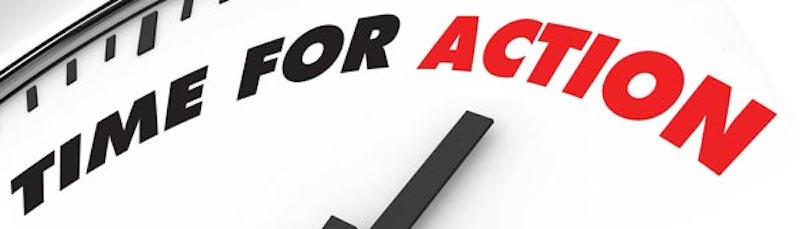

---

Dear political friends,

For many the holidays seem a bit hollow this year, and it's not just the dark or the usual *blahs*. Many are fearfully waiting for the hammer to drop on Inauguration Day.

Instead we should all be considering what kind of *action* we should be taking.

The Democratic Party needs a fresh direction, if not a new infusion of grassroots participation. It would be great to hear from those of you involved in party politics. How do people get involved? The Massachusetts Democratic Party website seems to be infrequently updated and it lists only chairs in larger cities. Whom should people contact in their communities?

Besides political parties, what issues and groups need urgent support right now?

Perhaps now is also a good time to get out in the streets and say NO! to hate. Here [is one event worth attending](http://www.facebook.com/events/210317916079875/).

Everyone should be reading and thinking. Here's [a recent book](http://www.mhpbooks.com/books/what-we-do-now-2/) on fighting back and [here's another](http://www.npr.org/books/titles/502026722/our-revolution-a-future-to-believe-in). Other recommendations, anyone?

What about hosting a political discussion in your living room? Invite your neighbors (at least the ones who didn't put out Trump lawn signs).

Now is not the time to despair but to organize and resist the coming assaults on every bit of progress this country has made in the last seventy years. We are now living in [a very different, dangerous nation](http://lithub.com/notes-from-the-resistance-a-column-on-language-and-power/) today — with an authoritarian, nationalist stench we haven't smelled since the Thirties — and we can't afford to be complacent.

Regards and best wishes for the holidays,

