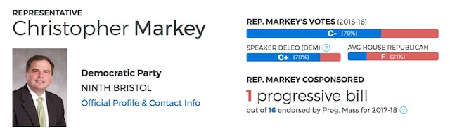

---

Dartmouth voters live in a pretty blue corner of a pretty blue state. With the ICE crackdown Trump unleashed on immigrants, many of us appealed to our state representatives only to discover they were not as blue as we thought. In fact, some are a surprising shade of red. And nobody likes an unpleasant surprise.

---

*Dear Dartmouth Voters,*

*Many of us have expressed concern about Rep. Chris Markey's poor record of voting for progressive causes. He recently added his support to the Massachusetts Family Leave Act, which may have been in response to recent lobbying by constituents. And for that we thank you, Rep. Markey!*

*But this presents us with a great opportunity to keep the pressure on by calling (1) to thank him for his support of the Family Leave Act, (2) to urge him to support H.3033, Tony Cabral's bill, which in effect prevents Sheriff Hodgson from using his staff to assist ICE, and (3) to ask Rep. Markey to support more than a dozen other pieces of progressive legislation which to date he has failed to co-sponsor and seems unlikely to vote for:*

*https://scorecard.progressivemass.com/my-legislators/02748*

*Rep. Markey's State House phone number is [617-722-2020](tel:617-722-2020) and his email address is [Christopher.Markey@mahouse.gov](mailto:Christopher.Markey@mahouse.gov).*

*Let's keep the pressure on! Dartmouth needs a stronger ally in the State House.*

*Regards,*

*Bettina Borders, Kate Fentress, David Ehrens, Sue Perry, Lisa Lemieux*