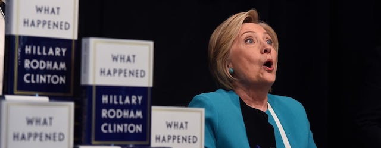

---

While the 45th president of the United States has been busy trying to wreck the country, you probably missed what happened this week in the Democratic Party.

This week Donna Brazile published an [explosive piece in POLITICO](https://www.politico.com/magazine/story/2017/11/02/clinton-brazile-hacks-2016-215774) titled "Inside Hillary Clinton's Secret Takeover of the DNC." In her article Brazile recounts how the DNC, sinking under $24 million of debt bequeathed by the Obama campaign, was bailed out by the Clinton machine's financial backers. Not only that, but the party was literally turned over to Clinton to a degree that DNC officers like Brazile didn't even know what was going on. The deal with the devil was this — the DNC would receive an "allowance" from Clinton's Wall Street cronies and in return Clinton would control the party.

Speaking of Wall Street and Clinton, [Douglas Schoen, a former Clinton advisor](https://www.nytimes.com/2017/10/17/opinion/why-democrats-need-wall-street.html), penned a piece in the New York Times recently, arguing that the Democrats need Wall Street. And while it may be true that Clinton and her billionaire friends on Wall Street need each other, others would beg to differ.

[Robert Borosage writes in the Nation](https://www.thenation.com/article/wall-street-has-some-advice-for-the-democratic-party/) that "the Wall Street wing of the Democratic Party will always be with us. Its policies—on financial deregulation, trade, fiscal austerity, mass incarceration, and military intervention—have been ruinous. Its political aversion to populist appeals has been self-defeating. But Wall Street has the money, so it will always enjoy upholstered think tanks, perches on op-ed pages, and gaggles of politicians eager to peddle its proposals." Borosage points to centrist Democrats' latest project — New Democracy — as an effort designed to convince Americans that Wall Street's interests are their own.

And if you've been wondering which way the Democratic Party is headed, look no further than our own state. Seth Moulton has apparently been identified as its new face. As a [Slate article](https://slate.com/news-and-politics/2017/10/who-is-seth-moulton-for.html) points out, "the Massachusetts congressman is a white, centrist, Harvard-educated war hero who wants to remake the Democratic Party. Too bad no one wants that." The Democrats and their "Better Deal" are intended to appeal to white, monied voters. To hell with everyone else.

While Clinton — to this day — still blames everyone but herself for her 2016 loss, this week a group of progressive Democrats issued their own report discussing what happened and what needs to change: [AUTOPSY: The Democratic Party in Crisis](https://democraticautopsy.org/). If you want to skip to the bottom line, [read the executive summary](https://democraticautopsy.org/executive-summary/). But several important important takeaways must be mentioned: 

- The Democratic National Committee and the party’s congressional leadership remain bent on prioritizing the chase for elusive Republican voters over the Democratic base: especially people of color, young people and working-class voters overall.
- After suffering from a falloff of turnout among people of color in the 2016 general election, the party appears to be losing ground with its most reliable voting bloc, African-American women. “The Democratic Party has experienced an 11 percent drop in support from black women according to one [survey](http://www.ncbcp.org/assets/2017BWR.ESSENCEPOSVPollFindingsFINAL9.20.17.pdf), while the percentage of black women who said neither party represents them went from 13 percent in 2016 to 21 percent in 2017.”
- One of the large groups with a voter-turnout issue is young people, “who encounter a toxic combination of a depressed economic reality, GOP efforts at voter suppression, and anemic messaging on the part of Democrats.”
- “Emerging sectors of the electorate are compelling the Democratic Party to come to terms with adamant grassroots rejection of economic injustice, institutionalized racism, gender inequality, environmental destruction and corporate domination. Siding with the people who constitute the base isn’t truly possible when party leaders seem to be afraid of them.”

Finally, if you are a progressive and still harbor the delusional hope that the Democratic "big tent" is big and broad enough to accommodate you, think again.

Last week [the DNC purged Sanders surrogates](https://inthesetimes.com/article/20627/dnc-purge-ellison-perez-bernie-sanders-left-center/) from the party leadership. [Only Keith Ellison](https://theintercept.com/2017/10/20/democratic-party-drama-puts-deputy-chair-keith-ellison-in-a-tough-spot/) remains but he is isolated and it's anyone's guess how long he will maintain the [pretense of party unity](https://jacobinmag.com/2017/10/dnc-purge-sanders-ellison-perez-rules-committee/).

Somebody needs to be fighting for the interests of struggling and working people. But it's obviously not going to be the Democrats.

