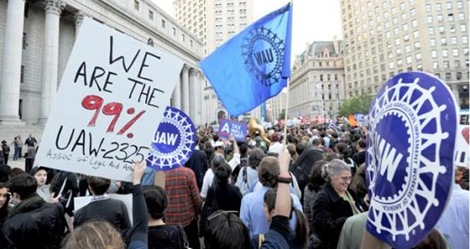
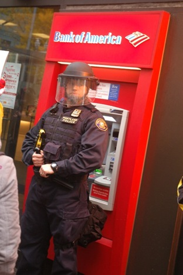
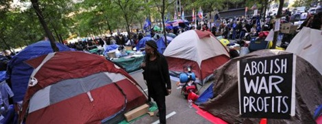

---

For the last couple of months the nation has been watching as protesters from New York City to Oakland have set up encampments and debated political issues. The mainstream press has reported on the Occupy Wall Street (OWS) movement as if it was a leaderless children's crusade or an incoherent mob unable to express its demands. But middle aged people, unions, minorities, civil libertarians, pacifists, and every stripe of progressive America have also turned out to show their support. They _have_ [expressed their demands](http://www.huffingtonpost.com/ali-hayat/occupy-wall-street_b_1089079.html), and unfortunately they are not neat, easily digested talking points from a central Tea Party organization. They are complex, interconnected demands that defy one minute sound bites.

Increasingly, city governments, with support from the Obama administration, have shut down the protests in city parks and squares by means of SWAT teams, sound cannons, tasers, concussion grenades, rubber bullets, tanks, and a [host of armaments](http://privacysos.org/node/368) we are used to seeing in photos of protesters being similarly set upon by authorities in Syria and Egypt. The message from the ruling class is: _You want class warfare? Fine. You've got it._

As winter sets in and the onslaught of injunctions, attacks, and arrests of OWS protesters increases, the mainstream media has [already begun writing its obituaries](http://www.timescolonist.com/business/Occupy+movement+fell+apart/5737769/story.html). Some claim that the OWS movement is the [Islamist spawn of Tahrir Square](http://www.nationalreview.com/media-blog/283533/occupy-wall-street-vs-occupy-tahrir-square-greg-pollowitz) protests. The [New York Times quoted Tahrir Square activist](http://cityroom.blogs.nytimes.com/2011/10/25/occupy-wall-street-meets-tahrir-square/) Asmaa Mahfouz, saying "Where are the organizers?" As if, without a Grover Norquist or a Dick Armey to speak for the masses they have no voice.

The OWS movement has successfully demonstrated the dimensions and size of a suffering working and middle class, in many ways much better than the Tea Party movement, which often veers into racist, xenophobic, and religious extremes. To be fair the OWS movement has its own share of people on the fringe, and [not all members](http://www.thenewamerican.com/usnews/politics/4957-naacp-releases-report-on-tea-party-racism) of FreedomWorks, 1776 Tea Party, Tea Party Nation, Tea Party Patriots, ResistNet, or the Tea Party Express are necessarily as racist as their leaders. Both groups share at least this: they've both been denied whatever they imagine the _American Dream_ to be.

But now, especially as both winter and political primaries approach, it's time for OWS to think about how it intends to _implement_ its many analyses and demands. Does it want the Democratic Party to magically change course? Does it want to create a PAC to promote progressive Democrats, Greens, or Independents? Recently some [Tea Party and OWS](http://www.washingtonpost.com/national/for-tea-party-and-occupy-wall-street-movements-some-common-ground/2011/10/18/gIQAkIg07L_story.html) groups have even begun talking with one another. There is some risk that part of the OWS movement will be co-opted.

The two million dollar questions are: How is OWS going to enter the political stage? And: Will OWS have a voice in the 2012 election?

Occupy Wall Street needs to decide, _and decide quickly,_ if it wants to live in the halls of Congress or just in tents from REI.
