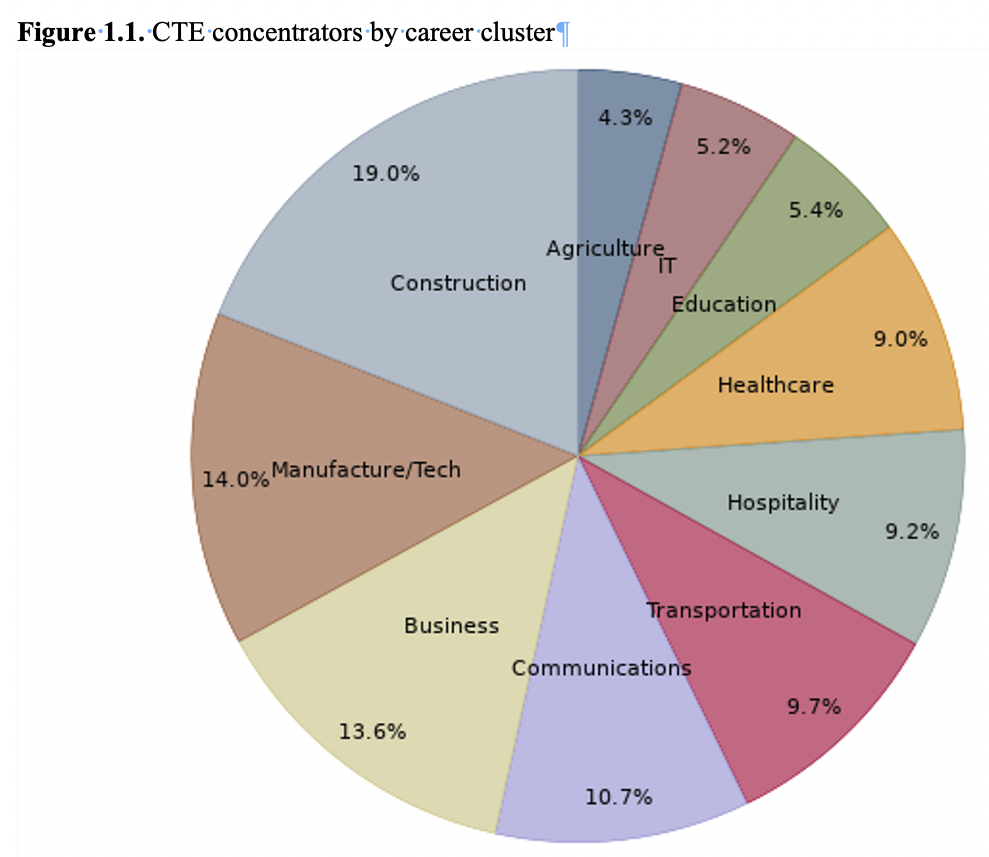
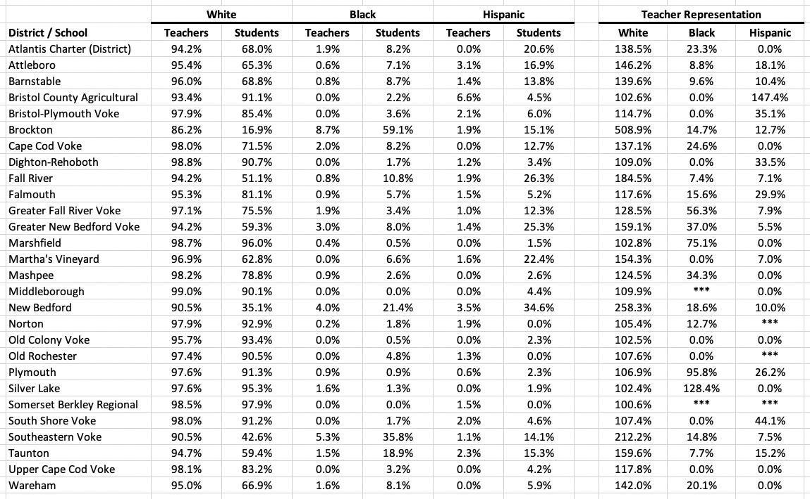
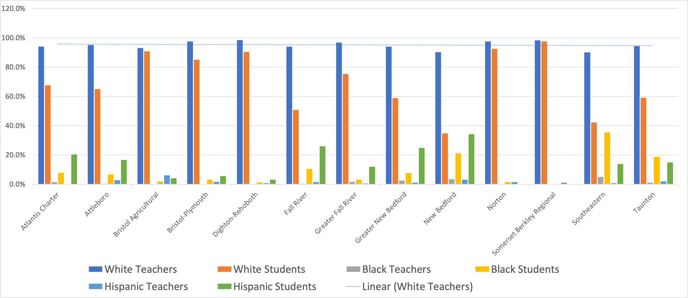
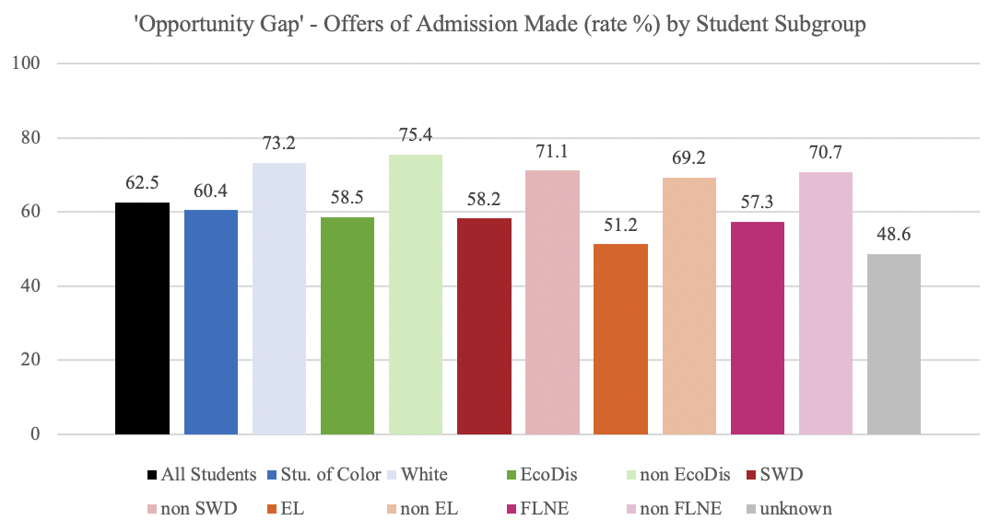
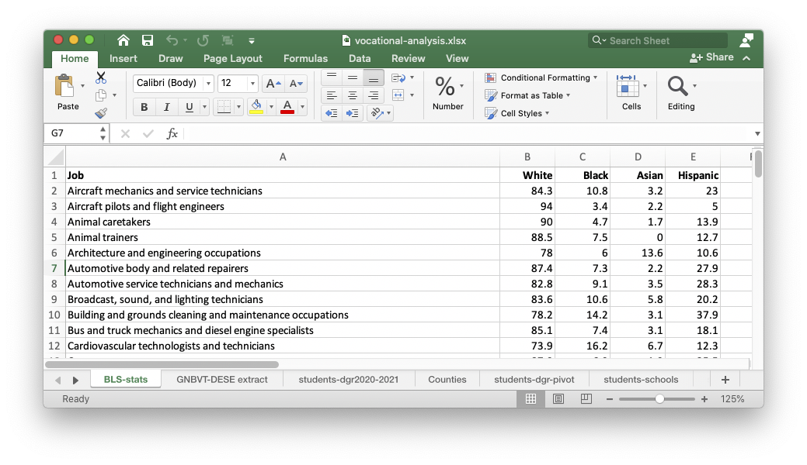

---

*Data and analysis discussed in this paper can be found online in [vocational-analysis.xlsx](https://naacpnewbedford.org/wp-content/uploads/2021/05/vocational-analysis.xlsx).*

**Massachusetts vocational programs**

There are approximately 132 high school career and vocational technical education (CVTE) programs offered at 102 locations throughout Massachusetts. In 2020 these schools and districts served a modest [63,400 vocational students](https://www.doe.mass.edu/infoservices/reports/enroll/default.html?yr=cvte2021) out of the state's [911,465 students](https://profiles.doe.mass.edu/general/generalstate.aspx?topNavID=1&leftNavId=100&orgcode=00000000&orgtypecode=0). Of the Commonwealth's vocational students, 54% are male, 46% female, 57% white, 9% African-American, 25% Hispanic, 4% Asian and 4% multi-racial. Demographics for CVTE students are not significantly different from averages for [all schools](https://profiles.doe.mass.edu/profiles/student.aspx?orgcode=00000000&orgtypecode=0&fycode=2020) in the Commonwealth, but as we will see they are frequently not representative of the communities in which they are situated. 

88 of the state's 132 vocational programs are designated N74, *Non*-Chapter 74 Career Technical Education (Perkins) programs; 44 are C74, Chapter 74 Approved, and 57 locations offer both C74 and N74 programs. Massachusetts offers 10 career clusters, and student participation in them is depicted in a graphic from a 2020 [DESE study](https://www.doe.mass.edu/research/reports/2020/10career-tech-ed.docx) of vocational school outcomes:

**Student demographics**

Racial compositiion of vocational programs varies greatly. The [Edward M. Kennedy Academy]() for Health Careers in Boston, for example, is 97% non-white, while [Somerset Berkley Regional's](http://somersetberkley.org/) vocational program is 97% white. 22 of the 102 districts are majority-minority, and 79 are majority white. Regardless of their demographics, however, the state's vocational schools do not reflect the racial characteristics of the "sending" school districts from which vocational students are drawn.

While 43% of the Commonwealth's students are non-white, with the exception of Boston and a handful of Gateway cities, Massachusetts vocational schools are as white as some of the whitest [suburban school districts with the highest percentages of white teachers](https://profiles.doe.mass.edu/statereport/teacherbyracegender.aspx). The following table built combining multiple DESE data sources shows the general lack of diversity of both students (and teachers) in Barnstable, Bristol, Dukes, and Plymouth counties:

.

**Vocational teachers are overwhelmingly white**

While student diversity is lacking, so also is [staffing](https://www.masslive.com/boston/2021/03/proposed-bill-seeks-to-increase-number-of-black-and-latino-teachers-better-reflecting-the-student-body.html). Incredibly, in every technical schools of all four counties shown above, all except Brockton have teaching staffs that are *more than 90% white*. Only four of the 28 vocational school districts depicted above have more than 2% Black or 2% Hispanic teachers.

**Under-representation**

One consequence of this lack of diversity is under-representation of Black, Hispanic, and Asian teachers. Providing just one example of the importance of representation, a [National Education  Association](https://www.higheredjournal.com/uncategorized/to-address-low-representation-of-black-teachers-experts-suggests-focusing-on-retention/) study found that when Black students had at least one Black teacher in grades 3-5, dropout rates fell by 30%. That improvement was even more pronounced, 39%, when Black teachers worked in underserved neighborhoods.

In the table below we see the ratio (expressed as a percentage) of teachers/students by the three largest racial categories in the SouthCoast. With with the exception of Bristol Aggie, the Plymouth Schools, and the Silver Lake School District, all SouthCoast vocational schools over-represent white students. None of the vocational schools shown *even came close* to matching Black and Hispanic youth percentages with teachers of the same race.

And in Bristol County, regardless of the racial composition of the community, the percentage of white teachers is always close to 95%.

.

**GNBVT Data: a closer look**

Using [data](http://naacpnewbedford.org/tiny/dese-data) we received from DESE for [a previous look](https://naacpnewbedford.org/tiny/nbps-report) at the New Bedford schools, out of 259 Greater New Bedford Vocational Technical employees in 2020, we found 145 teachers and 18 co-teachers. Of the teachers 135 were white, only 5 were Black, and there were only 3 Hispanic teachers. Looking back as far as 2008, for every year until the present all of New Bedford Voke's co-teachers have been white.

In line with the SouthCoast numbers above, we find diversity among GNBVT general staff is almost as bad as among teachers. The number of African-American *employees* at GNBVT reached a maximum of 8 in 2012 (in 2020 it was 5) and the highest number Hispanic employees over twelve years of data collection was 10 in 2017 (it has since dropped to 6). And it gets worse when you start looking at specific jobs.

**All-White or Whites-Only?**

All of the following job classifications at GNBVT have been all-white since 2008: 

> Superintendent; Principal; School Business Officer; Special Education Administrator; the Directors of English, History, Social Studies, Math, Science, Technology; Librarians; Media Center Director; School Psychologist; School Nurse; Special Education Administrative Aides; Information Technology Services; and Other Administrative Support Personnel. 

The Director of Guidance and Curriculum Supervisor has been all-white since 2017. Support Content instruction has been all-white since 2012. School adjustment counselors have been all-white since 2012.

Numbers like this beg the question — is GNBVT's overly white staffing a result of market forces or of policies and practices that lead to discrimination, such as patronage, unfair hiring practices, or outright racism?

**Admissions**

A common complaint about Vocational Technical schools is that they are not only disproportionately white, but that admission policies and informal recruitment and admission practices are designed to keep them that way.

Massachusetts currently has about 63,400 vocational students, a small portion of the state's almost one million students. A 2019 a [state study](https://www.doe.mass.edu/bese/docs/fy2021/2021-02/spec-item1.2-cvte-waitlist-report.docx) of vocational school admissions found that there were 1.75 applications for every admission. 

Law- and policy-makers have been looking at ways to expand CVTE opportunities, but for now the goal is to make the admissions process fairer. The same study found that there were two main obstacles to admission for non-white children — (1) an "awareness gap," basically student lack of familiarity with CVTE options; and (2) an "opportunity gap," in which children are denied access by others.

.

For most readers it will not come as a shock to learn that white students were most likely to be admitted, while students of color, English language learners, and economically disadvantaged had their applications placed on the back burner, receiving statistically lower admissions.

Worse, the applications process most schools use is a competitive system [based on](https://www.masslive.com/boston/2021/04/proposed-changes-to-vocational-school-admission-standards-which-have-been-called-discriminatory-to-open-up-for-public-comment.html) grades, discipline records, attendance, recommendations, and even interviews. In the past, if it is not still current practice, children are often given priority if a sibling already attends the vocational school. Jack Livramento of [UIA](https://www.capeandislands.org/local-news/2021-03-19/advocates-push-for-admissions-lottery-at-voc-tech-schools-say-current-system-discriminates) objects to an application process that looks like an admission to Harvard. "Vocational schools are public schools." 

Community groups like [United Interfaith](https://www.wgbh.org/news/education/2021/03/18/advocates-say-admissions-process-for-vocational-technical-high-schools-in-mass-is-discriminatory) Action, the [NAACP](https://www.southcoasttoday.com/news/20200124/who-gets-into-vocational-school-behind-scenes-advocates-are-pushing-for-change), the American Federation of Teachers, the North Atlantic Carpenter's Union, as well as a group of 23 mayors all weighed in on the results, urging reforms to the admission process. New Bedford mayor Jon Mitchell suggested a lottery. "It's good enough for charter schools. It is above board. It is. It can be verified." The Vocational Education justice Coalition, Citizens for Public Schools, UIA, *La Collaborativa*, and the Massachusetts Community Action Network have all backed the idea of a [lottery](https://www.masslive.com/boston/2021/03/advocates-call-for-lottery-system-for-massachusetts-vocational-school-admission-say-current-practice-is-discriminatory.html). 

The Vocational Educations Justice Coalition faults the admissions of students highly likely to abandon their learned trade in favor of a four-year college because it is both harmful to the trades as well as unfair to students not on an academic track. The [DESE study](https://www.doe.mass.edu/research/reports/2020/10career-tech-ed.docx) cited previously notes that "CTE concentrators are less likely to complete a college degree than the statewide average." And that "while CTE may be thought of as a means to increase earnings and education, it has also often been seen as an educational model that might reduce adverse outcomes. This is of particular importance for students who face social and economic disadvantages that may make them vulnerable to negative outcomes after high school." In addition, a [2018 survey](https://www.doe.mass.edu/ccte/cvte/data/outcomes-across-ma.docx) of CVTE outcomes currently only 33% of all Chapter 74 vocational students end up working in the career field for which they were trained, while that number is 12% for N74 programs. 18% never enroll in college and 45% enroll in college but never complete it.

**State recognition of the problem**

State Rep. Alice Peisch and state Sen. Jason Lewis, co-chairs of the Joint Committee on Education, have proposed the Educator Diversity Act ([HD.3641](https://malegislature.gov/Bills/192/HD3641)/[SD.2208](https://malegislature.gov/Bills/192/SD2208)), which has four parts that address hiring of minority teachers. The Educator Diversity Act simplifies the path to educator licensure, establishes hiring guidelines, mandates diversity programs and officers, and quantifies the efforts to increase diversity by collecting data and publishing statistics.

Addressing the "awareness gap," Minuteman Regional Voke Superintendent Edward Boquillon [suggests](https://www.govtech.com/education/k-12/massachusetts-trying-to-expand-access-to-technical-schools) that vocational schools be given student information from the sending school district so that students who are not aware of the programs can be contacted and invited to apply. One of the key findings in a separate [2020 DESE study](https://www.doe.mass.edu/research/reports/2020/10career-tech-ed.docx) of vocational school outcomes was that a "majority of 8th grade students reported that they receive enough information to make an informed high school choice, but a significantly lower proportion of students of color reported this than did white students."

**From trades worker to trades teacher**

White non-Hispanic Americans represent roughly 60.1% of the [population](https://www.census.gov/quickfacts/fact/table/US/PST045219), Hispanic Americans 18.5%, African-Americans 13.4%, Asians 5.6%, Multiple races 2.8%, Native American slightly under 1%, and Pacific Islanders 0.2%. We want workplaces to look like society in general, but we also want teachers, especially, to look like the students they instruct and for whom they serve as role-models.

We want to turn more trades people of color into trades teachers of color.

Since vocational teachers come straight from the vocations they teach, do enough non-white skilled technical workers exist to be able to move into teaching vocational courses? In order to explain an almost complete absence of vocational teachers of color we need to take a quick look.

For years the Department of Labor's [Bureau of Labor Statistics](https://www.bls.gov/cps/cpsaat11.htm) (BLS) has produced annual reports showing white, Black, Hispanic, and Asian labor participation in hundreds of job classifications. There are many BLS job classifications (Carpenters, Electricians, Plumbers, Hairdressers, etc.) that can be directly mapped to both the 10 career clusters mentioned previously and to specific vocations (Carpentry, Electrical, Plumbing, Cosmetology, etc). We chose over 70 classifications that mirror some of these career tracks..

Skilled Black workers are represented in the labor force in percents greater than representation in the general population for the following professions:

> Building and grounds cleaning and maintenance occupations; Cardiovascular technologists and technicians; Child, family, and school social workers; Childcare workers; Correctional officers and jailers; Credit counselors and loan officers; Cutting, punching, and press machine setters, operators, and tenders, metal and plastic; Education and childcare administrators; First-line supervisors of correctional officers; Food preparation and serving related occupations; Hairdressers, hairstylists, and cosmetologists; Home health aides; Human resources workers; Industrial truck and tractor operators; Janitors and building cleaners; Licensed practical and licensed vocational nurses; Miscellaneous health technologists and technicians; Motor vehicle operators, all other; Office and administrative support occupations; Office and administrative support workers, all other; Other metal workers and plastic workers; Packaging and filling machine operators and tenders; Security guards and gambling surveillance officers; Stationary engineers and boiler operators; Television, video, and film camera operators and editors.

Skilled Hispanic workers are represented in the labor force in percents greater than representation in the general population for the following professions:

> Building and grounds cleaning and maintenance occupations; Carpenters; Construction and extraction occupations; Construction laborers; Farming, fishing, and forestry occupations; Industrial truck and tractor operators; Janitors and building cleaners; Miscellaneous agricultural workers; Packaging and filling machine operators and tenders; Sewing machine operators.

Skilled Asian workers are represented in the labor force in percents greater than representation in the general population for the following professions:

> Architecture and engineering occupations; Cardiovascular technologists and technicians; Computer hardware engineers; Computer, automated teller, and office machine repairers; Electrical and electronic engineering technologists and technicians; Food preparation and serving related occupations; Healthcare practitioners and technical occupations; Marketing managers; Massage therapists; Miscellaneous health technologists and technicians; Motor vehicle operators, all other; Other engineering technologists and technicians, except drafters; Sewing machine operators.

There is, then, absolutely no reason that many of these skilled trades people could not transition to vocational teachers. There is plenty of skill out there. All that's lacking are the teacher certifications.

**Becoming a vocational teacher**

On May 20, 2021 the NAACP New Bedford Branch hosted [Jarrod Lussier](mailto:jrlussier82@gmail.com), an administrator at Greater New Bedford Voke, who addressed the monthly General Meeting and gave a short overview of the process of becoming a vocational teacher. 

Lussier was previous a Chapter 74 plumbing instructor at Southeastern Regional Vocational High School. He invites anyone interested in becoming a vocational teacher to [contact him]() and he is making his [presentation](https://naacpnewbedford.org/wp-content/uploads/2021/05/voc-licensure.pptx) available with the disclaimer that it is "on my own behalf and not as a representative of either [GNBVT or Southeastern] district."

