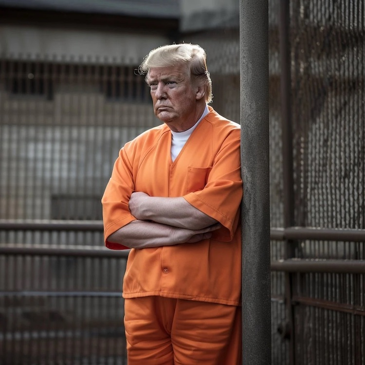
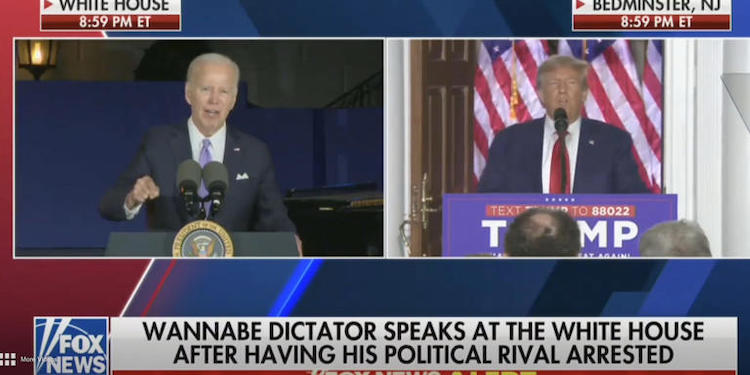

---
 

As Donald Trump fights the numerous criminal charges he earned while running the Presidency into the ground, I am reminded of Trump's *second* impeachment trial in which he was exonerated by an all white jury – well, actually, Republican Senators. Same principle, though. Men who believe they are above the law.

The House’s Articles of Impeachment had *already* been watered-down and consisted only of Trump's most *recent* attempts to extort Ukraine to intervene in the 2020 presidential election. Those charges did not include *anything* from the Mueller report, Trump's numerous emoluments clause violations, lying about illegal payments to porn stars or mistresses, or any of the many obstructions of justice to come. Prosecution by the Senate should have been a slam dunk but we all know what happened.

If all that winking and looking away at crime, and the kid-glove treatment, was not bad enough, then-Senate Majority Leader Mitch McConnell fast-tracked the Senate trial down to two weeks — three times shorter than Nixon’s. For sake of comparison, in 2016, when South Korea impeached president Park Geun-hye for corruption and influence-peddling, prosecutors charged her with 13 counts remarkably similar to Trump’s, and her trial in South Korea’s Constitutional Court lasted 10 weeks. Gun-hye’s refusal to appear before the court was never an impediment to her conviction.

But with Trump, well, kid gloves.

The travesty of justice Americans witnessed in the Senate that year was reminiscent of special treatment numerous white criminals have received in other sham trials:

- In 1955, when Emmett Till was murdered and his body thrown into the Tallahatchie River, his killers were acquitted by an all-white jury after one *hour* of deliberation.
- In 1963, after Medgar Evers was gunned down in Mississippi, two all-white juries acquitted his killers in separate trials.
- In 1998, when 13 white supremacists were charged with attempting to murder a federal judge and FBI agent, they were acquitted by an all-white jury.
- In 2013, George Zimmerman was found not guilty of the murder of Trayvon Martin by a jury with only one juror of color.
- In 2016, a group of armed sovereign citizens who occupied the Malheur National Wildlife Refuge were acquitted by an all-white jury — while on the same day unarmed Native Americans protesting a pipeline on their own land were maced and beaten by police.
- It’s not even possible to list the thousands of times that white police officers have murdered unarmed black men and been acquitted or simply not charged.

Yesterday, after only a brief pause from its election denial propaganda, FOX News was [back at it](https://www.theguardian.com/media/2023/jun/14/fox-news-labels-joe-biden-a-wannabe-dictator-during-trump-speech), calling Biden a "wannabe dictator" and portraying the *real* wannabe dictator, Trump, as the victim of – well – prosecution for crimes anybody else would be prosecuted for. To hear just about every Republican tell it, not one of the standard rules of justice applies to a white supremacist criminal like Trump. Apparently only [non-white] “banana republics” prosecute their corrupt politicians.

But let's not forget the many other get-out-of-jail cards available for white men. *Stand Your Ground* laws, statutes encouraging vigilantism, and the doctrine of *Qualified immunity* — a magic wand to wave away police murders. Add to this the increasing abuse of presidential and gubernatorial pardons for MAGA criminals and insurrectionists. Criminals who believe they're above the law.

For the moment it's not looking so good for Trump in 2024. If Biden *does* win this election, I am troubled by the nagging concern that Biden – in pursuing some sort of misguided *national unity* objective – might end up pardoning Trump's federal crimes, just as Gerald Ford wiped the slate clean for Richard Nixon. This would be a huge mistake.

Rubbing the average citizen's nose in impunity for serious criminality will do nothing to alter the perception that American justice is a cruel joke. If the most corrupt man in America is not subject to the same laws as the rest of us, we might as well open the prison doors and let *all the criminals* walk free.

