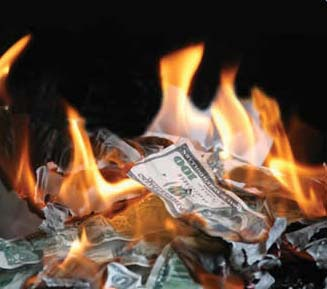
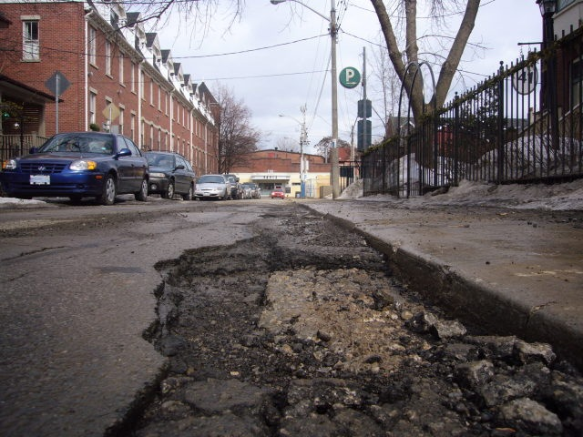
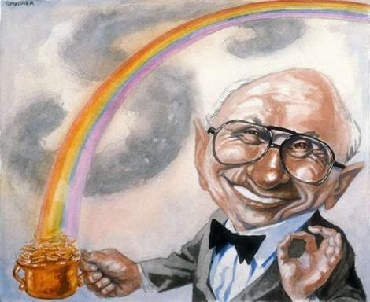
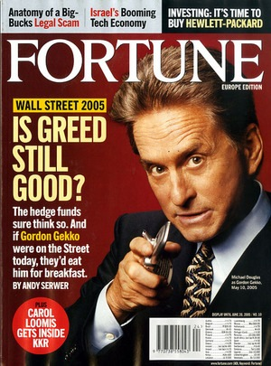
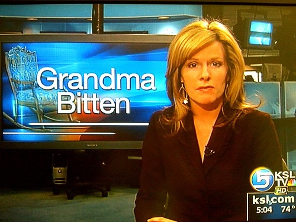

---

When Americans go to the polls on November 2nd, we will drag along considerable anger into the voting booths &#8212; anger at incumbents, anger at the economy, anger at the decline of American power, and anger at a growing sense that the country has run off the rails. As angry as we are, we will lash out at everyone and do anything but look in the mirror at the quite unflattering image before us. For, in reality, we have no one to blame but ourselves for the mess we are in.

True, incumbents from both parties voted for the wars in Iraq and Afghanistan &#8212; and now Pakistan &#8212; wars which have accounted for $1.1 trillion of our $1.3 trillion deficit. But it was the average citizen who wanted to lash out at someone &#8212; anyone &#8212; after 9/11. It was we voters who put in motion wars signed off by politicians from both parties who replaced their own consciences and judgment with polls and focus groups. Besides, haven't all our wars been slam-dunks?

It was we ourselves who gutted state governments, schools, libraries, and added to our own insecurity by choosing to slash taxes and support services. This winter if we break a strut in an icy pothole we can only blame ourselves for neglecting infrastructure. If grandma has to start eating pet food or choosing which medication to take because retirement benefits have not kept up with inflation for two years &#8212; we can blame ourselves for insisting on fiscal restraint for everything except wars, spying, and police services. Some of us want to smash the gods of government by dismantling the EPA and the Department of Education because we have lost our faith. The new watered-down health care bill is an abomination at the altar of Free Market Capitalism.

Angry people are seldom rational people. Americans are not unique in grasping at easy answers, quick solutions, the quarterly return, the unstudied decision, and even at straws. The lure of the Tea Party has both Democrats and Republicans scrambling to share some of their radical rhetoric. It may feel good to scream for the death of government, but if we throw the baby out with the bathwater, at the end of the day one out of ten of us will still be sitting, unemployed, in a recently foreclosed house, without any rational plan by a government to get us out of this mess &#8212; and still waiting for the Free Market to help out.

Whoever survives the next election is going to be there with agendas set &#8212; not by some cabal of "special interests" &#8212; but ultimately by us, the voters. If we see a rise in demagoguery, an increase of hate directed against gays, Latinos, Muslims, Blacks, Mormons, liberals, or some "other," we need only look in the mirror to see the cause. We ourselves have permitted a new generation of Gordon Gekkos to wreck the economy by rewarding corporations for sending jobs offshore or literally gambling with our money. Some want to expel all foreigners and abolish the 14th Amendment. Hate won't bring the jobs back from China but tough talk apparently sells at the polls. But talk is cheap.

If all this rage produces a series of poor choices, don't expect the politicians to save us from ourselves. We citizens may have no interest in forcing election reform, but we sure like to whine about craven politicians whose votes reflect our own views &#8212; those of us who bother to vote or to express them. Don't expect the news media to inform us of anything other than what's "newsworthy." We can't understand economic analysis or international news &#8212; we don't even know where some of these countries are &#8212; and besides, we have short attention spans; half of us think we need another war with Iran. We'd much prefer Talking Angry Heads, conspiracy theories, and Reality TV. And even though it's stealing trillions of dollars from our future, we don't really want to see stories about Iraq, Afghanistan or Pakistan on the 11:00 news. We want to know about warehouse fires and dog bites. And so that's what we get.

And in the end we get the democracy we deserve. If we are well-informed and work at understanding the roles of government and business and can appreciate the function and limits of both, our elected representatives will formulate sensible economic, environmental, educational, and foreign policies. But if all we are capable of expressing is anger and rejection, the search for easy answers will only lead us deeper into the swamp.