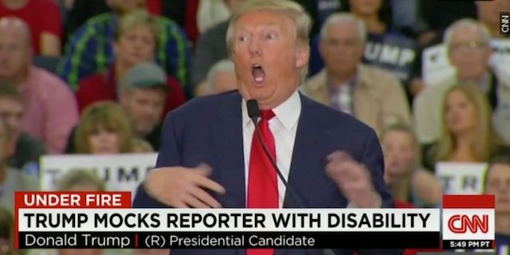

---

As we rapidly slide into authoritarianism led by a racist vulgarian, the press has oddly become fixated on not the danger to our democracy but on civility and balance. To hear some tell it, we have [too much democracy](http://www.politico.com/magazine/story/2018/06/26/america-democracy-trump-russia-2016-218894). No, we hear a lot lately, the threat to America is bad manners. 

The mainstream media considers it "uncivil" to lob hardballs at a politician or shout "non-responsive!" at his evasive answers. Instead, it steers a safe, middle course, avoiding "controversial" phrases and judgments. The "split-screen" showing both sides of an issue is a fixture of the media, whether in the Op-Ed section of a newspaper or on your favorite cable news show.

Civility is why "nationalist" is the style guide's choice for Richard Spencer — instead of the more accurate "white supremacist" or "neo-Nazi." If a Congressman uses the N-word it will be reported as a "racially-charged remark" and not as a "racist" epithet. When reporting climate change there must be "balance" to the 99% of scientists who regard it as fact. Civility means fairness and fairness requires false balance. So readers are obliged to hear from petrochemical lobbyists to provide indispensable new insights into a nonexistent "debate." 

Recently the press began worrying that Sarah Huckabee Sanders was [denied a cheeseburger](https://www.mediamatters.org/blog/2018/06/25/after-sanders-tweeted-about-red-hen-pro-trump-trolls-unleashed-pizzagate-style-targeted-harassment/220530) at a Virginia restaurant. The liberal press fretted — *is this the end of civility?* The [Washington Post](https://www.washingtonpost.com/opinions/let-the-trump-team-eat-in-peace/2018/06/24/46882e16-779a-11e8-80be-6d32e182a3bc_story.html?noredirect=on&utm_term=.cb0f5eff2790) warned in its best Mom voice, "Let the Trump team eat in peace." [Al Jazeera](http://www.aljazeera.com/news/2018/06/growing-concern-political-tribalism-trump-era-180626081017735.html) worried that liberal vexation at a mendacious fundamentalist White House spokeswoman reflected "growing concern about political tribalism" in the United States.

When U.S. Representative Maxine Waters suggested challenging Trump administration figures in public, [Politico](https://www.politico.com/story/2018/06/25/maxine-waters-democrats-reaction-trump-feud-648028) headed for the bomb shelter: "Waters scares Democrats with call for all-out war on Trump." House minority leader [Nancy Pelosi](https://www.politico.com/story/2018/06/25/nancy-pelosi-maxine-waters-tweet-669489) rebuked Waters, calling for "unity" — even though a recent CNN poll showed that 42 percent of Americans want Trump to be impeached — including a very unified 77 percent of Democrats.

The liberal reticence to vigorously challenge Trump seems based on fears of ridiculous things *Trumpistas* might say. In a piece entitled "The Left Loses its Cool," [Politico](https://www.politico.com/story/2018/06/25/liberals-attack-bondi-sanders-trump-667934) quoted Florida's GOP Attorney General Pam Bondi: “When you’re violent and cursing and screaming and blocking me from walking into a movie, there’s something wrong,” she said. “The next people are going to come with guns. That’s what’s going to happen.” For Trump supporters having an unpleasant lunch is worse than ICE throwing children into cages or dying because somebody took your healthcare away. Nonsense like this often goes unchallenged.

While the president was busy signing, un-signing, and re-signing executive orders on family separations, the press seemed far less intererested in discovering why sitting U.S. Senators were [denied entry to DHS](http://thehill.com/latino/394004-dem-senator-to-grill-hhs-secretary-over-denied-entry-at-detention-facility) detention facilities. When immigration attorney David Leopold appeared on CNN and pointed the finger for the White House's inhuman family separation policies at "white nationalist, Stephen Miller," host [Kate Bolduan](http://www.mediamatters.org/video/2018/06/25/cnn-anchor-bristles-calling-white-house-adviser-stephen-miller-white-nationalist-citing-civility/220528) cut him off: "I don't know if you want to go as far as to — I mean, let's not — I  just did an entire segment about civility here. I don't know if you want to call Stephen Miller a white nationalist."

Thus "civility" ended what could have shed some light on the issue of family separations. Leopold was on the right track: to really understand White House immigration policies you first have to understand its White Supremacists. Yet while the mainstream media pulls its punches, censors guests, and cuts off lines of inquiry, FOX and Sinclair, right-wing radio and conservative papers throughout the country dispense with such niceties and play hardball. 

"When they go low, we go high," Michelle Obama told Democrats shortly before the 2016 election. This was a sweet sentiment. But during that same campaign Donald Trump mocked a disabled journalist and called Mexicans rapists and criminals. This became the new standard of civility. Last March Trump [tweeted](https://thehill.com/homenews/administration/377789-trump-maxine-waters-is-a-very-low-iq-individual) that Maxine Waters was a "very low IQ individual." The Tweet was reported but Waters largely had to defend herself in the press.

The stakes have never been higher. We ought to worry less about civility and more about democracy. If we really want to salvage what's left of it we need to take the gloves off and aggressively confront injustice and untruth.

That goes for both liberals and for a very timid and diminished Fourth Estate.

